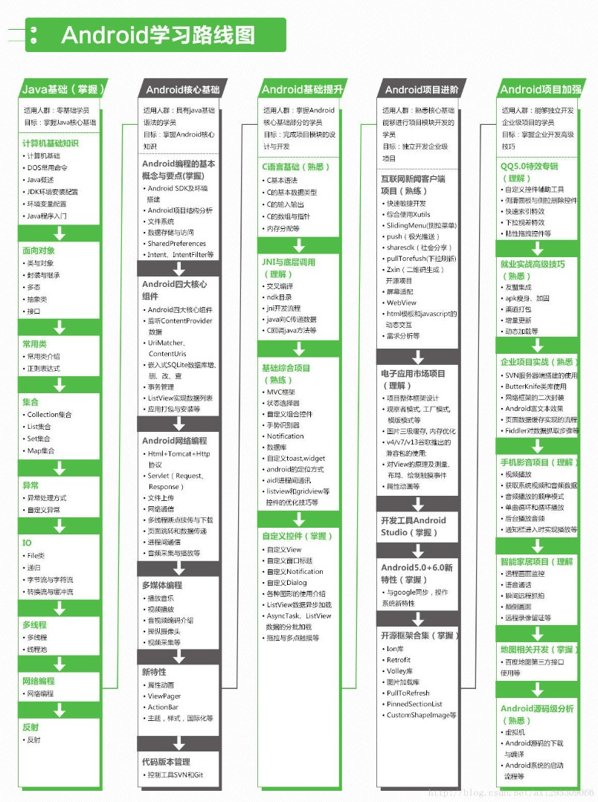

- [Android](#android)
  - [简介](#简介)
  - [系统特点](#系统特点)
    - [界面](#界面)
    - [应用程序](#应用程序)
    - [内存管理](#内存管理)
  - [系统架构](#系统架构)
    - [中介软件](#中介软件)
    - [硬件抽像层（HAL）](#硬件抽像层hal)
    - [编程语言](#编程语言)
  - [参考资料](#参考资料)
  - [Android学习之路](#android学习之路)

# Android
## 简介
+ Android（读音：英：['ændrɔɪd]，美：[ˈænˌdrɔɪd]），常见的非官方中文名称为安卓，是一个基于Linux内核的开放源代码移动操作系统，由Google成立的Open Handset Alliance（OHA，开放手持设备联盟）持续领导与开发，主要设计用于触摸屏移动设备如智能手机和平板电脑与其他便携式设备。
+ Android是一个全身绿色的机器人，半圆形的头部，有两支天线和空白的点作为眼睛。它的头部与身体之间有空白的区域，相似于一枚有平底的鸡蛋，两侧各有两个圆角矩形，作为它的双臂。Android的标志是由Ascender公司设计，颜色采用了PMS 376C和RGB中十六进制的#A4C639来绘制，这是Android操作系统的品牌象征[41]。当中的文字使用了Ascender公司专门制作的称之为“Google Droid”的字体[42]。有时候，它会以纯文字的标志展示[43]。
+ 2005年7月11日，Google以高于$5,000万美元的价钱收购了Android科技公司[44]，使其成为Google旗下的一部分。Android的关键人物包括安迪·鲁宾、利奇·米纳尔和克里斯·怀特，以及所有Android科技公司的员工都一并加入Google，作为收购的一部分。当时并没有人知道Google为何会作出这项收购，引来许多的猜测，后来证实Google正是借助该次收购正式进入移动领域。根据前Google CEO施密特的说法，收购Android目的是抗衡微软，试图阻止微软在移动市场复制桌面市场的成功[45]。在Google，由鲁宾领导的团队开发了一个基于Linux内核驱动的移动操作系统的平台，该开发项目便是Android操作系统。Google向手机制造商及手机网络供应商推出该平台，承诺提供一个灵活可靠并可升级的系统[46]，为Android提供一个广阔的市场。Google组织了一系列硬件及软件的合作伙伴，并向运营商示意指公司开放到各种程度的合作[47]。
## 系统特点
### 界面
+ Android的默认用户界面主要基于直接操作，透过触控松散地对应现实动作以作出输入，例如滑动、点击、捏动和反向挤压，随着虚拟键盘，以操控屏幕上的对象[96]。游戏控制器及物理键盘都能透过蓝牙或USB得到支持[97][98]。在回应用家的输入方面，设计旨在提供立即流畅的触摸界面，经常使用设备的振动功能向用户提供触觉反馈。内部硬件，例如是加速规、陀螺仪、距离传感器都能被某些应用程序来回应用户的操作，例如根据设备的方向来把屏幕由纵向调整为横向[99]，或容许用户透过旋转设备，在赛车游戏中驾驶车辆[100]。
+ 当Android设备引导就会进入主画面，那是设备的主要导航及信息“枢纽”，类似于个人电脑的桌面。Android的主画面通常由应用程序图标及小工具（widget）组成，应用程序图标引导相关的应用程序，而小工具则会实时显示，并会自动更新内容，例如天气预报、用户的电子邮件，或是直接在主画面上看新闻摘要[101]。主画面可以由若干页面组成，用户可以在这些页面之间来回滑动[102]。Google Play上提供的第三方应用程序，而其他的应用程序商店可以广泛使用重新定义的 主画面主题包[103]，甚至模仿其他操作系统的外观，例如Windows Phone[104]。大多数制造商会定制他们Android设备的外观和功能，以从竞争对手中脱颖而出[105]。
+ 屏幕顶部是状态栏，显示有关设备及其连接的信息。用户可把状态栏“拉下”，以显示应用程序显示的重要信息，或屏幕更新的通知[102]。通知是“当用户的应用程序在非使用时所提供简短、及时和相关的消息[106]。”当点击了，用户会被引导到该app内与该通知相关的屏幕。从Android Jelly Bean开始，可扩展通知“允许用户透过点击通知上的图标，以便它扩展和显示从通知中得知的更多信息以及有可能的应用操作[107]。”
+ “所有应用程序”的屏幕将会所有已安装的应用程序，用户可以将应用程序从列表拖曳到主画面上。“最近”的屏幕让用户在最近使用过的应用程序之间进行切换[102]。
### 应用程序
+ 应用程序（简称apps）是扩展设备功能的软件，都是利用Android软件开发工具包（SDK）编写的[108]，通常是Java编程语言[109]。Java可以与C语言或C++[110]结合使用，并且可以选择非默认的运行时库共享，以允许获得更好的C++支持[111]。虽然Google的Go是有一组有限的应用程序接口（API），然而它也支持编程语言[112]。2017年5月，Google宣布支持Kotlin编程语言[113][114]。
+ SDK包含一套全面的开发工具[115]，包括调试器、函数库、基于虚拟机镜像的仿真器、文档，示例代码和教程。最初，Google支持的集成开发环境（IDE）是使用Android开发工具（ADT）插件的Eclipse；在2014年12月，Google基于IntelliJ IDEA而发布Android Studio，作为Android应用程序开发的主要IDE。其他可用的开发工具，包括应用程序的本地开发包（NDK），或是用于C或C++中的扩展，MIT应用开发者，那是让新手程序员的视觉环境，以及各种跨平台移动应用程序框架。2014年1月，Google推出了一个基于Apache Cordova的框架，把Google Chrome、HTML5及网络应用程序移植到Android，包装于本机应用程序的外壳中[116]。
+ Android拥有越来越多第三方应用程序的选择，用户可以透过下载和安装应用程序的APK（Android应用程序包），或利用应用程序商店来下载，允许用户在那里进行安装、更新和移除。Google Play是安装在Android设备上的主要应用程序商店，那些程序都符合Google的兼容性要求，并获得Google移动服务软件许可[5][117]。Google Play商店允许用户浏览、下载及更新Google和第三方开发者发布的应用程序；截至2013年7月，Google Play商店中有超过1,000,000个适用于Android的应用程序[118]。截至2013年7月，已有500亿个应用程序获得安装[119][120]。一些电信商为Google Play应用程序提供直接结算，把应用程序的成本添加到用户的月结单中[121]。截至2017年5月，每月使用Gmail、Android、Chrome、Google Play和Google地图的活跃用户超过10亿。
+ 由于Android系统的开放性质，使它吸引许多第三方应用程序市场的竞争，及由于违反了Google Play商店的政策或是其他原因而不允许发布的应用程序替代品，第三方应用程序商店的例子包括是亚马逊应用商店、GetJar及SlideMe。另一个替代市场F-Droid，旨在提供仅在免费和开源许可下分发的应用程序[5][122][123][124]。
### 内存管理
于Android设备通常采用电池供电，因此Android旨在管理流程以将耗电降至最低。当应用程序未使用时，系统会暂停其操作，虽然可以在关闭期间立即使用，但它并不会使用电池电源或CPU资源[125][126]。当内存不足时，系统将会自动隐藏地开始关闭长时间内处于非活跃状态下的进程[127][128]。Lifehacker在2011年的报告指出，第三方任务杀手应用程序是弊大于利[129]。
## 系统架构
### 中介软件
+ 操作系统与应用程序的沟通桥梁，并用分为两层：函数层和虚拟机器。
+ Bionic是Android改良libc的版本。Android包含了Chrome浏览器引擎。Surface flinger是就2D或3D的内容显示到萤幕上。Android使用工具链为Google自制的Bionic Libc。
+ Android采用OpenCORE作为基础多媒体框架。OpenCORE可分7大块：PVPlayer、PVAuthor、Codec、PacketVideo Multimedia Framework（PVMF）、Operating System Compatibility Library（OSCL）、Common、OpenMAX。
+ Android使用Skia为核心图形引擎，搭配OpenGL/ES。Skia与Linux Cairo功能相当，但相较于Linux Cairo，Skia功能还只是阳春型的。2005年Skia公司被Google收购，2007年初，Skia GL源码被公开，当前Skia也是Google Chrome的图形引擎。
+ Android的多媒体资料库采用SQLite资料库系统。资料库又分为共享资料库及私用资料库。用户可透过ContentProvider类别获取共享资料库。
+ Android的中间层多以Java实现，4.4版之前使用特殊的Dalvik虚拟机器。Dalvik虚拟机器是一种“暂存器型态”的Java虚拟机器，变量皆存放于暂存器中，虚拟机器的指令相对减少。5.0版起改用Android Runtime（ART）。
+ Dalvik虚拟机器可以有多个实例，每个Android应用程序都用一个自属的Dalvik虚拟机器来执行，让系统在执行程序时可达到最优化。Dalvik虚拟机器并非执行Java字节码，而是执行一种称为.dex格式的文件。

### 硬件抽像层（HAL）
+ Android的硬件抽像层是能以封闭源码形式提供硬件驱动模块。HAL的目的是为了把Android framework与Linux kernel隔开，让Android不至过度依赖Linux kernel，以达成“内核独立”（kernel independent）的概念，也让Android framework的开发能在不考量驱动程序实现的前提下进行发展，以达到垄断GPU市场的目的。
+ HAL stub是一种代理人的概念，stub是以*.so档的形式存在。Stub向HAL“提供”操作函数，并由Android runtime向HAL获取stub的操作，再回调这些操作函数。HAL里包含了许多的stub（代理人）。Runtime只要说明“类型”，即module ID，就可以获取操作函数。

### 编程语言
+ Android是执行于Linux kernel之上，但并不是GNU/Linux。因为在一般GNU/Linux里支持的功能，Android大都没有支持，包括Cairo、X11、Alsa、FFmpeg、GTK、Pango及Glibc等都被移除掉了。Android又以bionic取代Glibc、以Skia取代Cairo、再以opencore取代FFmpeg等等。Android为了达到商业应用，必须移除被GNU GPL授权证所约束的部分，Android并没有用户层驱动（user space driver）这种东西。所有的驱动还是在内核空间中，并以HAL隔开著作权问题。bionic/libc/kernel/ 并非标准的内核头文件（kernel header files）。Android的内核头文件是利用工具由Linux内核的头文件所产生的，这样做是为了保留常数、资料结构与宏。
+ Android的核心基于Linux，除了核心之外，则是中介层、数据库元和用C/C++编写的API以及应用程序框架。Android的应用程序通常以Java数据库元为基础编写，运行程序时，应用程序的代码会被即时转变为Dalvik dex-code（Dalvik Executable），然后Android操作系统通过使用即时编译的Dalvik虚拟机来将其运行。[329]
+ 当前Android的Linux kernel控制包括安全、存储器管理、进程管理、网络堆叠、驱动程序模型等。下载Android源码之前，先要安装其构建工具Repo来初始化源码。Repo是Android用来辅助Git工作的一个工具。
+ 
## 参考资料
1. [Android](https://zh.wikipedia.org/wiki/Android)
2. [Android学习之路](https://segmentfault.com/a/1190000000609851)
3. [Android学习之路](https://my.oschina.net/stormzhang/blog/360078)
4. [Android学习路线指南](https://blog.csdn.net/singwhatiwanna/article/details/49560409)
5. [Android学习路线总结，绝对干货](http://www.imooc.com/article/264731?block_id=tuijian_wz)
6. [Android学习之路](https://blog.bihe0832.com/android_study.html)
7. [第一行代码解读](https://github.com/JsonChao/Awesome-Android-Notebook/blob/master/notes/%E7%AC%AC%E4%B8%80%E8%A1%8C%E4%BB%A3%E7%A0%81%EF%BC%88%E7%AC%AC%E4%BA%8C%E7%89%88%EF%BC%89.md)

## Android学习之路
