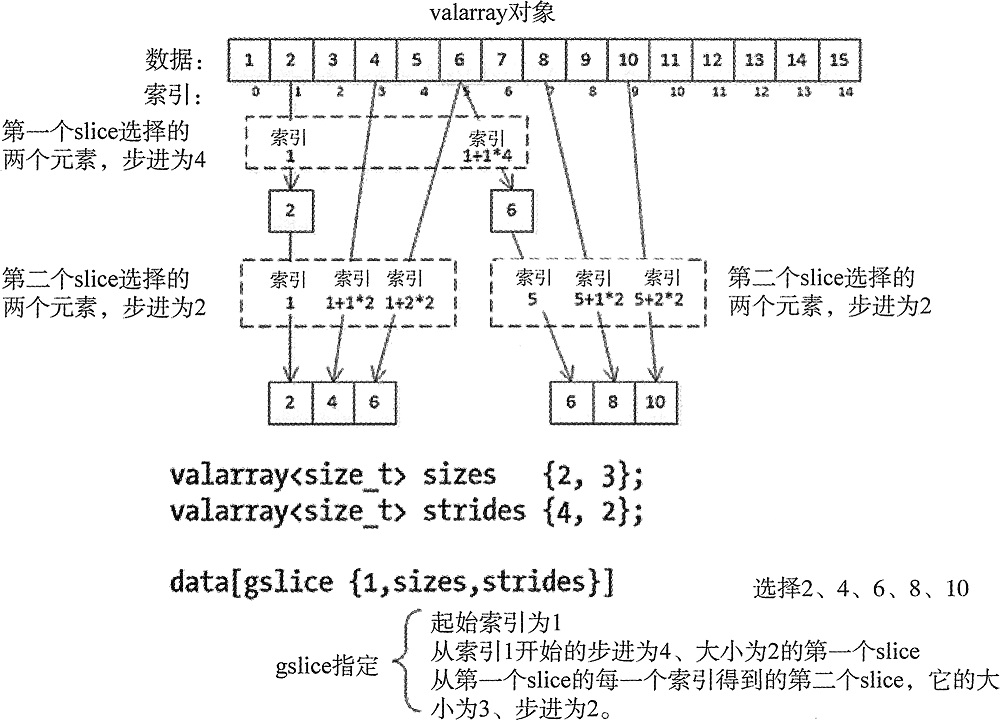

# 1. valarray

- [1. valarray](#1-valarray)
  - [1.1. 简介](#11-简介)
  - [1.2. 函数介绍](#12-函数介绍)
    - [1.2.1. 构造函数](#121-构造函数)
    - [1.2.2. 成员函数](#122-成员函数)
    - [1.2.3. 指数函数](#123-指数函数)
    - [1.2.4. 幂函数](#124-幂函数)
    - [1.2.5. 三角函数](#125-三角函数)
    - [1.2.6. 双曲线函数](#126-双曲线函数)
  - [1.3. 辅助类](#13-辅助类)
    - [1.3.1. slice](#131-slice)
    - [1.3.2. slice_array](#132-slice_array)
    - [1.3.3. gslice](#133-gslice)
    - [1.3.4. gslice_array](#134-gslice_array)
    - [1.3.5. mask_array](#135-mask_array)
    - [1.3.6. indirect_array](#136-indirect_array)
  - [1.4. 参考资料](#14-参考资料)

## 1.1. 简介

&emsp;&emsp;valarray是表示和操作值数组的类。它支持元素级的数学运算和各种形式的广义下标运算符、切片和间接访问。

&emsp;&emsp;定义在 valarray 头文件中的 valarray 类模板定义了保存和操作数值序列的对象的类型，主要用来处理整数和浮点数，但也能够用来保存类类型的对象，只要类满足一些条件：

- 类不能是抽象的。
- public 构造函数必须包含默认的构造函数和拷贝构造函数。
- 析构函数必须是 public。
- 类必须定义赋值运算符，而且必须是public。
- 类不能重载 operator&()。
- 成员函数不能拋出异常。
- 不能保存引用或 valarray 中用 const、volatile 修饰的对象。

如果类满足所有这些约束，就可以使用它了。

&emsp;&emsp;valarray 模板为数值数据处理提供的功能比任何序列容器（例如 vector）都多。

- 首先，最重要的是，它被设计为允许编译器以一种不应用到序列容器的方式来优化它的操作性能。但是，编译器是否优化并不依赖 valarray 操作的实现。
- 其次，有相当数量的一元和二元运算都是应用到 valarray 对象的内置类型上的。然后，有相当数量的内置一元函数可以将定义在 cmath 头文件中的运算应用到每个元素上。最后，valarray 类型内置提供了将数据作为多维数组使用的能力。

valarray大小制定后，不可以改变

## 1.2. 函数介绍

### 1.2.1. 构造函数

生成一个 valarray 对象很容易。下面是一些示例：

```C++
std::valarray<int> numbers (15); // 15 elements with default initial values 0
std::valarray<size_t> sizes {1, 2, 3}; // 3 elements with values 1 2 and 3
std::valarray<size_t> copy_sizes {sizes}; // 3 elements with values 1 2 and 3
std::valarray<double> values;  // Empty array
std::valarray<double> data(3.14, 10); // 10 elements with values 3.14
```

每个构造函数都生成了有给定元素数目的对象。在最后一条语句中，使用圆括号来定义 data 是必要的；如果使用花括号，data 会包含 3.14 和 10 两个元素。也可以用从普通数组得到的一定个数的值来初始化 valarray 对象。例如：

```C++
int vals[] {2, 4, 6, 8, 10, 12, 14};
std::valarray<int> valsl {vals, 5};   // 5 elements from vals: 2 4 6 8 10
std::valarray<int> vals2 {vals + 1, 4}; // 4 elements from vals: 4 6 8 10
```

后面会介绍其他的构造函数，因为它们有一些必须解释的参数类型。

### 1.2.2. 成员函数

| 函数名称      | 说明                                                                               | 类型                   |
| ------------- | ---------------------------------------------------------------------------------- | ---------------------- |
| (constructor) | 构造函数                                                                           | public member function |
| (destructor)  | 析构函数                                                                           | 同上                   |
| operator=     | 等号赋值                                                                           | 同上                   |
| operator[]    | get/set valarray element, slice, or mask                                           | 同上                   |
| operator+     | 应用一元数字操作符到每个元素 结果是一个 `valarray<bool>` 类型的对象                | 同上                   |
| operator-     | 同上                                                                               | 同上                   |
| operator~     | 同上                                                                               | 同上                   |
| operator!     | 同上                                                                               | 同上                   |
| operator+=    | 将复合赋值运算符应用于valarray的每个元素                                           | 同上                   |
| operator-=    | 同上                                                                               | 同上                   |
| operator*=    | 同上                                                                               | 同上                   |
| operator/=    | 同上                                                                               | 同上                   |
| operator%=    | 同上                                                                               | 同上                   |
| operator&=    | 同上                                                                               | 同上                   |
| operator=     | 同上                                                                               | 同上                   |
| operator^=    | 同上                                                                               | 同上                   |
| operator<<=   | 同上                                                                               | 同上                   |
| operator>>=   | 同上                                                                               | 同上                   |
| swap          | 交换二个valarray，元素大小可以不一样，但是类型需要一样                             | 同上                   |
| size          | returns the size of valarray                                                       | 同上                   |
| resize        | 改变大小，如果原来有内容，删除                                                     | 同上                   |
| sum           | 求和，它是使用 += 运算符计算出来的                                                 | 同上                   |
| min           | 返回最小值，元素必须是支持 operator<() 的类型                                      | 同上                   |
| max           | 返回最大值，条件同上                                                               | 同上                   |
| shift         | 所有元素指定count大小生成新的vararray，count为正数左移，为负数右移，空缺位补默认值 | 同上                   |
| cshift        | 同上，只是空缺位循环填充                                                           | 同上                   |
| apply         | 所有元素作用在指定函数上得到心得vararray                                           | 同上                   |

### 1.2.3. 指数函数

| 函数名称             | 说明                                                        | 类型              |
| -------------------- | ----------------------------------------------------------- | ----------------- |
| exp(std::valarray)   | applies the function std::exp to each element of valarray   | function template |
| log(std::valarray)   | applies the function std::log to each element of valarray   | 同上              |
| log10(std::valarray) | applies the function std::log10 to each element of valarray | 同上              |

### 1.2.4. 幂函数

| 函数名称            | 说明                                                                     | 类型              |
| ------------------- | ------------------------------------------------------------------------ | ----------------- |
| pow(std::valarray)  | applies the function std::pow to two valarrays or a valarray and a value | function template |
| sqrt(std::valarray) | applies the function std::sqrt to each element of valarray               | 同上              |

### 1.2.5. 三角函数

| 函数名称             | 说明                                                       | 类型              |
| -------------------- | ---------------------------------------------------------- | ----------------- |
| sin(std::valarray)   | applies the function std::sin to each element of valarray  | function template |
| cos(std::valarray)   | applies the function std::cos to each element of valarray  | 同上              |
| tan(std::valarray)   | applies the function std::tan to each element of valarray  | 同上              |
| asin(std::valarray)  | applies the function std::asin to each element of valarray | 同上              |
| acos(std::valarray)  | applies the function std::acos to each element of valarray | 同上              |
| atan(std::valarray)  | applies the function std::atan to each element of valarray | 同上              |
| atan2(std::valarray) | applies the function std::atan2 to a valarray and a value  | 同上              |

### 1.2.6. 双曲线函数

| 函数名称            | 说明                                                       | 类型              |
| ------------------- | ---------------------------------------------------------- | ----------------- |
| sinh(std::valarray) | applies the function std::sinh to each element of valarray | function template |
| cosh(std::valarray) | applies the function std::cosh to each element of valarray | 同上              |
| tanh(std::valarray) | applies the function std::tanh to each element of valarray | 同上              |

## 1.3. 辅助类

| 类名称         | 说明                                                                            | 类型           |
| -------------- | ------------------------------------------------------------------------------- | -------------- |
| slice          | BLAS-like slice of a valarray: starting index, length, stride                   | class          |
| slice_array    | proxy to a subset of a valarray after applying a slice                          | class template |
| gslice         | generalized slice of a valarray: starting index, set of lengths, set of strides | class          |
| gslice_array   | proxy to a subset of a valarray after applying a gslice                         | class template |
| mask_array     | proxy to a subset of a valarray after applying a boolean mask operator[]        | 同上           |
| indirect_array | proxy to a subset of a valarray after applying indirect operator[]              | 同上           |

### 1.3.1. slice

slice是一个选择器类，它标识std::valarray的一个子集。类型std::slice的对象包含三个值:起始索引、步长和子集中值的总数。类型为std::slice的对象可以使用valarray的操作符[]作为索引。

```C++
//默认构造函数，//等价于slice(0, 0, 0)
slice()
//带参构造函数，start其实位置，size个数，stride步长 
// start + 0*stride
// start + 1*stride
// ...
// start + (size-1)*stride
slice( std::size_t start, std::size_t size, std::size_t stride );
//拷贝构造
slice( const slice& other );

//成员函数
std::size_t start() const;
std::size_t size() const;
std::size_t stride() const;
```

### 1.3.2. slice_array

slice_array是std::slice下标操作符使用的一个帮助模板。它具有对std::slice对象指定的数组子集的引用语义。
成员函数
| 函数名称      | 说明                     | 类型                     |
| ------------- | ------------------------ | ------------------------ |
| (constructor) | constructs a slice_array | (public member function) |
| (destructor)  | destroys a slice_array   | (public member function) |
| operator=     | assigns contents         | (public member function) |
| operator+=    | 作用于每个元素           | (public member function) |
| operator-=    | 同上                     | 同上                     |
| operator*=    | 同上                     | 同上                     |
| operator/=    | 同上                     | 同上                     |
| operator%=    | 同上                     | 同上                     |
| operator&=    | 同上                     | 同上                     |
| `operator|=`  | 同上                     | 同上                     |
| operator^=    | 同上                     | 同上                     |
| operator<<=   | 同上                     | 同上                     |
| operator>>=   | 同上                     | 同上                     |

### 1.3.3. gslice

&emsp;&emsp;gslice是一个选择器类，它标识由多级步长和大小集定义的std::valarray索引的一个子集。类型为std::gslice的对象可以作为索引使用valarray的操作符[]来选择，例如，用valarray表示的多维数组的列。可以是认为是group slice,多个slice的组合。

```C++
//构造函数
gslice()
gslice( std::size_t start, const std::valarray<std::size_t>& sizes,
                           const std::valarray<std::size_t>& strides );
gslice( const gslice& other );

//成员函数
std::size_t start() const;
std::valarray<std::size_t> size() const;
std::valarray<std::size_t> stride() const;
```

&emsp;&emsp;可以看做是slice的扩展，slice的构造函数是`slice( std::size_t start, std::size_t size, std::size_t stride );`而gslice将size和stride换成了vararray数组形式，也就是可以同时生成多个slice。slice一般可以表示矩阵的一行或一列，而gslice可以表示矩阵的多行多列，也就是另一个矩阵。

如何构造如下图：


```C++
//说明：data是一个3*5的二维数组  
[1, 2, 3, 4, 5,  
 6, 7, 8, 9, 10,  
 11,12,15,14,15]  
valarray<size_t> sizes {2, 3}; //gslice为2*3(2行3列)的矩阵
valarray<size_t> strides {4, 2}; //行步长是4，列步长是2
data[gslice{1,sizes,strides}] //起始索引位置为1
```

- 第一步：确定行索引
  - 第一行起始索引：start参数就是第一行的起始索引，这是是1(内容为2)
  - 第二行起始索引：行步长为4，所以第二行的索引是1+4=5(内容为6).也就是第一行索引+4
- 第二步
  - 第一行的后续内容：每一行有3个元素，间隔为2，索引对应索引是（1，3，5）
  - 第二行的后续内容：每一行有3个元素，间隔为2，索引对应索引是（6，8，10）
- 索引最后内容结果是：[2, 4, 6, 6, 8, 10]

### 1.3.4. gslice_array

gslice_array是std::gslice下标操作符使用的一个帮助模板。它具有对std::gslice对象指定的数组子集的引用语义。

成员函数
| 函数名称      | 说明                     | 类型                     |
| ------------- | ------------------------ | ------------------------ |
| (constructor) | constructs a slice_array | (public member function) |
| (destructor)  | destroys a slice_array   | (public member function) |
| operator=     | assigns contents         | (public member function) |
| operator+=    | 作用于每个元素           | (public member function) |
| operator-=    | 同上                     | 同上                     |
| operator*=    | 同上                     | 同上                     |
| operator/=    | 同上                     | 同上                     |
| operator%=    | 同上                     | 同上                     |
| operator&=    | 同上                     | 同上                     |
| `operator|=`  | 同上                     | 同上                     |
| operator^=    | 同上                     | 同上                     |
| operator<<=   | 同上                     | 同上                     |
| operator>>=   | 同上                     | 同上                     |

### 1.3.5. mask_array

mask_array是一个帮助模板，由valarray下标操作符使用`std::valarray<bool>`参数。它具有引用语义，并提供对valarray的子集的访问，这些元素的索引对应于`std::valarray<bool>`掩码中的真值。

```C++
#include <iostream>
#include <valarray>

int main()
{
    std::valarray<int> data = {0,1,2,3,4,5,6,7,8,9};

    std::cout << "Initial valarray: ";
    for(int n: data) std::cout << n << ' ';
    std::cout << '\n';

    data[data > 5] = -1;
    // the type of data>5 is std::valarray<bool>
    // the type of data[data>5] is std::mask_array<int>

    std::cout << "After v[v>5]=-1:  ";
    for(int n: data) std::cout << n << ' ';
    std::cout << '\n';

    //Output
    //Initial valarray: 0 1 2 3 4 5 6 7 8 9
    //After v[v>5]=-1:  0 1 2 3 4 5 -1 -1 -1 -1
}
```

成员函数
| 函数名称      | 说明                     | 类型                     |
| ------------- | ------------------------ | ------------------------ |
| (constructor) | constructs a slice_array | (public member function) |
| (destructor)  | destroys a slice_array   | (public member function) |
| operator=     | assigns contents         | (public member function) |
| operator+=    | 作用于每个元素           | (public member function) |
| operator-=    | 同上                     | 同上                     |
| operator*=    | 同上                     | 同上                     |
| operator/=    | 同上                     | 同上                     |
| operator%=    | 同上                     | 同上                     |
| operator&=    | 同上                     | 同上                     |
| `operator|=`  | 同上                     | 同上                     |
| operator^=    | 同上                     | 同上                     |
| operator<<=   | 同上                     | 同上                     |
| operator>>=   | 同上                     | 同上                     |

### 1.3.6. indirect_array

gslice_array是std::indirect_array下标操作符使用的一个帮助模板。它具有对间接数组(`std::valarray<std::size_t>`对象)指定的数组子集的引用语义。

```C++
#include <iostream>
#include <valarray>

int main()
{
    std::valarray<int> data = {0,1,2,3,4,5,6,7,8,9};
    std::valarray<std::size_t> idx = {0,2,4,6,8};

    std::cout << "Original valarray: ";
    for(int n: data) std::cout << n << ' ';
    std::cout << '\n';

    data[idx] += data[idx]; // 双数索引位置相加

    // the type of data[idx] is std::indirect_array<int>
    std::cout << "After indirect modification: ";
    for(int n: data) std::cout << n << ' ';
    std::cout << '\n';
}
//Output:
//Original valarray: 0 1 2 3 4 5 6 7 8 9 
//After indirect modification: 0 1 4 3 8 5 12 7 16 9
```

## 1.4. 参考资料

1. [std::valarray](https://en.cppreference.com/w/cpp/numeric/valarray)
2. [C++ valarray用法（对象初始化和成员函数）详解](http://c.biancheng.net/view/688.html)
3. [C++ valarray对象适用运算符详解](http://c.biancheng.net/view/691.html)
4. [C++ valarray获取（访问）对象方法详解](http://c.biancheng.net/view/693.html)
5. [C++ gslice类用法详解](http://c.biancheng.net/view/696.html)
6. [slice](https://en.cppreference.com/w/cpp/numeric/valarray/slice)