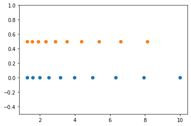
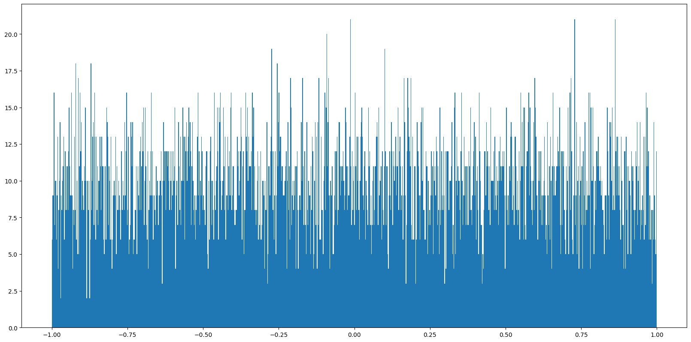
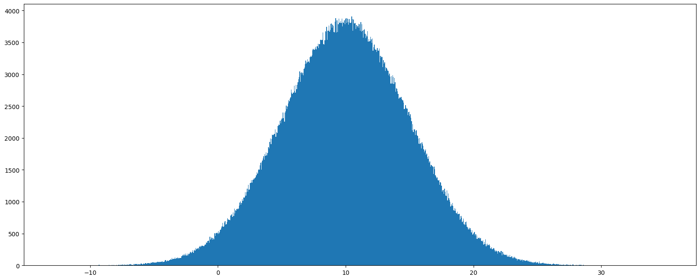

[TOC]

# 一、Numpy的优势:
## 1.Numpy介绍:

### 1.1 优势:
- Numpy(Numerical Python)是一个开源的Python科学计算库，用于快速处理任意维度的数组。
- Numpy支持常见的数组和矩阵操作。对于同样的数值计算任务，使用Numpy比直接使用Python要简洁的多。
- Numpy使用ndarray对象来处理多维数组，该对象是一个快速而灵活的大数据容器。
- Numpy是集成C / C++和Fortran代码的工具
- Numpy是众多机器学习框架的基础库(Scipy/Pandas/scikit-learn/Tensorflow)

### 1.2 文档:
- 官方文档:  https://numpy.org/doc/
- 中文文档:  https://www.numpy.org.cn/article/basics/python_numpy_tutorial.html


## 2. ndarray(任意纬度的数组)介绍:
```python
NumPy provides an N-dimensional array type, the ndarray, which describes a collection of “items” of the same type.
```

NumPy提供了一个**N纬数组类型ndarray**, 他描述了**相同类型**的items的集合。

np.array对象:

```python
numpy.array(object, dtype = None, copy = True, order = None, subok = False, ndmin = 0)
```
- 参数说明:
    - object：任何暴露数组接口方法的对象都会返回一个数组或任何（嵌套）序列。
    - dtype：数组的所需数据类型，可选。
    - copy：默认为true，对象是否被复制，可选。
    - order：C（按行）、F（按列）或A（任意，默认）。
    - subok：默认情况下，返回的数组被强制为基类数组。 如果为true，则返回子类。
    - ndmin：指定返回数组的最小维数。

| 语文 | 数学 | 英语 | 政治 | 体育 |
| ---- | ---- | ---- | ---- | ---- |
| 80   | 89   | 86   | 67   | 79   |
| 78   | 97   | 89   | 67   | 81   |
| 90   | 94   | 78   | 67   | 74   |
| 91   | 91   | 90   | 67   | 69   |
| 76   | 86   | 75   | 67   | 86   |
| 70   | 79   | 84   | 67   | 84   |
| 94   | 92   | 93   | 67   | 64   |
| 86   | 85   | 83   | 67   | 80   |

用ndarray进行存储:


```python

```


```python
import numpy as np
# 创建ndarray
score = np.array([
    [80, 89, 86, 67, 79],
    [78, 97, 89, 67, 81],
    [90, 94, 78, 67, 74],
    [91, 91, 90, 67, 69],
    [76, 87, 75, 67, 86],
    [70, 79, 84, 67, 84],
    [94, 92, 93, 67, 64],
    [86, 85, 83, 67, 80]
])
# 返回结果:
score
```


    array([[80, 89, 86, 67, 79],
           [78, 97, 89, 67, 81],
           [90, 94, 78, 67, 74],
           [91, 91, 90, 67, 69],
           [76, 87, 75, 67, 86],
           [70, 79, 84, 67, 84],
           [94, 92, 93, 67, 64],
           [86, 85, 83, 67, 80]])


使用Python列表可以存储一维数组，通过列表的嵌套可以实现多维数组，那么为什么还需要使用Numpy的ndarray呢？
## 3.ndarray与Python原生list运算效率对比:


```python
import random
import time
import numpy as np


a = [random.random() for _ in range(100000000)]

t1 = time.time()
sum1=sum(a)
t2=time.time()
print(f'使用原生list表示:{t2-t1}, 结果为:{sum1}')

b=np.array(a)
t4=time.time()
sum3=np.sum(b)
t5=time.time()
print(f'使用numpy数组表示{t5-t4}, 结果为:{sum3}')
```

    使用原生list表示:0.40561366081237793, 结果为:49999948.824034154
    使用numpy数组表示0.037039756774902344, 结果为:49999948.82402478


t2-t1为使用python自带的求和函数消耗的时间，t5-t4为使用numpy求和消耗的时间，结果为：
```python
0.923250675201416 0.2041323184967041
```
从中看到ndarray的计算速度要快很多，节约了时间。

**机器学习的最大特点就是大量的数据运算**，那么如果没有一个快速的解决方案，那可能现在python也在机器学习领域达不到好的效果。

Numpy专门针对ndarray的操作和运算进行了设计，所以数组的存储效率和输入输出性能远优于Python中的嵌套列表，数组越大，Numpy的优势就越明显。
## 4. ndarray的优势:
### 4.1  内存块风格
ndarray到底跟原生python列表有什么不同呢，请看一张图：

从图中可以看出ndarray在存储数据的时候，数据与数据的地址都是连续的，这样就给使得批量操作数组元素时速度更快。

这是因为ndarray中的所有元素的类型都是相同的，而Python列表中的元素类型是任意的，所以ndarray在存储元素时内存可以连续，而python原生lis就t只能通过寻址方式找到下一个元素，这虽然也导致了在通用性能方面Numpy的ndarray不及Python原生list，但在科学计算中，Numpy的ndarray就可以省掉很多循环语句，代码使用方面比Python原生list简单的多。
### 4.2  ndarray支持并行化运算（向量化运算）
### 4.3 Numpy底层使用C语言编写，内部解除了GIL（全局解释器锁），其对数组的操作速度不受Python解释器的限制，效率远高于纯Python代码。

# 二、认识N维数组-ndarray属性:
## 1.ndarray的属性
数组属性反映了数组本身固有的信息。

| 属性名字         | 属性解释                 |
| ---------------- | ------------------------ |
| ndarray.shape    | 数组纬度的元组           |
| ndarray.ndim     | 数组的组数               |
| ndarray.size     | 数组中元素的数量         |
| ndarray.itemsize | 一个数组元素的长度(字节) |
| ndarray.dtype    | 数组元素的类型           |

## 2. ndarray的形状:
首先创建一些数组。


```python
# import numpy as np
# 创建以下不同形状的数组
a = np.array([
    [1,2,3],
    [4,5,6]
])
b = np.array([1,2,3,4])
c = np.array([
    [
        [1,2,3],
        [4,5,6]
    ],
    [
        [7,8,9],
        [10,11,12]
    ]
])

# 分别打印出形状
print(f"a的形状为:{a.shape}")
print(f"b的形状为:{b.shape}")
print(f"c的形状为:{c.shape}")
print("="*30)
# 分别打印出纬度:
print(f"a的纬度为:{a.ndim}")
print(f"b的纬度为:{b.ndim}")
print(f"c的纬度为:{c.ndim}")
print("="*30)
# 数据类型
print(f"a的数据类型:{a.dtype}")
print("="*30)
# 元素的长度
print(f"a的元素的长度:{a.itemsize}个字节")

```

    a的形状为:(2, 3)
    b的形状为:(4,)
    c的形状为:(2, 2, 3)
    ==============================
    a的纬度为:2
    b的纬度为:1
    c的纬度为:3
    ==============================
    a的数据类型:int64
    ==============================
    a的元素的长度:8个字节


**如何理解数组的形状:**
二维数组:

三维数组:


## 3.ndarray的类型:


```python
type(score.dtype)
```


    numpy.dtype


dtype是numpy.dtype类型，先看看对于数组来说都有哪些类型

|名称|描述|	简写|
|-:-|-:-|-:-|
|np.bool|	用一个字节存储的布尔类型（True或False）|	'b'|
|np.int8|	一个字节大小，-128 至 127|	'i'|
|np.int16|	整数，-32768 至 32767|	'i2'|
|**np.int32**|	整数，-2 31 至 2 32 -1	|'i4'|
|**np.int64**|	整数，-2 63 至 2 63 - 1|	'i8'|
|**np.uint8**|	(常用于存储图片)无符号整数，0 至 255	|'u'|
|np.uint16|	无符号整数，0 至 65535	|'u2'|
|np.uint32|	无符号整数，0 至 2 ** 32 - 1|	'u4'|
|np.uint64|	无符号整数，0 至 2 ** 64 - 1|	'u8'|
|np.float16|	半精度浮点数：16位，正负号1位，指数5位，精度10位|	'f2'|
|**np.float32**|	单精度浮点数：32位，正负号1位，指数8位，精度23位|	'f4'|
|**np.float64**|	双精度浮点数：64位，正负号1位，指数11位，精度52位|	'f8'|
|np.complex64|	复数，分别用两个32位浮点数表示实部和虚部|	'c8'|
|np.complex128|	复数，分别用两个64位浮点数表示实部和虚部|	'c16'|
|**np.object_**|	python对象|	'O'|
|**np.string_**|	字符串|	'S'|
|**np.unicode_**|	unicode类型|	'U'|


### 3.1创建数组时指定类型:


```python
import numpy as np
a = np.array([[1, 2, 3],[4, 5, 6]], dtype=np.float32)
a.dtype
a
```


    array([[1., 2., 3.],
           [4., 5., 6.]], dtype=float32)


```python
b = np.array(["numpy", "python", "tensorflow"])
b.dtype
b
```


    array(['numpy', 'python', 'tensorflow'], dtype='<U10')


# 三、基本操作:
## 1.生成数组的方法:
### 1.1 生成0和1的数组:

- empty(shape[, dtype, order]) 
    - 生成初始化数组
    - 参数:
        - shape: 形状
        - dtype: 数据类型
        - order: 'C'为按C语言风格数组; 'F'为按Fortran风格数组


```python
ret = np.empty((4,3))
ret
```


    array([[6.95167365e-310, 6.95167365e-310, 0.00000000e+000],
           [0.00000000e+000, 0.00000000e+000, 0.00000000e+000],
           [0.00000000e+000, 0.00000000e+000, 0.00000000e+000],
           [0.00000000e+000, 0.00000000e+000, 0.00000000e+000]])


```python
ret[0][0]
```


    6.9516736507106e-310


```python
ret = np.empty((4,3), order='C')
ret
```


    array([[6.95167365e-310, 6.95167365e-310, 0.00000000e+000],
           [0.00000000e+000, 0.00000000e+000, 0.00000000e+000],
           [0.00000000e+000, 0.00000000e+000, 0.00000000e+000],
           [0.00000000e+000, 0.00000000e+000, 0.00000000e+000]])


```python
ret = np.empty((4,3), order='F')
ret
```


    array([[6.95167365e-310, 0.00000000e+000, 0.00000000e+000],
           [6.95167365e-310, 0.00000000e+000, 0.00000000e+000],
           [0.00000000e+000, 0.00000000e+000, 0.00000000e+000],
           [0.00000000e+000, 0.00000000e+000, 0.00000000e+000]])


- empty_like(prototype[, dtype, order,subok]) 
    - 生成初始化数组
    - 参数:
        - prototype: prototype:array类似于prototype的形状和数据类型，定义返回数组的这些相同属性
        - dtype: 数据类型
        - order: 'C'为按C语言风格数组; 'F'为按Fortran风格数组
        - subok: subok: 如果为True，则新创建的数组将使用子类类型“a”，否则它将是基类数组。默认为True


```python
ret = np.empty_like([[1,2,3],[4,5,6],[7,8,9]])
ret
```


    array([[139924806994856, 139924806994856,               0],
           [              0,               0,               0],
           [139923641112304,              33,        29433056]])


```python

```

- identity(n[, dtype])
    - 函数返回给定大小的单位数组。单位数组是主对角线元素都为 1 的方阵。
    - 参数:
        - n: nxn的数组
        - dtype: 数据类型


```python
ret = np.identity(10)
ret
```


    array([[1., 0., 0., 0., 0., 0., 0., 0., 0., 0.],
           [0., 1., 0., 0., 0., 0., 0., 0., 0., 0.],
           [0., 0., 1., 0., 0., 0., 0., 0., 0., 0.],
           [0., 0., 0., 1., 0., 0., 0., 0., 0., 0.],
           [0., 0., 0., 0., 1., 0., 0., 0., 0., 0.],
           [0., 0., 0., 0., 0., 1., 0., 0., 0., 0.],
           [0., 0., 0., 0., 0., 0., 1., 0., 0., 0.],
           [0., 0., 0., 0., 0., 0., 0., 1., 0., 0.],
           [0., 0., 0., 0., 0., 0., 0., 0., 1., 0.],
           [0., 0., 0., 0., 0., 0., 0., 0., 0., 1.]])


```python

```

- eye(N[, M, k, dtype,order])
    - 返回一个数组，对角线元素为 1，其他位置为0
    - 参数:
        - N: 行数
        - M: 列数(默认为N)
        - k: 对角线的索引;
        - dtype: 数据类型;
        - order: 'C'为按C语言风格数组; 'F'为按Fortran风格数组


```python
ret = np.eye(3,k=2)
ret
```


    array([[0., 0., 1.],
           [0., 0., 0.],
           [0., 0., 0.]])


```python

```

- ones(shape[, dtype, order])
    - 返回一个全是1的数组
    - 参数:
        - shape:形状;
        - dtype: 类型;
        - order: 风格;


```python
ret = np.ones((3,4))
ret
```


    array([[1., 1., 1., 1.],
           [1., 1., 1., 1.],
           [1., 1., 1., 1.]])


```python

```

- ones_like(a[, dtype, order, subok])
    - 返回与给定数组具有相同形状和类型的数组。
        - 参数:
            - a:python数组;
            - subok: 如果为True，则新创建的数组将使用子类类型“a”，否则它将是基类数组。默认为True


```python
ret = np.ones_like([[1,2,3],[4,5,6]])
ret
```


    array([[1, 1, 1],
           [1, 1, 1]])


```python

```

- zeros(shape[, dtype, order])
    - 返回一个全是0的数组
- zeros_like(a[, dtype, order, subok])
    - 返回一个与a形状的全是0的数组
 


```python
ret = np.zeros((4,3))
ret
```


    array([[0., 0., 0.],
           [0., 0., 0.],
           [0., 0., 0.],
           [0., 0., 0.]])


```python
ret.dtype
```


    dtype('float64')


```python

```

- full(shape, fill_value[, dtype, order])
    - 返回给定形状和类型的新数组，并用“fill_value”填充。
- full_like(a, fill_value[, dtype, order, subok])
    - 返回a形状和类型的新数组，并用“fill_value”填充。


```python
ret = np.full((3,4),6)
ret
```


    array([[6, 6, 6, 6],
           [6, 6, 6, 6],
           [6, 6, 6, 6]])


```python

```

### 1.2 从现有数组生成
- **array(object[, dtype, copy, order, subok, ndmin])**
    - 创建np.array对象
    - 参数:
        - object: 转换的list;
        - dtype: 数据类型;
        - copy(bool): 
        - ndmin: 返回数组的最小维度
- **asarray(a[, dtype, order])**
    - 将输入转换为数组(浅拷贝)
- asanyarray(a[, dtype, order]) ascontiguousarray(a[, dtype])
    - 将输入转换为ndarray，但传递ndarray子类。
- asmatrix(data[, dtype])
    - 将输入解释为矩阵。不会复制输入矩阵或数组。相当于“matrix（data，copy=False）”
- **copy(a[, order])**
    - 深拷贝


```python
help(np.asmatrix)
```

    Help on function asmatrix in module numpy:
    
    asmatrix(data, dtype=None)
        Interpret the input as a matrix.
        
        Unlike `matrix`, `asmatrix` does not make a copy if the input is already
        a matrix or an ndarray.  Equivalent to ``matrix(data, copy=False)``.
        
        Parameters
        ----------
        data : array_like
            Input data.
        dtype : data-type
           Data-type of the output matrix.
        
        Returns
        -------
        mat : matrix
            `data` interpreted as a matrix.
        
        Examples
        --------
        >>> x = np.array([[1, 2], [3, 4]])
        
        >>> m = np.asmatrix(x)
        
        >>> x[0,0] = 5
        
        >>> m
        matrix([[5, 2],
                [3, 4]])
    


```python
arr = np.array(score)# 通过数组创建数组
arr
```


    array([[80, 89, 86, 67, 79],
           [78, 97, 89, 67, 81],
           [90, 94, 78, 67, 74],
           [91, 91, 90, 67, 69],
           [76, 87, 75, 67, 86],
           [70, 79, 84, 67, 84],
           [94, 92, 93, 67, 64],
           [86, 85, 83, 67, 80]])


```python
id(arr)
```


    139923640735984


```python
id(score)
```


    139923641073136


```python
m_arr = np.array(score, ndmin=6)  # 6维数组
m_arr
```


    array([[[[[[80, 89, 86, 67, 79],
               [78, 97, 89, 67, 81],
               [90, 94, 78, 67, 74],
               [91, 91, 90, 67, 69],
               [76, 87, 75, 67, 86],
               [70, 79, 84, 67, 84],
               [94, 92, 93, 67, 64],
               [86, 85, 83, 67, 80]]]]]])


```python

```


```python
print(id(score))
arr1 = np.asarray(score)# 浅拷贝,是一种引用关系
print(id(arr1))
arr1
```

    139923641073136
    139923641073136


    array([[80, 89, 86, 67, 79],
           [78, 97, 89, 67, 81],
           [90, 94, 78, 67, 74],
           [91, 91, 90, 67, 69],
           [76, 87, 75, 67, 86],
           [70, 79, 84, 67, 84],
           [94, 92, 93, 67, 64],
           [86, 85, 83, 67, 80]])


```python
print(id(score))
arr2 = np.copy(score)# 深拷贝
print(id(arr2))
arr2
```

    140703264483008
    140699856995872


    array([[80, 89, 86, 67, 79],
           [78, 97, 89, 67, 81],
           [90, 94, 78, 67, 74],
           [91, 91, 90, 67, 69],
           [76, 87, 75, 67, 86],
           [70, 79, 84, 67, 84],
           [94, 92, 93, 67, 64],
           [86, 85, 83, 67, 80]])


```python

```

**关于array和asarray的不同:**
1. 通过np.asarray方法生成的数组是一种引用的关系;
2. 通过np.array和np.copy方法创建的数组,相当于深拷贝;

#### 1.3 生成固定范围的数组
- 生成等间隔的序列: np.linspace (start, stop, num, endpoint, retstep, dtype)
    - 参数:
        - start 序列的起始值
        - stop 序列的终止值，如果endpoint为true，该值包含于序列中
        - num 要生成的等间隔样例数量，默认为50
        - endpoint 序列中是否包含stop值，默认为ture
        - retstep 如果为true，返回样例，以及连续数字之间的步长
        - dtype 输出ndarray的数据类型


```python
# 生成等间隔的数组
arr10 = np.linspace(-10,10,10, retstep=True, endpoint=False, dtype=np.int8)
arr10
```


    (array([-10,  -8,  -6,  -4,  -2,   0,   2,   4,   6,   8], dtype=int8), 2.0)


```python
arr10[0].dtype
```


    dtype('int8')


- 其它的还有
    - numpy.arange(start,stop, step, dtype)
        - 返回给定间隔内的等间距值。
    - numpy.logspace(start,stop, num, endpoint, base, dtype)
        - 返回在对数刻度上均匀分布的数字。


```python
np.arange(-10, 10, 3)
```


    array([-10,  -7,  -4,  -1,   2,   5,   8])


```python
import matplotlib.pyplot as plt
%matplotlib inline
N = 10
x1 = np.logspace(0.1, 1, N, endpoint=True)
x2 = np.logspace(0.1, 1, N, endpoint=False)
y = np.zeros(N)
plt.plot(x1, y, 'o')
plt.plot(x2, y + 0.5, 'o')
plt.ylim([-0.5, 1])
plt.show()
```





```python
help(np.logspace)
```

    Help on function logspace in module numpy:
    
    logspace(start, stop, num=50, endpoint=True, base=10.0, dtype=None, axis=0)
        Return numbers spaced evenly on a log scale.
        
        In linear space, the sequence starts at ``base ** start``
        (`base` to the power of `start`) and ends with ``base ** stop``
        (see `endpoint` below).
        
        .. versionchanged:: 1.16.0
            Non-scalar `start` and `stop` are now supported.
        
        Parameters
        ----------
        start : array_like
            ``base ** start`` is the starting value of the sequence.
        stop : array_like
            ``base ** stop`` is the final value of the sequence, unless `endpoint`
            is False.  In that case, ``num + 1`` values are spaced over the
            interval in log-space, of which all but the last (a sequence of
            length `num`) are returned.
        num : integer, optional
            Number of samples to generate.  Default is 50.
        endpoint : boolean, optional
            If true, `stop` is the last sample. Otherwise, it is not included.
            Default is True.
        base : float, optional
            The base of the log space. The step size between the elements in
            ``ln(samples) / ln(base)`` (or ``log_base(samples)``) is uniform.
            Default is 10.0.
        dtype : dtype
            The type of the output array.  If `dtype` is not given, infer the data
            type from the other input arguments.
        axis : int, optional
            The axis in the result to store the samples.  Relevant only if start
            or stop are array-like.  By default (0), the samples will be along a
            new axis inserted at the beginning. Use -1 to get an axis at the end.
        
            .. versionadded:: 1.16.0
        
        
        Returns
        -------
        samples : ndarray
            `num` samples, equally spaced on a log scale.
        
        See Also
        --------
        arange : Similar to linspace, with the step size specified instead of the
                 number of samples. Note that, when used with a float endpoint, the
                 endpoint may or may not be included.
        linspace : Similar to logspace, but with the samples uniformly distributed
                   in linear space, instead of log space.
        geomspace : Similar to logspace, but with endpoints specified directly.
        
        Notes
        -----
        Logspace is equivalent to the code
        
        >>> y = np.linspace(start, stop, num=num, endpoint=endpoint)
        ... # doctest: +SKIP
        >>> power(base, y).astype(dtype)
        ... # doctest: +SKIP
        
        Examples
        --------
        >>> np.logspace(2.0, 3.0, num=4)
        array([ 100.        ,  215.443469  ,  464.15888336, 1000.        ])
        >>> np.logspace(2.0, 3.0, num=4, endpoint=False)
        array([100.        ,  177.827941  ,  316.22776602,  562.34132519])
        >>> np.logspace(2.0, 3.0, num=4, base=2.0)
        array([4.        ,  5.0396842 ,  6.34960421,  8.        ])
        
        Graphical illustration:
        
        >>> import matplotlib.pyplot as plt
        >>> N = 10
        >>> x1 = np.logspace(0.1, 1, N, endpoint=True)
        >>> x2 = np.logspace(0.1, 1, N, endpoint=False)
        >>> y = np.zeros(N)
        >>> plt.plot(x1, y, 'o')
        [<matplotlib.lines.Line2D object at 0x...>]
        >>> plt.plot(x2, y + 0.5, 'o')
        [<matplotlib.lines.Line2D object at 0x...>]
        >>> plt.ylim([-0.5, 1])
        (-0.5, 1)
        >>> plt.show()
    


```python
np.arange(10)
```


    array([0, 1, 2, 3, 4, 5, 6, 7, 8, 9])


```python
np.arange(1,10,2)
```


    array([1, 3, 5, 7, 9])


### 1.4 生成随机数组:
- np.random模块
    - 均匀分布

        - np.random.rand(d0, d1, ..., dn):
            - 返回[0.0，1.0)内的一组均匀分布的数。

        - np.random.uniform(low=0.0, high=1.0, size=None)
            - 功能：从一个均匀分布[low,high)中随机采样，注意定义域是左闭右开，即包含low，不包含high.
            - 参数介绍:
                - low: 采样下界，float类型，默认值为0；
                - high: 采样上界，float类型，默认值为1；
                - size: 输出样本数目，为int或元组(tuple)类型，例如，size=(m,n,k), 则输出mnk个样本，缺省时输出1个值。
        
            - 返回值：ndarray类型，其形状和参数size中描述一致。

        - np.random.randint(low, high=None, size=None, dtype='l')
        从一个均匀分布中随机采样，生成一个整数或N维整数数组，取数范围：若high不为None时，取[low,high)之间随机整数，否则取值[0,low)之间随机整数。

补充：均匀分布

均匀分布（Uniform Distribution）是概率统计中的重要分布之一。顾名思义，均匀，表示可能性相等的含义。


```python
# 随机生成0~1之间均匀分布的数据:
[np.random.rand() for _ in range(5)]
```


    [0.8717360633822037,
     0.6730805918633668,
     0.2108965021258361,
     0.25516887719147363,
     0.20628955869951748]


```python
np.random.uniform(0,100, (4,3))
```


    array([[79.57229546, 20.43212571, 23.73865166],
           [10.61309527, 82.84346586, 35.25990094],
           [97.99058517, 69.39736414, 27.19670733],
           [92.39784996, 27.16057306,  4.48291463]])


```python

```


```python
np.random.randint(0,100,(4,3))
```


    array([[ 9, 55, 62],
           [32, 64, 79],
           [46, 78, 45],
           [14, 63, 74]])


```python
# 生成均匀分布的随机数组
x1 = np.random.uniform(-1,1,100000000)
x1
```


    array([-0.67253462, -0.18370637, -0.56145391, ..., -0.88201074,
           -0.04911583, -0.94841615])


```python
# 画图看分布情况
import matplotlib.pyplot as plt
%matplotlib inline
# 生成均匀分布的随机数
x1 = np.random.uniform(-1, 1, 10000)

# 画图看分布状况
# 1）创建画布
plt.figure(figsize=(20,10), dpi=100)

# 2）绘制直方图
plt.hist(x1, bins = 1000)

# 3）显示图像
plt.show()
```





- 正态分布
    - np.random.randn(d0, d1, …, dn)
        - 功能：从标准正态分布中返回一个或多个样本值
    - np.random.normal(loc=0.0, scale=1.0, size=None)
        - loc：float
            -此概率分布的均值（对应着整个分布的中心centre）
        - scale：float
             - 此概率分布的标准差（对应于分布的宽度，scale越大越矮胖，scale越小，越瘦高）
        - size：int or tuple of ints
            - 输出的shape，默认为None，只输出一个值
    - np.random.standard_normal(size=None)
        - 返回指定形状的标准正态分布的数组。
        
**补充：正态分布:**
1. 什么是正态分布
正态分布是一种概率分布。正态分布是具有两个参数μ和σ的连续型随机变量的分布，第一参数μ是服从正态分布的随机变量的均值，第二个参数σ是此随机变量的方差，所以正态分布记作N(μ，σ )。

2. 正态分布的应用
生活、生产与科学实验中很多随机变量的概率分布都可以近似地用正态分布来描述。

3. 正态分布特点
μ决定了其位置，其标准差σ。决定了分布的幅度。当μ = 0,σ = 1时的正态分布是标准正态分布。


标准差如何来？

    3.1 方差
    在概率论和统计学中衡量一组数据离散程度的度量
    


    其中M为平均值，n为数据总个数，S为标准差，S^2可以理解一个整体为方差


    3.2 标准差与方差的意义
    可以理解成数据的一个离散程度的衡量
    


```python
[np.random.randn() for _ in range(5)] # 服从标准正态分布的数组
```


    [-0.042331059480765966,
     0.8361717974339892,
     -1.2577532588023523,
     0.45687321088835925,
     0.3171956800877781]


```python
data = np.random.normal(size=1000000,)
data
```


    array([-0.98450065, -0.2229803 , -0.85738908, ...,  2.48742035,
           -0.50831292,  1.27754532])


```python
# 正态分布绘图
import matplotlib.pyplot as plt
z1 = np.random.normal(loc=10, scale=5, size=1000000,)# 均值为10, 标准差为5的正态分布 
# 创建画布
plt.figure(figsize=(20,8), dpi=100)

# 绘制图像
plt.hist(z1,bins=1000)

# 显示图像
plt.show()
```





## 2.案例：随机生成8x10的数组:

### 2.1 数据的创建


```python
import numpy as np
# 创建符合正态分布的8x10数据
change = np.random.normal(0, 1, (8, 10))
change
```


    array([[-0.20439759,  2.18655066,  1.00081148, -0.78524415,  0.54983616,
             0.132582  , -0.94968901, -0.81263941, -0.92458089, -0.07849146],
           [ 0.24259823,  1.02601287, -0.93447052,  1.1297538 , -0.21785088,
            -0.71903282,  0.53183759,  0.15430805,  0.22148237,  1.4355278 ],
           [ 1.7726767 , -0.21472632, -0.28218712, -0.44522535,  1.67689693,
            -0.66957872, -0.9668918 , -0.15910578, -1.46497273,  0.48457951],
           [-1.28180122,  0.29404085,  0.09230369,  0.02150004,  0.775104  ,
            -0.44805295, -1.12461215,  0.33175708, -1.05580122, -1.14539542],
           [-0.4120266 ,  0.57247872, -0.70541154, -1.0781004 ,  0.93831695,
             0.94669188,  1.3258231 ,  0.74412721,  0.76481105,  0.58490424],
           [ 0.61584258,  1.05646408, -0.00728139, -1.29969934, -0.32241833,
            -1.76556109,  0.94521513, -0.44770975, -1.17634745,  1.53609323],
           [ 1.71807786, -0.69353725,  1.5894029 ,  0.25992939,  0.44398414,
             0.74716372, -1.27504794, -0.79011085,  1.9557806 ,  1.35406829],
           [-0.60579009, -0.04458717, -0.79361992,  0.04436359, -2.0980827 ,
            -0.08406398,  1.93485624, -1.00171973,  0.46025373, -1.08019521]])


### 2.2 数组的索引、切片
- 获取第一组前3列


```python
# 二维数组,两个维度
change[0,:3]
```


    array([-0.20439759,  2.18655066,  1.00081148])


- 一维,二维,三维的数组如何索引?


```python
# 创建一个三维数组
a1 = np.array([[[1,2,3],[4,5,6]], [[7,8,9],[10,11,12]]])
# 返回结果
a1
```


    array([[[ 1,  2,  3],
            [ 4,  5,  6]],
    
           [[ 7,  8,  9],
            [10, 11, 12]]])


```python
a1.shape
```


    (2, 2, 3)


```python
# 索引切片
a1[0][1]
```


    array([4, 5, 6])


```python
a1[0,0]
```


    array([1, 2, 3])


```python
a1[0,0,0]
```


    1


### 2.3 形状修改:
需求：让刚才的数据行列互换
```python
ndarray.reshape(shape[, order]) Returns an array containing the same data with a new shape.
```


```python
# 在转换形状的时候,一定要注意数组的元素匹配
change.reshape([4,20])# 只是将形状进行了修改,但并没有进行行列的转换
```


    array([[-0.20439759,  2.18655066,  1.00081148, -0.78524415,  0.54983616,
             0.132582  , -0.94968901, -0.81263941, -0.92458089, -0.07849146,
             0.24259823,  1.02601287, -0.93447052,  1.1297538 , -0.21785088,
            -0.71903282,  0.53183759,  0.15430805,  0.22148237,  1.4355278 ],
           [ 1.7726767 , -0.21472632, -0.28218712, -0.44522535,  1.67689693,
            -0.66957872, -0.9668918 , -0.15910578, -1.46497273,  0.48457951,
            -1.28180122,  0.29404085,  0.09230369,  0.02150004,  0.775104  ,
            -0.44805295, -1.12461215,  0.33175708, -1.05580122, -1.14539542],
           [-0.4120266 ,  0.57247872, -0.70541154, -1.0781004 ,  0.93831695,
             0.94669188,  1.3258231 ,  0.74412721,  0.76481105,  0.58490424,
             0.61584258,  1.05646408, -0.00728139, -1.29969934, -0.32241833,
            -1.76556109,  0.94521513, -0.44770975, -1.17634745,  1.53609323],
           [ 1.71807786, -0.69353725,  1.5894029 ,  0.25992939,  0.44398414,
             0.74716372, -1.27504794, -0.79011085,  1.9557806 ,  1.35406829,
            -0.60579009, -0.04458717, -0.79361992,  0.04436359, -2.0980827 ,
            -0.08406398,  1.93485624, -1.00171973,  0.46025373, -1.08019521]])


- -1的运用,表示形状元组的某个数待定


```python
change.reshape([-1,20])#数组的形状被修改为:(4,20), -1表示通过待计算
```


    array([[-0.67463255, -0.55682492,  0.69708131, -0.24457656, -0.17611206,
             1.7343531 , -1.00934609, -0.04617682,  0.23490594,  0.5209573 ,
            -2.53288804, -0.70125479,  0.27229745, -0.7437157 ,  0.22185573,
            -0.48016924,  1.13160573,  2.08810576,  0.11293965,  0.72550906],
           [-2.1551984 ,  1.04945943, -1.59312051,  0.23715467,  0.2361525 ,
             0.59683766,  0.60959889, -1.64476287,  0.52223835, -0.54062954,
            -1.59171521, -0.24085126, -1.05425483,  0.44928343, -0.93432316,
             1.4004979 ,  1.11495077, -0.14263201,  0.93353774, -0.98457224],
           [ 0.86783382,  0.28940623,  0.35313321,  0.59245488,  1.75645708,
             0.42745958, -2.06370614, -0.54296625, -1.99523884,  0.63804495,
            -0.80680326, -1.89558854,  1.14596888,  0.90220809, -1.30346797,
             0.85410948,  0.83407347, -1.41166988,  2.44899363, -0.41813567],
           [-0.61040967,  0.33401561,  1.10114761, -0.21234687,  0.69742632,
             1.18998884,  0.18451999,  1.38694629,  1.00423007,  0.92489462,
             1.2569829 ,  1.18458192, -0.77109934, -0.50750022,  0.29354087,
            -1.55762194, -1.03905661,  0.58256928, -0.28058944, -0.661335  ]])


- ndarray.T 数组的转置
    - 将数组的行、列进行互换


```python
change.shape
```


    (8, 10)


```python
change.T.shape
```


    (10, 8)


```python
# 创建一个三维数组
a1 = np.array([[[1,2,3],[4,5,6]], [[7,8,9],[10,11,12]]])
# 返回结果
a1
```


    array([[[ 1,  2,  3],
            [ 4,  5,  6]],
    
           [[ 7,  8,  9],
            [10, 11, 12]]])


```python

```


```python
a1.T
```


    array([[[ 1,  7],
            [ 4, 10]],
    
           [[ 2,  8],
            [ 5, 11]],
    
           [[ 3,  9],
            [ 6, 12]]])


- **ndarray.resize(new_shape[, refcheck]) Change shape and size of array in-place.**
    - 没有返回值,直接修改原数组


```python
change.resize([4,20])
change
```


    array([[-0.20439759,  2.18655066,  1.00081148, -0.78524415,  0.54983616,
             0.132582  , -0.94968901, -0.81263941, -0.92458089, -0.07849146,
             0.24259823,  1.02601287, -0.93447052,  1.1297538 , -0.21785088,
            -0.71903282,  0.53183759,  0.15430805,  0.22148237,  1.4355278 ],
           [ 1.7726767 , -0.21472632, -0.28218712, -0.44522535,  1.67689693,
            -0.66957872, -0.9668918 , -0.15910578, -1.46497273,  0.48457951,
            -1.28180122,  0.29404085,  0.09230369,  0.02150004,  0.775104  ,
            -0.44805295, -1.12461215,  0.33175708, -1.05580122, -1.14539542],
           [-0.4120266 ,  0.57247872, -0.70541154, -1.0781004 ,  0.93831695,
             0.94669188,  1.3258231 ,  0.74412721,  0.76481105,  0.58490424,
             0.61584258,  1.05646408, -0.00728139, -1.29969934, -0.32241833,
            -1.76556109,  0.94521513, -0.44770975, -1.17634745,  1.53609323],
           [ 1.71807786, -0.69353725,  1.5894029 ,  0.25992939,  0.44398414,
             0.74716372, -1.27504794, -0.79011085,  1.9557806 ,  1.35406829,
            -0.60579009, -0.04458717, -0.79361992,  0.04436359, -2.0980827 ,
            -0.08406398,  1.93485624, -1.00171973,  0.46025373, -1.08019521]])


### 2.4 类型修改:
- ndarray.astype(type)


```python
c1= change.astype(np.int32)
c1.dtype
```


    dtype('int32')


```python
c1
```


    array([[ 0,  2,  1,  0,  0,  0,  0,  0,  0,  0,  0,  1,  0,  1,  0,  0,
             0,  0,  0,  1],
           [ 1,  0,  0,  0,  1,  0,  0,  0, -1,  0, -1,  0,  0,  0,  0,  0,
            -1,  0, -1, -1],
           [ 0,  0,  0, -1,  0,  0,  1,  0,  0,  0,  0,  1,  0, -1,  0, -1,
             0,  0, -1,  1],
           [ 1,  0,  1,  0,  0,  0, -1,  0,  1,  1,  0,  0,  0,  0, -2,  0,
             1, -1,  0, -1]], dtype=int32)


```python
c1.itemsize
```


    4


```python
change.itemsize
```


    8


- ndarray.tostring([order])或者ndarray.tobytes([order]) Construct Python bytes containing the raw data bytes in the array.
    - 转换成bytes, 将数组转化成二进制数据,如果需要将数组存储到本地文件中,需要转换成字符串


```python
arr = np.array([[[1, 2, 3], [4, 5, 6]], [[12, 3, 34], [5, 6, 7]]])
arr.tostring()
```


    b'\x01\x00\x00\x00\x00\x00\x00\x00\x02\x00\x00\x00\x00\x00\x00\x00\x03\x00\x00\x00\x00\x00\x00\x00\x04\x00\x00\x00\x00\x00\x00\x00\x05\x00\x00\x00\x00\x00\x00\x00\x06\x00\x00\x00\x00\x00\x00\x00\x0c\x00\x00\x00\x00\x00\x00\x00\x03\x00\x00\x00\x00\x00\x00\x00"\x00\x00\x00\x00\x00\x00\x00\x05\x00\x00\x00\x00\x00\x00\x00\x06\x00\x00\x00\x00\x00\x00\x00\x07\x00\x00\x00\x00\x00\x00\x00'


```python
temp = np.array([[1, 2, 3, 4],[3, 4, 5, 6]])
np.unique(temp)
```


    array([1, 2, 3, 4, 5, 6])


# 四、ndarray的运算:
## 1.逻辑判断:


```python
score
```


    array([[80, 89, 86, 67, 79],
           [78, 97, 89, 67, 81],
           [90, 94, 78, 67, 74],
           [91, 91, 90, 67, 69],
           [76, 87, 75, 67, 86],
           [70, 79, 84, 67, 84],
           [94, 92, 93, 67, 64],
           [86, 85, 83, 67, 80]])


```python
score > 80 # 条件判断
```


    array([[False,  True,  True, False, False],
           [False,  True,  True, False,  True],
           [ True,  True, False, False, False],
           [ True,  True,  True, False, False],
           [False,  True, False, False,  True],
           [False, False,  True, False,  True],
           [ True,  True,  True, False, False],
           [ True,  True,  True, False, False]])


```python
# 布尔索引
a = score[score > 80] # 将ture位置的数据拿出来
a[0] = 100
a
```


    array([100,  86,  97,  89,  81,  90,  94,  91,  91,  90,  87,  86,  84,
            84,  94,  92,  93,  86,  85,  83])


```python
score
```


    array([[80, 89, 86, 60, 60],
           [60, 97, 89, 60, 81],
           [90, 94, 60, 60, 60],
           [91, 91, 90, 60, 60],
           [60, 87, 60, 60, 86],
           [60, 60, 84, 60, 84],
           [94, 92, 93, 60, 60],
           [86, 85, 83, 60, 80]])


```python
# 布尔赋值
score[score < 80 ] = 60
score
```


    array([[80, 89, 86, 60, 60],
           [60, 97, 89, 60, 81],
           [90, 94, 60, 60, 60],
           [91, 91, 90, 60, 60],
           [60, 87, 60, 60, 86],
           [60, 60, 84, 60, 84],
           [94, 92, 93, 60, 60],
           [86, 85, 83, 60, 80]])


```python
score
```


    array([[80, 89, 86, 60, 60],
           [60, 97, 89, 60, 81],
           [90, 94, 60, 60, 60],
           [91, 91, 90, 60, 60],
           [60, 87, 60, 60, 86],
           [60, 60, 84, 60, 84],
           [94, 92, 93, 60, 60],
           [86, 85, 83, 60, 80]])


## 2. 通用判断函数:
- np.all()


```python
np.all(score < 0)# 所有元素都满足条件时,返回True, 有一个不满足就返回Flase
```


    False


- np.any()


```python
np.any(score > 70 )# 有一个满足条件的就返回True
```


    True


## 3.三元运算符(np.where):
通过使用np.where能够进行更加复杂的运算
三元运算符,满足条件做某个操作,不满足做另一种操作, 和if else语句类似
- np.where():有返回值


```python
np.where(score > 80, 1, 0) # 第二个和第三个参数,可以使整数,也可以是和要判断的数组形状相同的数组
```


    array([[0, 1, 1, 0, 0],
           [0, 1, 1, 0, 1],
           [1, 1, 0, 0, 0],
           [1, 1, 1, 0, 0],
           [0, 1, 0, 0, 1],
           [0, 0, 1, 0, 1],
           [1, 1, 1, 0, 0],
           [1, 1, 1, 0, 0]])


- 复合逻辑需要结合np.logical_and和np.logical_or使用:
范围操作


```python
np.where(np.logical_and(score>60, score<70),score,0)# 与操作
```


    array([[0, 0, 0, 0, 0],
           [0, 0, 0, 0, 0],
           [0, 0, 0, 0, 0],
           [0, 0, 0, 0, 0],
           [0, 0, 0, 0, 0],
           [0, 0, 0, 0, 0],
           [0, 0, 0, 0, 0],
           [0, 0, 0, 0, 0]])


```python
np.where(np.logical_or(score<70, score>80),score,0)# 或操作
```


    array([[ 0, 89, 86, 60, 60],
           [60, 97, 89, 60, 81],
           [90, 94, 60, 60, 60],
           [91, 91, 90, 60, 60],
           [60, 87, 60, 60, 86],
           [60, 60, 84, 60, 84],
           [94, 92, 93, 60, 60],
           [86, 85, 83, 60,  0]])


```python
np.where(np.logical_not(score>80), score,0)# 非操作
```


    array([[80,  0,  0, 60, 60],
           [60,  0,  0, 60,  0],
           [ 0,  0, 60, 60, 60],
           [ 0,  0,  0, 60, 60],
           [60,  0, 60, 60,  0],
           [60, 60,  0, 60,  0],
           [ 0,  0,  0, 60, 60],
           [ 0,  0,  0, 60, 80]])


- np.logical_xor()# 异或操作

## 4.统计运算:
### 4.1 统计指标:
在数据挖掘/机器学习领域，统计指标的值也是我们分析问题的一种方式。常用的指标如下：

- min(a[, axis, out, keepdims])# 最小值
    - Return the minimum of an array or minimum along an axis.
- max(a[, axis, out, keepdims])# 最大值
    - Return the maximum of an array or maximum along an axis.
- median(a[, axis, out, overwrite_input, keepdims])# 中位数
    - Compute the median along the specified axis.
- mean(a[, axis, dtype, out, keepdims])# 均值
    - Compute the arithmetic mean along the specified axis.
- std(a[, axis, dtype, out, ddof, keepdims]) # 标准差   
    - Compute the standard deviation along the specified axis.
- var(a[, axis, dtype, out, ddof, keepdims]) # 方差
    - Compute the variance along the specified axis.
   
进行统计的时候，**axis 轴的取值并不一定，Numpy中不同的API轴的值都不一样，在这里，axis 0代表列, axis 1代表行去进行统计**


```python
temp  =np.array([[1, 2, 3, 4],[3, 4, 5, 6]])
temp
```


    array([[1, 2, 3, 4],
           [3, 4, 5, 6]])


```python
# 接下来对于这个数据，进行一些统计运算
# [[1, 2, 3, 4],[3, 4, 5, 6]]
# 指定行 去统计
print("每行的最大值{}".format(np.max(temp, axis=1)))
# 使用min, std, mean
print("每行的最小值{}".format(np.min(temp, axis=1)))
print("每行的标准差{}".format(np.std(temp, axis=1)))
print("每行的均值{}".format(np.mean(temp, axis=1)))
```

    每行的最大值[4 6]
    每行的最小值[1 3]
    每行的标准差[1.11803399 1.11803399]
    每行的均值[2.5 4.5]


- np.argmax(temp, axis=)
    - 返回沿轴的最大值的索引
- np.argmin(temp, axis=)
    - 返回沿轴的最小值的索引

注:
- axis: 0:按列计算;1:按行计算;


```python
print("每行的最大值的索引{}".format(np.argmax(temp, axis=1)))
print("每列的最小值的索引{}".format(np.argmax(temp, axis=0)))
temp
```

    每行的最大值的索引[3 3]
    每列的最小值的索引[1 1 1 1]


    array([[1, 2, 3, 4],
           [3, 4, 5, 6]])


# 五、数组间的运算:
## 1.数组与数的运算:(矢量化运算)


```python
import numpy as np
arr = np.array([[1,2,3,4],[4,5,6,7]])
print(arr)
print(arr + 1)
print(arr * 2)
print(arr / 2)
```

    [[1 2 3 4]
     [4 5 6 7]]
    [[2 3 4 5]
     [5 6 7 8]]
    [[ 2  4  6  8]
     [ 8 10 12 14]]
    [[0.5 1.  1.5 2. ]
     [2.  2.5 3.  3.5]]


## 2. 数组与数组的运算:
### 2.1 形状相同的运算
必须是两个结构相同的数组才可做运算


```python
arr1 = np.array([[1,2,3,4], [5,6,7,8]])
arr2 = np.array([[4,5,6,7],[8,9,10,11]])
print(arr1)
print()
print(arr2)
print()
print(arr1 + arr2)
print()
print(arr1 / arr2)
print()
arr1 * arr2
```

    [[1 2 3 4]
     [5 6 7 8]]
    
    [[ 4  5  6  7]
     [ 8  9 10 11]]
    
    [[ 5  7  9 11]
     [13 15 17 19]]
    
    [[0.25       0.4        0.5        0.57142857]
     [0.625      0.66666667 0.7        0.72727273]]
    


    array([[ 4, 10, 18, 28],
           [40, 54, 70, 88]])


```python
import numpy as np
arr3 = np.array([[1,2,3,4,5,6,7,8,9], [10,11,12,13,14,15,16,17,18]])
print(arr3)
print(arr1 + arr3)# 两个结构不相同的数组不能做运算
```

    [[ 1  2  3  4  5  6  7  8  9]
     [10 11 12 13 14 15 16 17 18]]


    ---------------------------------------------------------------------------

    ValueError                                Traceback (most recent call last)

    <ipython-input-117-3d8b63f7505e> in <module>
          2 arr3 = np.array([[1,2,3,4,5,6,7,8,9], [10,11,12,13,14,15,16,17,18]])
          3 print(arr3)
    ----> 4 print(arr1 + arr3)# 两个结构不相同的数组不能做运算
    

    ValueError: operands could not be broadcast together with shapes (2,4) (2,9) 


## 3.广播机制:(形状不同的数组运算)
**执行 broadcast 的前提在于，两个 ndarray 执行的是 element-wise的运算，Broadcast机制的功能是为了方便不同形状的ndarray（numpy库的核心数据结构）进行数学运算。**

当操作两个数组时，numpy会逐个比较它们的shape（构成的元组tuple），只有在下述情况下，两个数组才能够进行数组与数组的运算。

- 维度相等
- shape（其中相对应的一个地方为1）

例如：
```python

Image (3d array):  256 x 256 x 3
Scale (1d array):              3
Result (3d array): 256 x 256 x 3

A      (4d array):  9 x 1 x 7 x 1
B      (3d array):      8 x 1 x 5
Result (4d array):  9 x 8 x 7 x 5

A      (2d array):  5 x 4
B      (1d array):      1
Result (2d array):  5 x 4

A      (3d array):  15 x 3 x 5
B      (3d array):  15 x 1 x 1
Result (3d array):  15 x 3 x 5

```
如果是下面这样的,则不匹配:
```python
A  (1d array): 10
B  (1d array): 12
A  (2d array):      2 x 1
B  (3d array):  8 x 4 x 3
```


## 4.矩阵运算:
### 4.1 什么是矩阵:
矩阵，英文matrix，**和array的区别矩阵必须是2维的，但是array可以是多维的。**

- np.mat()
    - 将数组转换成矩阵类型


```python
import numpy as np
a = np.array([[80, 86],
[82, 80],
[85, 78],
[90, 90],
[86, 82],
[82, 90],
[78, 80],
[92, 94]])
b = np.array([[0.7], [0.3]])
print(a.dtype)

np.mat(a)
```

    int64


    matrix([[80, 86],
            [82, 80],
            [85, 78],
            [90, 90],
            [86, 82],
            [82, 90],
            [78, 80],
            [92, 94]])


```python
aa = np.array([
    [
        [1,2,3],[4,5,6]
    ],
    [
        [3,4,6],[8,6,5]
    ]
    
    ])
print(aa)
np.mat(aa)
```

    [[[1 2 3]
      [4 5 6]]
    
     [[3 4 6]
      [8 6 5]]]


    ---------------------------------------------------------------------------

    ValueError                                Traceback (most recent call last)

    <ipython-input-120-a5021d130657> in <module>
          9     ])
         10 print(aa)
    ---> 11 np.mat(aa)
    

    ~/miniconda3/envs/jupyter/lib/python3.6/site-packages/numpy/matrixlib/defmatrix.py in asmatrix(data, dtype)
         69 
         70     """
    ---> 71     return matrix(data, dtype=dtype, copy=False)
         72 
         73 


    ~/miniconda3/envs/jupyter/lib/python3.6/site-packages/numpy/matrixlib/defmatrix.py in __new__(subtype, data, dtype, copy)
        135             else:
        136                 intype = N.dtype(dtype)
    --> 137             new = data.view(subtype)
        138             if intype != data.dtype:
        139                 return new.astype(intype)


    ~/miniconda3/envs/jupyter/lib/python3.6/site-packages/numpy/matrixlib/defmatrix.py in __array_finalize__(self, obj)
        180                 return
        181             elif (ndim > 2):
    --> 182                 raise ValueError("shape too large to be a matrix.")
        183         else:
        184             newshape = self.shape


    ValueError: shape too large to be a matrix.


### 4.2 矩阵乘法运算:
矩阵乘法的两个关键:
- 形状改变;
- 运算规则;

形状改变:

**(M行,N列)x(N行,L列)=(M行,L列)**
    
必须符合上面的式子,否则运算出错

运算规则:


**矩阵乘法api:**

- np.matmul: (矩阵的叉乘)禁止矩阵与标量的乘法
- np.dot:点乘


```python
a = np.array([[80, 86],
[82, 80],
[85, 78],
[90, 90],
[86, 82],
[82, 90],
[78, 80],
[92, 94]])

b = np.array([[0.7], [0.3]])

np.matmul(a,b)
```


    array([[81.8],
           [81.4],
           [82.9],
           [90. ],
           [84.8],
           [84.4],
           [78.6],
           [92.6]])


```python
np.dot(a,b)
```


    array([[81.8],
           [81.4],
           [82.9],
           [90. ],
           [84.8],
           [84.4],
           [78.6],
           [92.6]])


# 六、数组的合并与分割:
## 1. 数组的合并:
- numpy.concatenate((a1, a2, ...), axis=0): 合并,按行或按列
- numpy.hstack(tup) Stack arrays in sequence horizontally (column wise).:横向堆砌
- numpy.vstack(tup) Stack arrays in sequence vertically (row wise).: 纵向堆砌

示例：
```python
np.concatenate()：
```


```python
import numpy as np
a = np.array([[1,2],[4,5]])

b = np.array([[5,6],[7,8]])
```


```python
np.concatenate((a,b))# 参数必须以元组的方式传递,默认axis=0, 按列合并
```


    array([[1, 2],
           [4, 5],
           [5, 6],
           [7, 8]])


```python
np.concatenate((a,b), axis=1)#
```


    array([[1, 2, 5, 6],
           [4, 5, 7, 8]])


```python
b.T
```


    array([[5],
           [6]])


```python
np.concatenate((a,b.T), axis=1)
```


    array([[1, 2, 5],
           [4, 5, 6]])


## 2.数组的分割:
- numpy.split(ary, indices_or_sections, axis=0) Split an array into multiple sub-arrays.


```python
import numpy as np
x = np.arange(9.0)
print(x)
print(np.split(x,3))
```

    [0. 1. 2. 3. 4. 5. 6. 7. 8.]
    [array([0., 1., 2.]), array([3., 4., 5.]), array([6., 7., 8.])]


```python
np.split(x,[1,2,3,5])
```


    [array([0.]),
     array([1.]),
     array([2.]),
     array([3., 4.]),
     array([5., 6., 7., 8.])]


```python
np.split(x,[1,4])# 指定切分的位置
```


    [array([0.]), array([1., 2., 3.]), array([4., 5., 6., 7., 8.])]


# 七、IO操作与数据处理:
## 1.Numpy读取
- genfromtxt(fname[, dtype, comments, ...]) Load data from a text file, with missing values handled as specified.


```python
import numpy as np
data = np.genfromtxt("./test.csv", delimiter=",")
data
```


    array([[  nan,   nan,   nan,   nan],
           [  1. , 123. ,   1.4,  23. ],
           [  2. , 110. ,   nan,  18. ],
           [  3. ,   nan,   2.1,  19. ],
           [  5. ,   nan,   nan,   nan]])


## 2. 如何处理缺失值:
### 2.1 什么是缺失值:
什么时候numpy中会出现nan：当我们读取本地的文件为float的时候，如果有缺失(或者为None)，就会出现nan
### 2.2 缺失值处理: 
那么，在一组数据中单纯的把nan替换为0，合适么？会带来什么样的影响？

比如，全部替换为0后，替换之前的平均值如果大于0，替换之后的均值肯定会变小，所以更一般的方式是把缺失的数值替换为均值（中值）或者是直接删除有缺失值的一行

所以：

- 如何计算一组数据的中值或者是均值
- 如何删除有缺失数据的那一行（列）在pandas中介绍

# 八、总结:


```python

```
