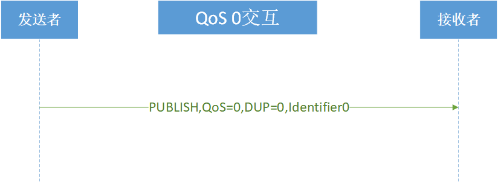
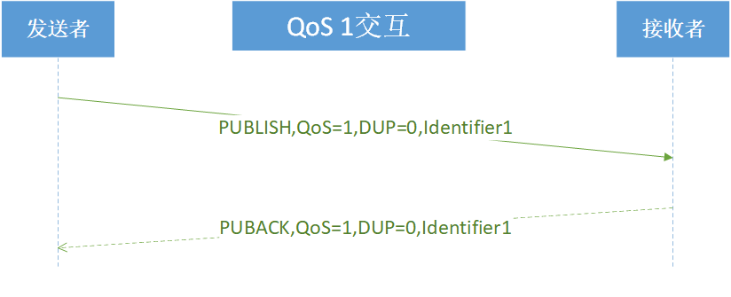
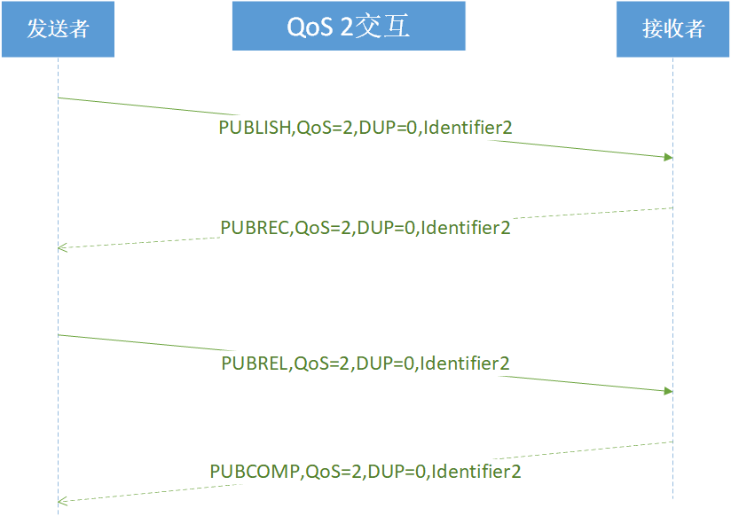
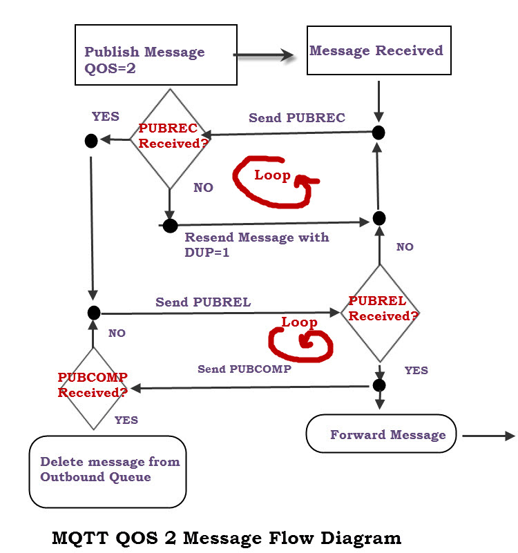

# 1. MQTT

- [1. MQTT](#1-mqtt)
  - [1.1. 简介](#11-简介)
  - [1.2. 特性](#12-特性)
  - [1.3. 角色和术语](#13-角色和术语)
    - [1.3.1. 发布者(client) Publisher](#131-发布者client-publisher)
    - [1.3.2. 代理(server) Broker](#132-代理server-broker)
    - [1.3.3. 发布者(client) Subscriber](#133-发布者client-subscriber)
    - [1.3.4. 客户端 client](#134-客户端-client)
    - [1.3.5. 服务端 server](#135-服务端-server)
    - [1.3.7. 会话（Session）](#137-会话session)
  - [1.4. 操作行为](#14-操作行为)
    - [1.4.1. QoS](#141-qos)
      - [1.4.1.1. QoS 0:最多分发一次](#1411-qos-0最多分发一次)
      - [1.4.1.2. QoS 1:至少分发一次](#1412-qos-1至少分发一次)
      - [1.4.1.3. QoS 2:仅分发一次](#1413-qos-2仅分发一次)
    - [1.4.2. 状态存储 Storing state](#142-状态存储-storing-state)
    - [1.4.3. 网络连接 Network Connections](#143-网络连接-network-connections)
    - [1.4.4. 消息分发重试 Message delivery retry](#144-消息分发重试-message-delivery-retry)
    - [1.4.5. 消息收到 Message receipt](#145-消息收到-message-receipt)
    - [1.4.6. 消息排序 Message ordering](#146-消息排序-message-ordering)
    - [1.4.7. 主题名和主题过滤器 Topic Names and Topic Filters](#147-主题名和主题过滤器-topic-names-and-topic-filters)
    - [1.4.8. 主题名](#148-主题名)
    - [1.4.9. 主题过滤器](#149-主题过滤器)
    - [1.4.10. 错误处理 Handling errors](#1410-错误处理-handling-errors)
  - [1.5. 数据格式](#15-数据格式)
    - [1.5.1. 二进制位](#151-二进制位)
    - [1.5.2. 整数数值](#152-整数数值)
    - [1.5.3. UTF-8编码](#153-utf-8编码)
  - [1.6. 控制报文](#16-控制报文)
    - [1.6.1. CONNECT](#161-connect)
      - [1.6.1.1. 固定报头(2bytes)1](#1611-固定报头2bytes1)
      - [1.6.1.2. 可变报头(10bytes)](#1612-可变报头10bytes)
        - [1.6.1.2.1. 协议名称](#16121-协议名称)
        - [1.6.1.2.2. 协议级别](#16122-协议级别)
        - [1.6.1.2.3. 连接标志](#16123-连接标志)
        - [1.6.1.2.4. 保持连接](#16124-保持连接)
      - [1.6.1.3. 有效负载 payload](#1613-有效负载-payload)
        - [1.6.1.3.1. 客户端标示符 Client Identifier](#16131-客户端标示符-client-identifier)
        - [1.6.1.3.2. 遗嘱主题 Will Topic](#16132-遗嘱主题-will-topic)
        - [1.6.1.3.3. 遗嘱消息 Will Message](#16133-遗嘱消息-will-message)
        - [1.6.1.3.4. 用户名 User Name](#16134-用户名-user-name)
        - [1.6.1.3.5. 密码 Password](#16135-密码-password)
    - [1.6.2. CONNACK](#162-connack)
      - [1.6.2.1. 固定报头(2bytes)2](#1621-固定报头2bytes2)
      - [1.6.2.2. 可变报头(2bytes)](#1622-可变报头2bytes)
    - [1.6.3. DISCONNECT –断开连接](#163-disconnect-断开连接)
      - [1.6.3.1. 固定报头(2bytes)14](#1631-固定报头2bytes14)
    - [1.6.4. PUBLISH](#164-publish)
      - [1.6.4.1. 固定报头(2bytes)3](#1641-固定报头2bytes3)
      - [1.6.4.2. 可变报头](#1642-可变报头)
        - [1.6.4.2.1. 主题名 Topic Name](#16421-主题名-topic-name)
        - [1.6.4.2.2. 报文标识符 Packet Identifier(2bytes)](#16422-报文标识符-packet-identifier2bytes)
      - [1.6.4.3. 有效负载 payload](#1643-有效负载-payload)
      - [1.6.4.4. 动作 Actions及响应](#1644-动作-actions及响应)
    - [1.6.5. PUBACK –发布确认](#165-puback-发布确认)
      - [1.6.5.1. 固定报头(2bytes)4](#1651-固定报头2bytes4)
      - [1.6.5.2. 可变报头(2bytes)](#1652-可变报头2bytes)
    - [1.6.6. PUBREC – 发布收到（QoS 2，第一步）5](#166-pubrec--发布收到qos-2第一步5)
    - [1.6.7. PUBREL – 发布释放（QoS 2，第二步）6](#167-pubrel--发布释放qos-2第二步6)
    - [1.6.8. PUBCOMP – 发布完成（QoS 2，第三步）7](#168-pubcomp--发布完成qos-2第三步7)
    - [1.6.9. SUBSCRIBE - 订阅主题](#169-subscribe---订阅主题)
      - [1.6.9.1. 固定报头(2bytes)8](#1691-固定报头2bytes8)
      - [1.6.9.2. 可变报头(2bytes)](#1692-可变报头2bytes)
      - [1.6.9.3. 有效负载 payload](#1693-有效负载-payload)
      - [1.6.9.4. 响应](#1694-响应)
    - [1.6.10. SUBACK – 订阅确认](#1610-suback--订阅确认)
      - [1.6.10.1. 固定报头(2bytes)9](#16101-固定报头2bytes9)
      - [1.6.10.2. 可变报头(2bytes)](#16102-可变报头2bytes)
      - [1.6.10.3. 有效负载 payload](#16103-有效负载-payload)
    - [1.6.11. UNSUBSCRIBE –取消订阅](#1611-unsubscribe-取消订阅)
      - [1.6.11.1. 固定报头(2bytes)10](#16111-固定报头2bytes10)
      - [1.6.11.2. 可变报头(2bytes)](#16112-可变报头2bytes)
      - [1.6.11.3. 有效负载 payload](#16113-有效负载-payload)
      - [1.6.11.4. 响应](#16114-响应)
    - [1.6.12. UNSUBACK – 取消订阅确认](#1612-unsuback--取消订阅确认)
      - [1.6.12.1. 固定报头(2bytes)11](#16121-固定报头2bytes11)
      - [1.6.12.2. 可变报头(2bytes)](#16122-可变报头2bytes)
    - [1.6.13. PINGREQ – 心跳请求](#1613-pingreq--心跳请求)
      - [1.6.13.1. 固定报头(2bytes)12](#16131-固定报头2bytes12)
    - [1.6.14. PINGRESP – 心跳响应](#1614-pingresp--心跳响应)
      - [1.6.14.1. 固定报头(2bytes)13](#16141-固定报头2bytes13)
  - [1.7. 名词解释](#17-名词解释)
    - [1.7.1. 非保留消息](#171-非保留消息)
    - [1.7.2. 保留消息](#172-保留消息)
  - [1.8. 参考资料](#18-参考资料)

## 1.1. 简介

    MQTT（Message Queuing Telemetry Transport，消息队列遥测传输协议），是一种基于发布/订阅（publish/subscribe）模式的"轻量级"通讯协议，该协议构建于TCP/IP协议上，由IBM在1999年发布。MQTT最大优点在于，可以以极少的代码和有限的带宽，为连接远程设备提供实时可靠的消息服务。作为一种低开销、低带宽占用的即时通讯协议，使其在物联网、小型设备、移动应用等方面有较广泛的应用。

## 1.2. 特性

- 使用发布/订阅消息模式，提供一对多的消息发布，解除应用程序耦合。
- 对负载内容屏蔽的消息传输。
- 使用TCP/IP提供网络连接。
- 有三种消息发布服务质量，最多一次，至少一次，只有一次
- 小型传输，开销很小（固定长度的头部是2字节），协议交换最小化，以降低网络流量。
- 使用Last Will和Testament特性通知有关各方客户端异常中断的机制。

## 1.3. 角色和术语

    实现MQTT协议需要客户端和服务器端通讯完成，在通讯过程中，MQTT协议中有三种身份：发布者（Publish）、代理（Broker）（服务器）、订阅者（Subscribe）。其中，消息的发布者和订阅者都是客户端，消息代理是服务器，消息发布者可以同时是订阅者。

### 1.3.1. 发布者(client) Publisher

### 1.3.2. 代理(server) Broker

### 1.3.3. 发布者(client) Subscriber

### 1.3.4. 客户端 client

- 一个使用MQTT协议的应用程序或者设备，它总是建立到服务器的网络连接。客户端可以：
  - 发布其他客户端可能会订阅的信息；
  - 订阅其它客户端发布的消息；
  - 退订或删除应用程序的消息；
  - 断开与服务器连接。

### 1.3.5. 服务端 server

- MQTT服务器以称为"消息代理"（Broker），可以是一个应用程序或一台设备。它是位于消息发布者和订阅者之间，它可以：
  - 接受来自客户的网络连接；
  - 接受客户发布的应用信息；
  - 处理来自客户端的订阅和退订请求；
  - 向订阅的客户转发应用程序消息。

### 1.3.7. 会话（Session）

    每个客户端与服务器建立连接后就是一个会话，客户端和服务器之间有状态交互。会话存在于一个网络之间，也可能在客户端和服务器之间跨越多个连续的网络连接。

## 1.4. 操作行为

### 1.4.1. QoS

#### 1.4.1.1. QoS 0:最多分发一次

消息的分发依赖于底层网络的能力。接收者不会发送响应，发送者也不会重试。消息可能送达一次也可能根本没送达。

#### 1.4.1.2. QoS 1:至少分发一次

- 发送者发送 PUBLISH 报文
- 接收者发送 PUBACK 报文

- 对于QoS 1的分发协议，发送者
  - 每次发送新的应用消息都必须分配一个未使用的报文标识符。
  - 发送的PUBLISH报文必须包含报文标识符且QoS等于1，DUP等于0。
  - 必须将这个PUBLISH报文看作是 未确认的 ，直到从接收者那收到对应的PUBACK报文。
  - 允许发送者在等待确认时使用不同的报文标识符发送后续的PUBLISH报文。

- 对于QoS 1的分发协议，接收者
  - 响应的PUBACK报文必须包含一个报文标识符，这个标识符来自接收到的、已经接受所有权的PUBLISH报文。
  - 发送了PUBACK报文之后，接收者必须将任何包含相同报文标识符的入站PUBLISH报文当作一个新的消息，并忽略它的DUP标志的值。

#### 1.4.1.3. QoS 2:仅分发一次

这是最高等级的服务质量，消息丢失和重复都是不可接受的。
使用这个服务质量等级会有额外的开销。
解决了msgID重复及复用问题。（重复问题其实通过业务虑重就可以实现，只是必须要求短期内msgID不能重复，QoS2保证短期内msgID可以重用）

- 对于QoS 2的分发协议，发送者
  - 必须给要发送的新应用消息分配一个未使用的报文标识符。
  - 发送的PUBLISH报文必须包含报文标识符且报文的QoS等于2,，DUP等于0。
  - 必须将这个PUBLISH报文看作是 未确认的 ，直到从接收者那收到对应的PUBREC报文。
  - 收到PUBREC报文后必须发送一个PUBREL报文。PUBREL报文必须包含与原始PUBLISH报文相同的报文标识符。
  - 必须将这个PUBREL报文看作是 未确认的，直到从接收者那收到对应的PUBCOMP报文。
  - 一旦发送了对应的PUBREL报文就不能重发这个PUBLISH报文。
  - 一旦发送者收到PUBCOMP报文，这个报文标识符就可以重用。

- 对于QoS 2的分发协议，接收者
  - 响应的PUBREC报文必须包含报文标识符，这个标识符来自接收到的、已经接受所有权的PUBLISH报文。
  - 在收到对应的PUBREL报文之前，接收者必须发送PUBREC报文确认任何后续的具有相同标识符的PUBLISH报文。 在这种情况下，它不能重复分发消息给任何后续的接收者。
  - 响应PUBREL报文的PUBCOMP报文必须包含与PUBREL报文相同的标识符。
  - 发送PUBCOMP报文之后，接收者必须将包含相同报文标识符的任何后续PUBLISH报文当作一个新的发布。

- qos2可以实现仅仅接受一次message，其主要原理(对于publisher而言)，publisher和broker进行了缓存，其中publisher缓存了message和msgID，而broker缓存了msgID，两方都做记录所以可以保证消息不重复，但是由于记录是需要删除的，这个删除流程同样多了一倍
- 流程：（publisher -> broker）
  - publisher -> publish ->broker -> broker store msgID（传递message）
  - broker -> puberc （确认传递成功）
  - publisher -> pubrel -> broker delete msgID （告诉broker删除msgID），在这之前，因为缓存了msgID,所以收到相同msgID的publish，都需要回复puberc，在这种情况下，它不能重复分发消息给任何后续的接收者。
  - broker -> pubcomp -> publisher delete msg （告诉publisher删除msg），这里删除了msgID,所以后续来得相同msgID都按照新的对待

### 1.4.2. 状态存储 Storing state

### 1.4.3. 网络连接 Network Connections

### 1.4.4. 消息分发重试 Message delivery retry

    客户端设置清理会话（CleanSession）标志为0重连时，客户端和服务端必须使用原始的报文标识符重发任何未确认的PUBLISH报文（如果QoS>0）和PUBREL报文。这是唯一要求客户端或服务端重发消息的情况。

### 1.4.5. 消息收到 Message receipt

    服务端接管入站应用消息的所有权时，它必须将消息添加到订阅匹配的客户端的会话状态中。
    正常情况下，客户端收到发送给它的订阅的消息。
    客户端也可能收到不是与它的订阅精确匹配的消息。如果服务端自动给客户端分配了一个订阅，可能发生这种情况。正在处理UBSUBSCRIBE请求时也可能收到消息。客户端必须按照可用的服务质量（QoS）规则确认它收到的任何PUBLISH报文，不管它选择是否处理报文包含的应用消息。

### 1.4.6. 消息排序 Message ordering

### 1.4.7. 主题名和主题过滤器 Topic Names and Topic Filters

- 主题名和主题过滤器必须符合下列规则
  - 所有的主题名和主题过滤器必须至少包含一个字符。
  - 主题名和主题过滤器是区分大小写的。
  - 主题名和主题过滤器可以包含空格。
  - 主题名或主题过滤器以前置或后置斜杠 “/” 区分。
  - 只包含斜杠 “/” 的主题名或主题过滤器是合法的。
  - 主题名和主题过滤器不能包含空字符 (Unicode U+0000) [Unicode]。
  - 主题名和主题过滤器是UTF-8编码字符串，它们不能超过65535字节。
  - 如果订阅的主题过滤器与消息的主题名匹配，应用消息会被发送给每一个匹配的客户端订阅。
  - 主题可能是管理员在服务端预先定义好的，也可能是服务端收到第一个订阅或使用那个主题名的应用消息时动态添加的。
  - 服务端也可以使用一个安全组件有选择地授权客户端使用某个主题资源。

### 1.4.8. 主题名

- 斜杠（‘/’ U+002F）用于分割主题的每个层级，为主题名提供一个分层结构。
- 主题层级分隔符可以出现在主题过滤器或主题名字的任何位置。

- 以$开头的主题
  - 服务端不能将 $ 字符开头的主题名匹配通配符 (#或+) 开头的主题过滤器
  - 服务端应该阻止客户端使用这种主题名与其它客户端交换消息。
  - 服务端实现可以将 $ 开头的主题名用作其他目的。
  - 订阅 “#” 的客户端不会收到任何发布到以 “$” 开头主题的消息。
  - 订阅 “+/monitor/Clients” 的客户端不会收到任何发布到 “$SYS/monitor/Clients” 的消息。
  - 订阅 “$SYS/#” 的客户端会收到发布到以 “$SYS/” 开头主题的消息。
  - 订阅 “$SYS/monitor/+” 的客户端会收到发布到 “$SYS/monitor/Clients” 主题的消息。
  - 如果客户端想同时接受以 “$SYS/” 开头主题的消息和不以 $ 开头主题的消息，它需要同时订阅 “#” 和 ““$SYS/#”。

### 1.4.9. 主题过滤器

- 主题过滤器中可以使用通配符(#+)，但是主题名不能使用通配符
- 数字标志（‘#’ U+0023）是用于匹配主题中任意层级的通配符。
  - 多层通配符表示它的父级和任意数量的子层级。
  - sport/tennis/player1/# 匹配 “sport/tennis/player1”、“sport/tennis/player1/ranking”、“sport/tennis/player1/score/wimbledon”
  - 多层通配符必须位于它自己的层级或者跟在主题层级分隔符后面。“sport/tennis#”是无效的。
  - 不管哪种情况，它都必须是主题过滤器的最后一个字符。“sport/tennis/#/ranking”是无效的。
  - “#”是有效的，会收到所有非$开头主体的应用消息。
- 加号 (‘+’ U+002B) 是只能用于单个主题层级匹配的通配符。
  - 在主题过滤器的任意层级都可以使用单层通配符，包括第一个和最后一个层级。“sport+” 是无效的。“sport/+/player1” 也是有效的。
  - 可以在主题过滤器中的多个层级中使用它，也可以和多层通配符一起使用。“+/tennis/#” 是有效的。
  - “sport/tennis/+” 匹配 “sport/tennis/player1” 和 “sport/tennis/player2” ，但是不匹配 “sport/tennis/player1/ranking” 。
  - 由于单层通配符只能匹配一个层级， “sport/+” 不匹配 “sport” 但是却匹配 “sport/”。
  - “/finance” 匹配 “+/+” 和 “/+” ，但是不匹配 “+”

### 1.4.10. 错误处理 Handling errors

- 除非另有说明，如果服务端或客户端遇到了协议违规的行为，它必须关闭传输这个协议违规控制报文的网络连接。
- 客户端或服务端实现可能会遇到瞬时错误（Transient Error）（例如内部缓冲区满了的情况）导致无法成功处理MQTT报文。
  - 如果客户端或服务端处理入站控制报文时遇到了瞬时错误，它必须关闭传输那个控制报文的网络连接。
  - 如果服务端发现了瞬时错误，它不应该断开连接或者执行任何对其它客户端有影响的操作。

## 1.5. 数据格式

### 1.5.1. 二进制位

    字节中的位从0到7。第7位是最高有效位，第0位是最低有效位。

### 1.5.2. 整数数值

    整数数值是16位，使用大端序（big-endian，高位字节在低位字节前面）。

### 1.5.3. UTF-8编码

    每一个字符串都有一个两字节的长度字段作为前缀，它给出这个字符串UTF-8编码的字节数。因此可以传送的UTF-8编码的字符串大小有一个限制，不能超过 65535字节。

- 如果服务端或客户端收到下边的UTF-8字符的控制报文，它必须关闭网络连接
  - U+0001和U+001F之间的控制字符
  - U+007F和U+009F之间的控制字符
  - Unicode规范定义的非字符代码点（例如U+0FFFF）
  - Unicode规范定义的保留字符（例如U+0FFFF）

## 1.6. 控制报文

通过网络连接发送的信息数据包。MQTT规范定义了十四种不同类型的控制报文。

| 结构名称        | 描述                         |
| --------------- | ---------------------------- |
| Fixed header    | 固定报头，所有控制报文都包含 |
| Variable header | 可变报头，部分控制报文包含   |
| Payload         | 有效载荷，部分控制报文包含   |

Fixed header：固定头（Fixed header）。存在于所有MQTT数据包中，表示数据包类型及数据包的分组类标识。

| Bit    | Description    | 7   | 6   | 5   | 4   | 3   | 2   | 1   | 0   | 说明 |
| ------ | -------------- | --- | --- | --- | --- | --- | --- | --- | --- | ---- |
| byte 1 | Length MSB (1) | X7  | X6  | X5  | X4  | X3  | X2  | X1  | X0  | bits |
| byte 2 | Length LSB (4) | len |

- byte1:固定，前4bit表示类型(X7X6X5X4)，后4bit(X3X2X1X0)和协议有关
- byte2:len(包括可变报头和payload)

| 名字        | 值(X7X6X5X4) | X3  | X2  | X1  | X0     | Identifer   | payload | 报文流动方向   | 描述                                |
| ----------- | ------------ | --- | --- | --- | ------ | ----------- | ------- | -------------- | ----------------------------------- |
| Reserved    | 0            | 0   | 0   | 0   | 0      |             |         | 禁止           | 保留                                |
| CONNECT     | 1            | 0   | 0   | 0   | 0      | 不需要      | 需要    | 客户端到服务端 | 客户端请求连接服务端                |
| CONNACK     | 2            | 0   | 0   | 0   | 0      | 不需要      | 不需要  | 服务端到客户端 | 连接报文确认                        |
| PUBLISH     | 3            | DUP | Qos | Qos | RETAIN | 需要(Qos>0) | 可选    | 两个方向都允许 | 发布消息                            |
| PUBACK      | 4            | 0   | 0   | 0   | 0      | 需要        | 不需要  | 两个方向都允许 | QoS 1消息发布收到确认               |
| PUBREC      | 5            | 0   | 0   | 1   | 0      | 需要        | 不需要  | 两个方向都允许 | 发布收到（保证交付第一步）          |
| PUBREL      | 6            | 0   | 0   | 0   | 0      | 需要        | 不需要  | 两个方向都允许 | 发布释放（保证交付第二步）          |
| PUBCOMP     | 7            | 0   | 0   | 0   | 0      | 需要        | 不需要  | 两个方向都允许 | QoS 2消息发布完成（保证交互第三步） |
| SUBSCRIBE   | 8            | 0   | 0   | 1   | 0      | 需要        | 需要    | 客户端到服务端 | 客户端订阅请求                      |
| SUBACK      | 9            | 0   | 0   | 0   | 0      | 需要        | 需要    | 服务端到客户端 | 订阅请求报文确认                    |
| UNSUBSCRIBE | 10           | 0   | 0   | 1   | 0      | 需要        | 需要    | 客户端到服务端 | 客户端取消订阅请求                  |
| UNSUBACK    | 11           | 0   | 0   | 0   | 0      | 需要        | 不需要  | 服务端到客户端 | 取消订阅报文确认                    |
| PINGREQ     | 12           | 0   | 0   | 0   | 0      | 不需要      | 不需要  | 客户端到服务端 | 心跳请求                            |
| PINGRESP    | 13           | 0   | 0   | 0   | 0      | 不需要      | 不需要  | 服务端到客户端 | 心跳响应                            |
| DISCONNECT  | 14           | 0   | 0   | 0   | 0      | 不需要      | 不需要  | 客户端到服务端 | 客户端断开连接                      |
| Reserved    | 15           | 0   | 0   | 0   | 0      |             |         | 禁止           | 保留                                |

### 1.6.1. CONNECT

客户端到服务端的网络连接建立后，客户端发送给服务端的第一个报文必须是CONNECT报文

#### 1.6.1.1. 固定报头(2bytes)1

| Bit    | Description    | 7   | 6   | 5   | 4   | 3   | 2   | 1   | 0   | 说明 |
| ------ | -------------- | --- | --- | --- | --- | --- | --- | --- | --- | ---- |
| byte 1 | Length MSB (1) | X7  | X6  | X5  | X4  | X3  | X2  | X1  | X0  | bits |
| byte 2 | Length LSB (4) | len |

- byte1:固定，前4bit表示类型(X7X6X5X4)，后4bit预留Reserved(X3X2X1X0)，类型是1
- byte2:len(包括可变报头和payload)

#### 1.6.1.2. 可变报头(10bytes)

##### 1.6.1.2.1. 协议名称

utf-8格式描述

| Protocol Name | Description    | 7   | 6   | 5   | 4   | 3   | 2   | 1   | 0   | 说明  |
| ------------- | -------------- | --- | --- | --- | --- | --- | --- | --- | --- | ----- |
| byte 1        | Length MSB (0) | 0   | 0   | 0   | 0   | 0   | 0   | 0   | 0   | utf-8 |
| byte 2        | Length LSB (4) | 0   | 0   | 0   | 0   | 0   | 1   | 0   | 0   | utf-8 |
| byte 3        | ‘M’            | 0   | 1   | 0   | 0   | 1   | 1   | 0   | 1   | utf-8 |
| byte 4        | ‘Q’            | 0   | 1   | 0   | 1   | 0   | 0   | 0   | 1   | utf-8 |
| byte 5        | ‘T’            | 0   | 1   | 0   | 1   | 0   | 1   | 0   | 0   | utf-8 |
| byte 6        | ‘T’            | 0   | 1   | 0   | 1   | 0   | 1   | 0   | 0   | utf-8 |

##### 1.6.1.2.2. 协议级别

- 对于3.1.1版协议，协议级别字段的值是4(0x04)
- 如果发现不支持的协议级别，服务端必须给发送一个返回码为0x01（不支持的协议级别）的CONNACK报文响应CONNECT报文
- 整个字节表示level

| Protocol Level | Description | 7   | 6   | 5   | 4   | 3   | 2   | 1   | 0   | 说明   |
| -------------- | ----------- | --- | --- | --- | --- | --- | --- | --- | --- | ------ |
| byte 7         | Level (4)   | 0   | 0   | 0   | 0   | 0   | 1   | 0   | 0   | uint_8 |

##### 1.6.1.2.3. 连接标志

- 连接标志，指定MQTT连接行为的参数。它还指出有效载荷中的字段是否存在。供8个bits
  - User Name Flag (1bit X7) 0，有效载荷中不能包含用户名字段。1，有效载荷中必须包含用户名字段
  - Password Flag (1bit X6)  0，有效载荷中不能包含密码字段。1，有效载荷中必须包含密码字段
  - Will Retain (1bit X5)    0，服务端必须将遗嘱消息当作非保留消息发布。1，服务端必须将遗嘱消息当作保留消息发布
  - Will QoS (2bit X4X3)      这两位用于指定发布遗嘱消息时使用的服务质量等级，只能是0(0x00)，1(0x01)，2(0x02)
  - Will Flag (1bit X2)      0:不触发遗嘱，Will QoS和Will Retain必须被置0。1:触发遗嘱，Will QoS和Will Retain被应用。
  - Clean Session (1bit X1)  0：不清理Session，再次连接，会收到断开期间的Qos1和Qos2级别的消息。1:清理Session，下次连接是一个全新的连接。
  - Reserved (0bit X0)       0:如果不为0必须断开客户端连接

| Connect Flags | Description | 7   | 6   | 5   | 4   | 3   | 2   | 1   | 0   | 说明 |
| ------------- | ----------- | --- | --- | --- | --- | --- | --- | --- | --- | ---- |
| byte 8        |             | X7  | X6  | X5  | X4  | X3  | X2  | X1  | X0  | bits |

##### 1.6.1.2.4. 保持连接

- 保持连接（Keep Alive）是一个以秒为单位的时间间隔，表示为一个16位的字，它是指在客户端传输完成一个控制报文的时刻到发送下一个报文的时刻，两者之间允许空闲的最大时间间隔。
- 客户端负责保证控制报文发送的时间间隔不超过保持连接的值。如果没有任何其它的控制报文可以发送，客户端必须发送一个PINGREQ报文
- 允许的最大值是18小时12分15秒。
- 如果保持连接的值非零，并且服务端在一点五倍的保持连接时间内没有收到客户端的控制报文，它必须断开客户端的网络连接，认为网络连接已断开
- 保持连接的值为零表示关闭保持连接功能。这意味着，服务端不需要因为客户端不活跃而断开连接。

| Keep Alive | Description         | 7   | 6   | 5   | 4   | 3   | 2   | 1   | 0   | 说明 |
| ---------- | ------------------- | --- | --- | --- | --- | --- | --- | --- | --- | ---- |
| byte 9     | Keep Alive MSB (0)  | 0   | 0   | 0   | 0   | 0   | 0   | 0   | 0   |
| byte 10    | Keep Alive LSB (10) | 0   | 0   | 0   | 0   | 1   | 0   | 1   | 0   |

#### 1.6.1.3. 有效负载 payload

    CONNECT报文的有效载荷（payload）包含一个或多个以长度为前缀的字段，可变报头中的标志决定是否包含这些字段。如果包含的话，必须按这个顺序出现：客户端标识符，遗嘱主题，遗嘱消息，用户名，密码

##### 1.6.1.3.1. 客户端标示符 Client Identifier

- 服务端必须允许1到23个字节长的UTF-8编码的客户端标识符
- 客户端标识符只能包含这些字符：“0123456789abcdefghijklmnopqrstuvwxyzABCDEFGHIJKLMNOPQRSTUVWXYZ”（大写字母，小写字母和数字）

##### 1.6.1.3.2. 遗嘱主题 Will Topic

- 如果遗嘱标志被设置为1，有效载荷的下一个字段是遗嘱主题（Will Topic）。
- 遗嘱主题必须是UTF-8编码字符串

##### 1.6.1.3.3. 遗嘱消息 Will Message

- 如果遗嘱标志被设置为1，有效载荷的下一个字段是遗嘱消息。
- 遗嘱消息定义了将被发布到遗嘱主题的应用消息。
- 这个字段由一个两字节的长度和遗嘱消息的有效载荷组成，表示为零字节或多个字节序列。长度给出了跟在后面的数据的字节数，不包含长度字段本身占用的两个字节。
- 遗嘱消息被发布到遗嘱主题时，它的有效载荷只包含这个字段的数据部分，不包含开头的两个长度字节。

##### 1.6.1.3.4. 用户名 User Name

- 如果用户名（User Name）标志被设置为1，有效载荷的下一个字段就是它。
- 用户名必须是UTF-8编码字符串。服务端可以将它用于身份验证和授权。

##### 1.6.1.3.5. 密码 Password

- 如果密码（Password）标志被设置为1，有效载荷的下一个字段就是它。
- 密码字段包含一个两字节的长度字段，长度表示二进制数据的字节数（不包含长度字段本身占用的两个字节），后面跟着0到65535字节的二进制数据。

### 1.6.2. CONNACK

#### 1.6.2.1. 固定报头(2bytes)2

| Bit    | Description    | 7   | 6   | 5   | 4   | 3   | 2   | 1   | 0   | 说明 |
| ------ | -------------- | --- | --- | --- | --- | --- | --- | --- | --- | ---- |
| byte 1 | Length MSB (2) | X7  | X6  | X5  | X4  | X3  | X2  | X1  | X0  | bits |
| byte 2 | Length LSB (4) | len |

- byte1:固定，前4bit表示类型(X7X6X5X4)，后4bit预留Reserved(X3X2X1X0)，类型是2
- byte2:len(包括可变报头和payload)

#### 1.6.2.2. 可变报头(2bytes)

- 第一个字节，只有X0位有效，表示是否保留了上一次的状态(CONNECT中CleanSession为0的情况，才可能有效)
- 第二个字节，X7-X0整体代表返回码

| 值    | 返回码响应                           | 描述                                              |
| ----- | ------------------------------------ | ------------------------------------------------- |
| 0     | 0x00连接已接受                       | 连接已被服务端接受                                |
| 1     | 0x01连接已拒绝，不支持的协议版本     | 服务端不支持客户端请求的MQTT协议级别              |
| 2     | 0x02连接已拒绝，不合格的客户端标识符 | 客户端标识符是正确的UTF-8编码，但服务端不允许使用 |
| 3     | 0x03连接已拒绝，服务端不可用         | 网络连接已建立，但MQTT服务不可用                  |
| 4     | 0x04连接已拒绝，无效的用户名或密码   | 用户名或密码的数据格式无效                        |
| 5     | 0x05连接已拒绝，未授权               | 客户端未被授权连接到此服务器                      |
| 6-255 |                                      | 保留                                              |

| Bite   | Description | 7   | 6   | 5   | 4   | 3   | 2   | 1   | 0   | 说明 |
| ------ | ----------- | --- | --- | --- | --- | --- | --- | --- | --- | ---- |
| byte 1 | bit         | 0   | 0   | 0   | 0   | 0   | 0   | 0   | X0  |
| byte 2 | byte        | X7  | X6  | X5  | X4  | X3  | X2  | X1  | X0  |

PUBACK报文没有有效载荷。

### 1.6.3. DISCONNECT –断开连接

#### 1.6.3.1. 固定报头(2bytes)14

| Bit    | Description     | 7   | 6   | 5   | 4   | 3   | 2   | 1   | 0   | 说明 |
| ------ | --------------- | --- | --- | --- | --- | --- | --- | --- | --- | ---- |
| byte 1 | Length MSB (14) | X7  | X6  | X5  | X4  | X3  | X2  | X1  | X0  | bits |
| byte 2 | Length LSB (4)  | len |

- byte1:固定，前4bit表示类型(X7X6X5X4)，类型是14。
- 后4bit(X3X2X1X0)预留
- byte2:len(包括可变报头和payload)固定为0

无可变报头及有效载荷

### 1.6.4. PUBLISH

PUBLISH控制报文是指从客户端向服务端或者服务端向客户端传输一个应用消息。

#### 1.6.4.1. 固定报头(2bytes)3

| Bit    | Description    | 7   | 6   | 5   | 4   | 3   | 2   | 1   | 0   | 说明 |
| ------ | -------------- | --- | --- | --- | --- | --- | --- | --- | --- | ---- |
| byte 1 | Length MSB (3) | X7  | X6  | X5  | X4  | X3  | X2  | X1  | X0  | bits |
| byte 2 | Length LSB (4) | len |

- byte1:固定，前4bit表示类型(X7X6X5X4)，类型是3。
- 后4bit
  - DUP(X3) 重发标志位
  - Qos(X2X1) 00：最多分发一次， 01：至少分发一次， 10：只分发一次
  - RETAIN(X0) 保留标志
- byte2:len(包括可变报头和payload)

- DUP
  - 如果DUP标志被设置为0，表示这是客户端或服务端第一次请求发送这个PUBLISH报文。
  - 如果DUP标志被设置为1，表示这可能是一个早前报文请求的重发。
  - 客户端或服务端请求重发一个PUBLISH报文时，必须将DUP标志设置为1。对于QoS 0的消息，DUP标志必须设置为0。

- RETAIN
  1. 如果客户端发给服务端的PUBLISH报文的保留（RETAIN）标志被设置为1，服务端必须存储这个应用消息和它的服务质量等级（QoS），以便它可以被分发给未来的主题名匹配的订阅者
  2. 一个新的订阅建立时，对每个匹配的主题名，如果存在最近保留的消息，它必须被发送给这个订阅者.且必须将报文的保留标志设为1
  3. 如果服务端收到一条保留（RETAIN）标志为1的QoS 0消息，它必须丢弃之前为那个主题保留的任何消息。它应该将这个新的QoS 0消息当作那个主题的新保留消息
  4. 当一个PUBLISH报文发送给客户端是因为匹配一个已建立的订阅时，服务端必须将保留标志设为0，不管它收到的这个消息中保留标志的值是多少。
  5. 对于发布者不定期发送状态消息这个场景，保留消息很有用。新的订阅者将会收到最近的状态。

#### 1.6.4.2. 可变报头

可变报头按顺序包含主题名和报文标识符。

##### 1.6.4.2.1. 主题名 Topic Name

- 主题名（Topic Name）用于识别有效载荷数据应该被发布到哪一个信息通道。
- 主题名必须是PUBLISH报文可变报头的第一个字段。它必须是UTF-8编码的字符串。
- PUBLISH报文中的主题名不能包含通配符(#+)。
- 服务端发送给订阅客户端的PUBLISH报文的主题名必须匹配该订阅的主题过滤器。

##### 1.6.4.2.2. 报文标识符 Packet Identifier(2bytes)

- 只有当QoS等级是1或2时，报文标识符（Packet Identifier）字段才能出现在PUBLISH报文中。
- 16bits大小的标识符

#### 1.6.4.3. 有效负载 payload

- 有效载荷包含将被发布的应用消息。
- 数据的内容和格式是应用特定的。
- 有效载荷的长度这样计算：用固定报头中的剩余长度字段的值减去可变报头的长度。
- 包含零长度有效载荷的PUBLISH报文是合法的。

#### 1.6.4.4. 动作 Actions及响应

- PUBLISH报文的接收者必须按照根据PUBLISH报文中的QoS等级发送响应
  - QoS 0 无响应
  - QoS 1 PUBACK报文
  - QoS 2 PUBREC报文
- 客户端使用PUBLISH报文发送应用消息给服务端，目的是分发到其它订阅匹配的客户端。
- 服务端使用PUBLISH报文发送应用消息给每一个订阅匹配的客户端。
- 客户端使用带通配符的主题过滤器请求订阅时，客户端的订阅可能会重复，因此发布的消息可能会匹配多个过滤器。对于这种情况，服务端必须将消息分发给所有订阅匹配的QoS等级最高的客户端。服务端之后可以按照订阅的QoS等级，分发消息的副本给每一个匹配的订阅者。
- 如果服务端实现不授权某个客户端发布PUBLISH报文，它没有办法通知那个客户端。它必须按照正常的QoS规则发送一个正面的确认，或者关闭网络连接。

### 1.6.5. PUBACK –发布确认

PUBACK报文是对QoS 1等级的PUBLISH报文的响应。

#### 1.6.5.1. 固定报头(2bytes)4

| Bit    | Description    | 7   | 6   | 5   | 4   | 3   | 2   | 1   | 0   | 说明 |
| ------ | -------------- | --- | --- | --- | --- | --- | --- | --- | --- | ---- |
| byte 1 | Length MSB (4) | X7  | X6  | X5  | X4  | X3  | X2  | X1  | X0  | bits |
| byte 2 | Length LSB (4) | len |

- byte1:固定，前4bit表示类型(X7X6X5X4)，类型是4。
- 后4bit预留
- byte2:len(包括可变报头和payload)，这里是2

#### 1.6.5.2. 可变报头(2bytes)

报文标识符 Packet Identifier(2bytes)

### 1.6.6. PUBREC – 发布收到（QoS 2，第一步）5

- PUBREC报文是对QoS等级2的PUBLISH报文的响应。它是QoS 2等级协议交换的第二个报文。
- 结构同PBUACK，类型为5

### 1.6.7. PUBREL – 发布释放（QoS 2，第二步）6

- PUBREL报文是对PUBREC报文的响应。它是QoS 2等级协议交换的第三个报文。
- 结构同PBUACK，类型为6

### 1.6.8. PUBCOMP – 发布完成（QoS 2，第三步）7

- PUBCOMP报文是对PUBREL报文的响应。它是QoS 2等级协议交换的第四个也是最后一个报文。
- 结构同PBUACK，类型为7

### 1.6.9. SUBSCRIBE - 订阅主题

- 客户端向服务端发送SUBSCRIBE报文用于创建一个或多个订阅。
- 每个订阅注册客户端关心的一个或多个主题。
- 为了将应用消息转发给与那些订阅匹配的主题，服务端发送PUBLISH报文给客户端。
- SUBSCRIBE报文也（为每个订阅）指定了最大的QoS等级，服务端根据这个发送应用消息给客户端。

#### 1.6.9.1. 固定报头(2bytes)8

| Bit    | Description    | 7   | 6   | 5   | 4   | 3   | 2   | 1   | 0   | 说明 |
| ------ | -------------- | --- | --- | --- | --- | --- | --- | --- | --- | ---- |
| byte 1 | Length MSB (8) | X7  | X6  | X5  | X4  | X3  | X2  | X1  | X0  | bits |
| byte 2 | Length LSB (4) | len |

- byte1:固定，前4bit表示类型(X7X6X5X4)，类型是8。
- 后4bit预留(X3X2X1X0,必须为0010)
- byte2:len(包括可变报头和payload)

#### 1.6.9.2. 可变报头(2bytes)

报文标识符 Packet Identifier(2bytes)

#### 1.6.9.3. 有效负载 payload

- SUBSCRIBE报文的有效载荷包含了一个主题过滤器列表，它们表示客户端想要订阅的主题。
- SUBSCRIBE报文有效载荷中的主题过滤器列表UTF-8字符串。
- 服务端应该支持包含通配符的主题过滤器。如果服务端选择不支持包含通配符的主题过滤器，必须拒绝任何包含通配符过滤器的订阅请求。
- 每一个过滤器后面跟着一个字节，这个字节被叫做 服务质量要求（Requested QoS）。它给出了服务端向客户端发送应用消息所允许的最大QoS等级。
- SUBSCRIBE报文的有效载荷必须包含至少一对主题过滤器 和 QoS等级字段组合。没有有效载荷的SUBSCRIBE报文是违反协议的。
- 请求的最大服务质量等级字段编码为一个字节，它后面跟着UTF-8编码的主题名，那些主题过滤器 /和QoS等级组合是连续地打包。

| Protocol Name | Description    | 7   | 6   | 5   | 4   | 3   | 2   | 1   | 0   | 说明  |
| ------------- | -------------- | --- | --- | --- | --- | --- | --- | --- | --- | ----- |
| byte 1        | Length MSB (0) | 0   | 0   | 0   | 0   | 0   | 0   | 0   | 0   | utf-8 |
| byte 2        | Length LSB (4) | 0   | 0   | 0   | 0   | 0   | 1   | 0   | 0   | utf-8 |
| byte 3...N    | Topic Filter   | 0   | 1   | 0   | 0   | 1   | 1   | 0   | 1   | utf-8 |
| byte N+1      | QoS            | X7  | X6  | X5  | X4  | X3  | X2  | X1  | X0  | byte  |

- Topic Filter是UTF-8字符串
- Qos前 6 bits 预留，后两位表示 Qos
- `Topic Filter`+`QoS`为一组，可以有多组

#### 1.6.9.4. 响应

- 服务端收到客户端发送的一个SUBSCRIBE报文时，必须使用SUBACK报文响应
- 允许服务端在发送SUBACK报文之前就开始发送与订阅匹配的PUBLISH报文。
- 如果服务端收到一个SUBSCRIBE报文，报文的主题过滤器与一个现存订阅的主题过滤器相同，那么必须使用新的订阅彻底替换现存的订阅
- 服务端可以授予比订阅者要求的低一些的QoS等级。
- 为响应订阅而发出的消息的有效载荷的QoS必须是原始发布消息的QoS和服务端授予的QoS两者中的最小值。
- 使用QoS等级2订阅一个主题过滤器等于是说：我想要按照它们发布时的QoS等级接受匹配这个过滤器的消息。这意味着，确定消息分发时可能的最大QoS等级是发布者的责任，而订阅者可以要求服务端降低QoS到更适合它的等级。

### 1.6.10. SUBACK – 订阅确认

- 服务端发送SUBACK报文给客户端，用于确认它已收到并且正在处理SUBSCRIBE报文。
- SUBACK报文包含一个返回码清单，它们指定了SUBSCRIBE请求的每个订阅被授予的最大QoS等级。

#### 1.6.10.1. 固定报头(2bytes)9

| Bit    | Description    | 7   | 6   | 5   | 4   | 3   | 2   | 1   | 0   | 说明 |
| ------ | -------------- | --- | --- | --- | --- | --- | --- | --- | --- | ---- |
| byte 1 | Length MSB (9) | X7  | X6  | X5  | X4  | X3  | X2  | X1  | X0  | bits |
| byte 2 | Length LSB (4) | len |

- byte1:固定，前4bit表示类型(X7X6X5X4)，类型是9。
- 后4bit预留(X3X2X1X0,必须为0000)
- byte2:len(包括可变报头和payload)

#### 1.6.10.2. 可变报头(2bytes)

报文标识符 Packet Identifier(2bytes)

#### 1.6.10.3. 有效负载 payload

- 有效载荷包含一个返回码清单。每个返回码对应等待确认的SUBSCRIBE报文中的一个主题过滤器。
- 返回码的顺序必须和SUBSCRIBE报文中主题过滤器的顺序相同

| Bit    | Description | 7   | 6   | 5   | 4   | 3   | 2   | 1   | 0   | 说明 |
| ------ | ----------- | --- | --- | --- | --- | --- | --- | --- | --- | ---- |
| byte 1 | 返回码      | X7  | X6  | X5  | X4  | X3  | X2  | X1  | X0  | bits |

- 允许的返回码值
  - 0x00 - 最大QoS 0
  - 0x01 - 成功 – 最大QoS 1
  - 0x02 - 成功 – 最大 QoS 2、
  - 0x80 - Failure  失败
  - 0x00, 0x01, 0x02, 0x80之外的SUBACK返回码是保留的，不能使用

### 1.6.11. UNSUBSCRIBE –取消订阅

客户端发送UNSUBSCRIBE报文给服务端，用于取消订阅主题。

#### 1.6.11.1. 固定报头(2bytes)10

| Bit    | Description     | 7   | 6   | 5   | 4   | 3   | 2   | 1   | 0   | 说明 |
| ------ | --------------- | --- | --- | --- | --- | --- | --- | --- | --- | ---- |
| byte 1 | Length MSB (10) | X7  | X6  | X5  | X4  | X3  | X2  | X1  | X0  | bits |
| byte 2 | Length LSB (4)  | len |

- byte1:固定，前4bit表示类型(X7X6X5X4)，类型是10。
- 后4bit预留(X3X2X1X0,必须为0010)
- byte2:len(包括可变报头和payload)

#### 1.6.11.2. 可变报头(2bytes)

报文标识符 Packet Identifier(2bytes)

#### 1.6.11.3. 有效负载 payload

- UNSUBSCRIBE报文的有效载荷包含客户端想要取消订阅的主题过滤器列表。UNSUBSCRIBE报文中的主题过滤器必须是连续打包的
- UNSUBSCRIBE报文的有效载荷必须至少包含一个消息过滤器。没有有效载荷的UNSUBSCRIBE报文是违反协议的
- 与订阅主题的区别是没有QoS字节

| Protocol Name | Description    | 7   | 6   | 5   | 4   | 3   | 2   | 1   | 0   | 说明  |
| ------------- | -------------- | --- | --- | --- | --- | --- | --- | --- | --- | ----- |
| byte 1        | Length MSB (0) | 0   | 0   | 0   | 0   | 0   | 0   | 0   | 0   | utf-8 |
| byte 2        | Length LSB (4) | 0   | 0   | 0   | 0   | 0   | 1   | 0   | 0   | utf-8 |
| byte 3...N    | Topic Filter   | 0   | 1   | 0   | 0   | 1   | 1   | 0   | 1   | utf-8 |
| byte N+1      | Length MSB (0) | 0   | 0   | 0   | 0   | 0   | 0   | 0   | 0   | utf-8 |
| byte N+2      | Length LSB (4) | 0   | 0   | 0   | 0   | 0   | 1   | 0   | 0   | utf-8 |
| byte N+3...M  | Topic Filter   | 0   | 1   | 0   | 0   | 1   | 1   | 0   | 1   | utf-8 |

#### 1.6.11.4. 响应

- UNSUBSCRIBE报文提供的主题过滤器（无论是否包含通配符）必须与服务端持有的这个客户端的当前主题过滤器集合逐个字符比较。
- 如果有任何过滤器完全匹配，那么它（服务端）自己的订阅将被删除，否则不会有进一步的处理。
- 如果服务端删除了一个订阅：
  - 它必须停止分发任何新消息给这个客户端。
  - 它必须完成分发任何已经开始往客户端发送的QoS 1和QoS 2的消息。
  - 它可以继续发送任何现存的准备分发给客户端的缓存消息。
- 服务端必须发送UNSUBACK报文响应客户端的UNSUBSCRIBE请求。
- UNSUBACK报文必须包含和UNSUBSCRIBE报文相同的报文标识符。
- 即使没有删除任何主题订阅，服务端也必须发送一个UNSUBACK响应。
- 如果服务端收到包含多个主题过滤器的UNSUBSCRIBE报文，它必须如同收到了一系列的多个UNSUBSCRIBE报文一样处理那个报文

### 1.6.12. UNSUBACK – 取消订阅确认

服务端发送UNSUBACK报文给客户端用于确认收到UNSUBSCRIBE报文。

#### 1.6.12.1. 固定报头(2bytes)11

| Bit    | Description     | 7   | 6   | 5   | 4   | 3   | 2   | 1   | 0   | 说明 |
| ------ | --------------- | --- | --- | --- | --- | --- | --- | --- | --- | ---- |
| byte 1 | Length MSB (11) | X7  | X6  | X5  | X4  | X3  | X2  | X1  | X0  | bits |
| byte 2 | Length LSB (4)  | len |

- byte1:固定，前4bit表示类型(X7X6X5X4)，类型是11。
- 后4bit预留
- byte2:len(包括可变报头和payload)，这里是2

#### 1.6.12.2. 可变报头(2bytes)

报文标识符 Packet Identifier(2bytes)

### 1.6.13. PINGREQ – 心跳请求

- 客户端发送PINGREQ报文给服务端的。
  - 在没有任何其它控制报文从客户端发给服务的时，告知服务端客户端还活着。
  - 请求服务端发送 响应确认它还活着。
  - 使用网络以确认网络连接没有断开。

#### 1.6.13.1. 固定报头(2bytes)12

| Bit    | Description     | 7   | 6   | 5   | 4   | 3   | 2   | 1   | 0   | 说明 |
| ------ | --------------- | --- | --- | --- | --- | --- | --- | --- | --- | ---- |
| byte 1 | Length MSB (12) | X7  | X6  | X5  | X4  | X3  | X2  | X1  | X0  | bits |
| byte 2 | Length LSB (4)  | len |

- byte1:固定，前4bit表示类型(X7X6X5X4)，类型是12。
- 后4bit预留
- byte2:len(包括可变报头和payload)，这里是0

### 1.6.14. PINGRESP – 心跳响应

服务端发送PINGRESP报文响应客户端的PINGREQ报文。表示服务端还活着。

#### 1.6.14.1. 固定报头(2bytes)13

| Bit    | Description     | 7   | 6   | 5   | 4   | 3   | 2   | 1   | 0   | 说明 |
| ------ | --------------- | --- | --- | --- | --- | --- | --- | --- | --- | ---- |
| byte 1 | Length MSB (13) | X7  | X6  | X5  | X4  | X3  | X2  | X1  | X0  | bits |
| byte 2 | Length LSB (4)  | len |

- byte1:固定，前4bit表示类型(X7X6X5X4)，类型是13。
- 后4bit预留
- byte2:len(包括可变报头和payload)，这里是0

## 1.7. 名词解释

### 1.7.1. 非保留消息

如果客户端发给服务端的PUBLISH报文的保留（RETAIN）标志被设置为0，则成为保留消息。具体详见 PUBLISH 消息。

### 1.7.2. 保留消息

如果客户端发给服务端的PUBLISH报文的保留（RETAIN）标志被设置为1，则成为保留消息。具体详见 PUBLISH 消息。

## 1.8. 参考资料

1. [MQTT 入门介绍](https://www.runoob.com/w3cnote/mqtt-intro.html)
2. [MQTT协议中文版](https://github.com/mcxiaoke/mqtt)
