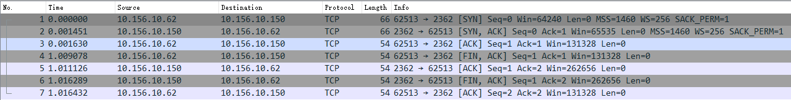
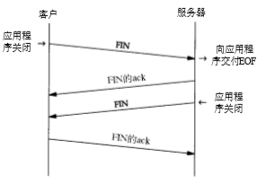
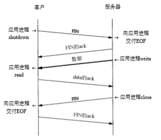
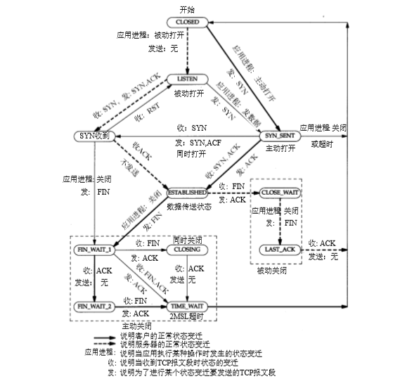
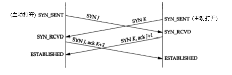
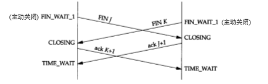
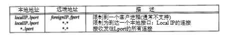

# 1. tcp从建立到终止

- [1. tcp从建立到终止](#1-tcp从建立到终止)
  - [1.1. 简介](#11-简介)
  - [1.2. 三次握手四次挥手](#12-三次握手四次挥手)
  - [1.3. TCP状态](#13-tcp状态)
    - [1.3.1. 2MSL等待状态](#131-2msl等待状态)
    - [1.3.2. 平静时间](#132-平静时间)
    - [1.3.3. FIN_WAIT_2 状态](#133-fin_wait_2-状态)
    - [1.3.4. 同时打开](#134-同时打开)
    - [1.3.5. 同时关闭](#135-同时关闭)
  - [1.4. TCP服务器的设计](#14-tcp服务器的设计)
    - [1.4.1. 限定IP和端口](#141-限定ip和端口)
    - [1.4.2. 呼入连接请求队列](#142-呼入连接请求队列)
  - [1.5. 参考资料](#15-参考资料)

## 1.1. 简介

&emsp;&emsp;TCP 是一个面向连接的协议。无论哪一方向另一方发送数据之前，都必须先在双方之间 建立一条连接。本章将详细讨论一个 TCP 连接是如何建立的以及通信结束后是如何终止的。

## 1.2. 三次握手四次挥手

TCP三次握手四次挥手抓包数据图

连接终止期间报文段的正常交换

TCP半关闭的例子

## 1.3. TCP状态

TCP正常连接建立和终止所对应的状态

TCP的状态变迁图

- 只有处于 LISTEN 的进程能够接收新的连接请求。
- 处于 ESTABLISHED 的进程将不能接收 SYN 报文段，而处于 LISTEN 的进程将不能接收数据报文段。
- CLOSED 状态不是一个真正的状态，而是这个状态图的假想起点和终点
- 从 LISTEN 到 SYN_SENT 的变迁是 正确的，但伯克利版的 TCP 软件并不支持它

### 1.3.1. 2MSL等待状态

&emsp;&emsp;TIME_WAIT 状态也称为2 MSL 等待状态。每个具体 TCP 实现必须选择一个报文段最大生存时间 MSL （Maximum Segment Lifetime）。它是任何报文段被丢弃前在网络内的最长时间。我们知道这个时间是有限的，因为 TCP 报文段以 IP 数据报在网络内传输，而 IP 数据报则有限制其生存时间的 TTL 字段。

&emsp;&emsp;RFC 793 [Postel 1981c] 指出MSL为2分钟。然而实现中的常用值是30秒，1分钟， 或2分钟。

&emsp;&emsp;某些实现和 API 提供了一种避开这个限制的方法。使用插口 API 时，可说明其中的 SO_REUSEADDR 选项。它将让调用者对处于 2MSL 等待的本地端口进行赋值，但我们将看到TCP原则上仍将避免使用仍处于2MSL连接中的端口。

- **为什么客户端在TIME-WAIT状态必须等待2MSL的时间？**
  1. **保证客户端发送的最后一个ACK报文段能够到达服务端。**  
  这个ACK报文段有可能丢失，使得处于LAST-ACK状态的B收不到对已发送的FIN+ACK报文段的确认，服务端超时重传FIN+ACK报文段，而客户端能在2MSL时间内收到这个重传的FIN+ACK报文段，接着客户端重传一次确认，重新启动2MSL计时器，最后客户端和服务端都进入到CLOSED状态，若客户端在TIME-WAIT状态不等待一段时间，而是发送完ACK报文段后立即释放连接，则无法收到服务端重传的FIN+ACK报文段，所以不会再发送一次确认报文段，则服务端无法正常进入到CLOSED状态。
  2. **防止“已失效的连接请求报文段”出现在本连接中。**  
  客户端在发送完最后一个ACK报文段后，再经过2MSL，就可以使本连接持续的时间内所产生的所有报文段都从网络中消失，使下一个新的连接中不会出现这种旧的连接请求报文段。

### 1.3.2. 平静时间

&emsp;&emsp;对于来自某个连接的较早替身的迟到报文段， 2MSL 等待可防止将它解释成使用相同插口对的新连接的一部分。但这只有在处于 2MSL 等待连接中的主机处于正常工作状态时才有效。

&emsp;&emsp;如果使用处于 2MSL 等待端口的主机出现故障，它会在 MSL 秒内重新启动，并立即使用故障前仍处于2MSL 的插口对来建立一个新的连接吗？如果是这样，在故障前从这个连接发出而迟到的报文段会被错误地当作属于重启后新连接的报文段。无论如何选择重启后新连接的初始序号，都会发生这种情况。

&emsp;&emsp;为了防止这种情况，RFC793 指出 TCP 在重启动后的 MSL 秒内不能建立任何连接。这就称为平静时间(quiet time)。

&emsp;&emsp;只有极少的实现版遵守这一原则，因为大多数主机重启动的时间都比MSL秒要长。

### 1.3.3. FIN_WAIT_2 状态

&emsp;&emsp;在 FIN_WAIT_2 状态我们已经发出了 FIN ，并且另一端也已对它进行确认。除非我们在实行半关闭，否则将等待另一端的应用层意识到它已收到一个文件结束符说明，并向我们发一个 FIN 来关闭另一方向的连接。只有当另一端的进程完成这个关闭，我们这端才会从 FIN_WAIT_2 状态进入 TIME_WAIT 状态。

&emsp;&emsp;这意味着我们这端可能永远保持这个状态。另一端也将处于 CLOSE_WAIT 状态，并一直保持这个状态直到应用层决定进行关闭。

&emsp;&emsp;许多伯克利实现采用如下方式来防止这种在 FIN_WAIT_2 状态的无限等待。如果执行主动关闭的应用层将进行全关闭，而不是半关闭来说明它还想接收数据，就设置一个定时器。如果这个连接空闲 10 分钟 75 秒，TCP 将进入 CLOSED 状态。在实现代码的注释中确认这个实现代码违背协议的规范。

### 1.3.4. 同时打开

&emsp;&emsp;两端几乎在同时发送 SYN ，并进入 SYN_SENT 状态。当每一端收到 SYN 时，状态变为 SYN_RCVD，同时它们都再发 SYN 并对收到的 SYN 进行确认。当双方都收到 SYN 及相应的 ACK 时，状态都变迁为 ESTABLISHED 。如下图所示。

&emsp;&emsp;许多伯克利版的 TCP 实现都不能正确地支持同时打开。

### 1.3.5. 同时关闭

&emsp;&emsp;我们在以前讨论过一方（通常但不总是客户方）发送第一个 FIN 执行主动关闭。双方都执行主动关闭也是可能的， TCP 协议也允许这样的同时关闭（simultaneous close）。 当应用层发出关闭命令时，两端均从 ESTABLISHED 变为 FIN_WAIT_1。 这将导致双方各发送一个 FIN ，两个 FIN 经过网络传送后分别到达另一端。收到 FIN 后，状态由 FIN_WAIT_1 变迁到CLOSING，并发送最后的 ACK。当收到最后的 ACK 时，状态变化为 TIME_WAIT。如下图：

## 1.4. TCP服务器的设计

### 1.4.1. 限定IP和端口

TCP服务器本地和远端IP地址及端口号的规范,可以指定本地IP，端口，也可以指定远端IP和端口(一般不支持)

### 1.4.2. 呼入连接请求队列

&emsp;&emsp;一个并发服务器调用一个新的进程来处理每个客户请求，因此处于被动连接请求的服务器应该始终准备处理下一个呼入的连接请求。那正是使用并发服务器的根本原因。但仍有可能出现当服务器在创建一个新的进程时，或操作系统正忙于处理优先级更高的进程时，到达多个连接请求。当服务器正处于忙时，TCP 是如何处理这些呼入的连接请求？

- 在伯克利的 TCP 实现中采用以下规则
  1. 正等待连接请求的一端有一个固定长度的连接队列，该队列中的连接已被 TCP 接受 （即三次握手已经完成），但还没有被应用层所接受。 注意区分 TCP 接受一个连接是将其放入这个队列，而应用层接受连接是将其从该队列中移出。
  2. 应用层将指明该队列的最大长度，这个值通常称为积压值( backlog )。它的取值范围是 0~5 之间的整数，包括0和5（大多数的应用程序都将这个值说明为 5）。挤压值有些系统不是与实际数值意义对应，具体详见下图中二类系统的对应值。
  3. 当一个连接请求（即 SYN ）到达时， TCP 使用一个算法，根据当前连接队列中的连接数来确定是否接收这个连接。我们期望应用层说明的积压值为这一端点所能允许接受连接的最大数目。 注意，积压值说明的是 TCP 监听的端点已被 TCP 接受而等待应用层接受的最大连接数。这个积压值对系统所允许的最大连接数，或者并发服务器所能并发处理的客户数，并无影响。
  4. 如果对于新的连接请求，连接队列中已没有空间，TCP 将不理会收到的 SYN。也不发回任何报文段（即不发回 RST ）。如果应用层不能及时接受已被 TCP 接受的连接，这些连接可能占满整个连接队列，客户的主动打开最终将超时。

BSD系统的 backlog 由于某些原因，这个值是 乘3除2加1

## 1.5. 参考资料

1. [TCP连接建立和终止](./../TCP-IP详解卷1/018.PDF)
