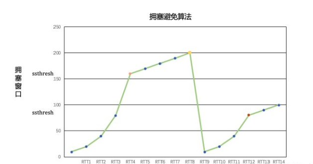

# 1. TCP的超时与重传

- [1. TCP的超时与重传](#1-tcp的超时与重传)
  - [1.1. 往返时间测量RTT](#11-往返时间测量rtt)
  - [1.2. 拥塞避免](#12-拥塞避免)
    - [1.2.1. 慢启动](#121-慢启动)
    - [1.2.2. 拥塞避免算法](#122-拥塞避免算法)
    - [1.2.3. 快速重传与快速恢复算法](#123-快速重传与快速恢复算法)
  - [1.3. 参考资料](#13-参考资料)

## 1.1. 往返时间测量RTT

&emsp;&emsp;RTT（Round Trip Time）由三部分组成：链路的传播时间（propagation delay）、末端系统的处理时间、路由器缓存中的排队和处理时间（queuing delay）。
&emsp;&emsp;其中，前两个部分的值对于一个TCP连接相对固定，路由器缓存中的排队和处理时间会随着整个网络拥塞程度的变化而变化。所以RTT的变化在一定程度上反应了网络的拥塞程度。

RTT = 当前时间 - 数据包中Timestamp选项的回显时间

这个回显时间是该数据包发出去的时间，知道了数据包的接收时间（当前时间）和发送时间（回显时间），就可以轻松的得到RTT的一个测量值。

## 1.2. 拥塞避免

### 1.2.1. 慢启动

&emsp;&emsp;现在， TCP 需要支持一种被称为“慢启动(slow start)”的算法。该算法通过观察到新分组进入网络的速率应该与另一端返回确认的速率相同而进行工作。

&emsp;&emsp;慢启动为发送方的 TCP 增加了另一个窗口：拥塞窗口(congestion window)，记为 cwnd 。当与另一个网络的主机建立 TCP 连接时，拥塞窗口被初始化为 1个报文段（即另一端通告的报文段大小）。每收到一个 ACK ，拥塞窗口就增加一个报文段（ cwnd 以字节为单位，但是慢启动以报文段大小为单位进行增加）。发送方取拥塞窗口与通告窗口中的最小值作为发送上限。拥塞窗口是发送方使用的流量控制，而通告窗口则是接收方使用的流量控制。

```shell
#linux禁用慢启动
$> sysctl net.ipv4.tcp_slow_start_after_idle
$> sysctl -w net.ipv4.tcp_slow_start_after_idle=0
```

&emsp;&emsp;发送方开始时发送一个报文段，然后等待 ACK 。当收到该 ACK 时，拥塞窗口从1增加为2， 即可以发送两个报文段。当收到这两个报文段的  ACK 时，拥塞窗口就增加为4。这是一种指数增加的关系。

&emsp;&emsp; 在某些点上可能达到了互联网的容量，于是中间路由器开始丢弃分组。这就通知发送方 它的拥塞窗口开得过大。、

### 1.2.2. 拥塞避免算法

&emsp;&emsp;拥塞避免算法和慢启动算法是两个不同的算法，但是他们都是为了解决拥塞，在实际中这两个算法通常是在一起实现的。相比于慢启动算法拥塞避免算法多维护了一个慢启动阈值 ssthresh(65535)。

&emsp;&emsp;当 `cwnd<ssthresh` 时，拥塞窗口使用慢启动算法，按指数级增长。 当 `cwnd>ssthresh` 时，拥塞窗口使用拥塞避免算法，按线性增长。拥塞避免算法每经过一个RTT，拥塞窗口增加 initcwnd。

&emsp;&emsp;当发生拥塞的时候（超时或者收到重复ack），RFC5681认为此时 ssthresh 需要置为没有被确认包的一半(当前可用窗口的一半)，但是不小于两个MSS。此外，如果是超时引起的拥塞，则cwnd被置为initcwnd。

- 超时重传对传输性能有严重影响。
  - 原因之一是在RTO阶段不能传数据，相当于浪费了一段时间；
  - 原因之二是拥塞窗口的急剧减小，相当于接下来传得慢多了。

慢启动和拥塞避免算法,如下图



修改方法详见链接 [linux修改拥塞控制参数](https://blog.csdn.net/zhangskd/article/details/7608343)

### 1.2.3. 快速重传与快速恢复算法

&emsp;&emsp;在介绍修改之前，我们认识到在收到一个失序的报文段时， TCP 立即需要产生一个 ACK （一个重复的 ACK ）。这个重复的 ACK 不应该被迟延。该重复的 ACK 的目的在于让对方知道收到一个失序的报文段，并告诉对方自己希望收到的序号。

&emsp;&emsp;由于我们不知道一个重复的 ACK 是由一个丢失的报文段引起的，还是由于仅仅出现了几个报文段的重新排序，因此我们等待少量重复的 ACK 到来。假如这只是一些报文段的重新排序，则在重新排序的报文段被处理并产生一个新的 ACK 之前，只可能产生1 ~ 2个重复的 ACK 。如果一连串收到3个或3个以上的重复 ACK ，就非常可能是一个报文段丢失了（我们在2 1 . 5节中见到过这种现象）。于是我们就重传丢失的数据报文段，而无需等待超时定时器溢出。这就是快速重传算法。接下来执行的不是慢启动算法而是拥塞避免算法。这就是快速恢复算法。

这个算法通常按如下过程进行实现

1. 当收到第3个重复的 ACK 时，将 ssthresh 设置为当前拥塞窗口 cwnd 的一半。重传丢失的 报文段。设置 cwnd 为 ssthresh 加上3倍的报文段大小。
2. 每次收到另一个重复的 ACK 时， cwnd 增加1个报文段大小并发送 1个分组（如果新的  cwnd 允许发送）。
3. 当下一个确认新数据的 ACK 到达时，设置 cwnd 为 ssthresh （在第1步中设置的值）。这个  ACK 应该是在进行重传后的一个往返时间内对步骤 1中重传的确认。另外，这个  ACK 也应该 是对丢失的分组和收到的第1个重复的 ACK 之间的所有中间报文段的确认。这一步采用的是拥塞避免，因为当分组丢失时我们将当前的速率减半。

## 1.3. 参考资料

1. [TCP的超时与重传](../TCP-IP详解卷1/021.PDF)
