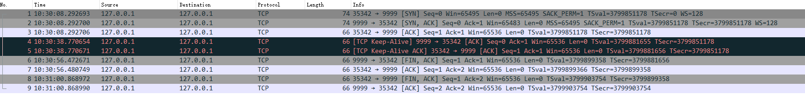
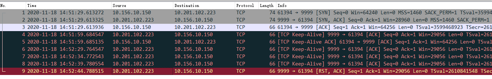
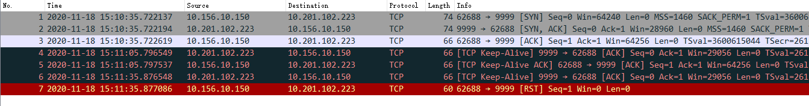

# 1. TCP的定时器

- [1. TCP的定时器](#1-tcp的定时器)
  - [1.1. TCP的坚持定时器](#11-tcp的坚持定时器)
  - [1.2. TCP的保活定时器](#12-tcp的保活定时器)
  - [1.3. TCP的重传定时器](#13-tcp的重传定时器)
  - [1.4. TCP的2MSL定时器](#14-tcp的2msl定时器)
  - [1.5. 参考资料](#15-参考资料)

## 1.1. TCP的坚持定时器

- 当接收窗口变为0是，会发送 win = 0的ACK，告知对方停止发送。
- 当接收窗口变为MSS(或变为Windows的一般时)，发送窗口更新ACK，通知发送方继续发送数据。

&emsp;&emsp; TCP 不对 ACK 报文段进行确认， TCP 只确认那些包含有数据的 ACK 报文段。 如果更新窗口确认丢失了，则双方就有可能因为等待对方而使连接终止：接收方等待接收数据（因为它已经向发送方通告了一个非 0的窗口），而发送方在等待允许它继续发送数据的窗口更新。为防止这种死锁情况的发生，发送方使用一个坚持定时器 (persist timer)来周期性地 向接收方查询，以便发现窗口是否已增大。这些从发送方发出的报文段称为窗口探查 ( windowprobe )。

&emsp;&emsp;坚持定时器的原理是简单的，当TCP服务器收到了客户端的0滑动窗口报文的时候，就启动一个定时器来计时，并在定时器溢出的时候向向客户端查询窗口是否已经增大，如果得到非零的窗口就重新开始发送数据，如果得到0窗口就再开一个新的定时器准备下一次查询。通过观察可以得知，TCP的坚持定时器使用1，2，4，8，16……64秒这样的普通指数退避序列来作为每一次的溢出时间。

具体详见 ../test/persistTime.cap

## 1.2. TCP的保活定时器

&emsp;&emsp;如果 TCP 连接的双方都没有向对方发送数据，则在两个 TCP 模块之间不交换任何信息。 这意味着我们可以启动一个客户与服务器建 立一个连接，然后离去数小时、数天、数个星期或者数月，而连接依然保持。中间路由器可 以崩溃和重启，电话线可以被挂断再连通，但是只要两端的主机没有被重启，则连接依然保 持建立。

- 保活并不是 TCP 规范中的一部分。Host Requirements RFC提供了3个不使用保活定 时器的理由：
  - 在出现短暂差错的情况下，这可能会使一个非常好的连接释放掉；
  - 它们耗费不必要的带宽；
  - 在按分组计费的情况下会在互联网上花掉更多的钱。

一般这个功能在服务端使用，检测客户端的链接状态。当然客户端也可以使用

- 如果一个给定的连接在两个小时之内没有任何动作，则服务器就向客户发送一个探查报 文段。客户主机必须处于以下 4 个状态之一
  1. 客户主机依然正常运行，并从服务器可达。客户的 TCP响应正常，而服务器也知道对方是正常工作的。服务器在两小时以后将保活定时器复位。如果在两个小时定时器到时间之前有应用程序的通信量通过此连接，则定时器在交换数据后的未来 2 小时再复位。
  2. 客户主机已经崩溃，并且关闭或者正在重新启动。在任何一种情况下，客户的 TCP 都 没有响应。服务器将不能够收到对探查的响应，并在 7 5秒后超时。服务器总共发送 1 0个这样 的探查，每个间隔7 5秒。如果服务器没有收到一个响应，它就认为客户主机已经关闭并终止 连接。
  3. 客户主机崩溃并已经重新启动。这时服务器将收到一个对其保活探查的响应，但是这个响应是一个复位，使得服务器终止这个连接。
  4. 客户主机正常运行，但是从服务器不可达。这与状态 2 相同，因为 TCP 不能够区分状态 4 与状态 2 之间的区别，它所能发现的就是没有收到探查的响应。

&emsp;&emsp;在第1种情况下，服务器的应用程序没有感觉到保活探查的发生。 TCP 层负责一切。这个 过程对应用程序都是透明的，直至第 2、3或4种情况发生。在这三种情况下，服务器应用程序 将收到来自它的 TCP 的差错报告（通常服务器已经向网络发出了读操作请求，然后等待来自 客户的数据。如果保活功能返回一个差错，则该差错将作为读操作的返回值返回给服务器）。 在第2种情况下，差错是诸如“连接超时”之类的信息，而在第 3种情况则为“连接被对方复 位”。第4种情况看起来像是连接超时，也可根据是否收到与连接有关的 ICMP 差错来返回其他的差错。

&emsp;&emsp;一个被人们不断讨论的关于保活选项的问题就是两个小时的空闲时间是否可以改 变。通常他们希望该数值可以小得多，处在分钟的数量级。这个值通常可以改变，但是在所有系统中，保活间隔时间是系统级的 变量，因此改变它会影响到所有使用该功能的用户

```bash
# 保活时间：默认7200秒（2小时）如果一个给定的连接在两个小时之内没有任何动作，则服务器就向客户发送一个探查报文段
cat /proc/sys/net/ipv4/tcp_keepalive_time
#保活时间间隔：默认75秒,总共发送 9 个这样的探查，每个间隔 75 秒。如果服务器没有收到一个响应，它就认为客户主机已经关闭并终止连接。
cat /proc/sys/net/ipv4/tcp_keepalive_intvl
#保活探测数：默认9次
cat /proc/sys/net/ipv4/tcp_keepalive_probes
```

正常保活包，详见 ../test/keepAlive.cap


网络异常保活尝试包，详见 ../test/keepAliveCrash.cap


异常后网络恢复保活相应包，详见 ../test/keepAliveReset.cap


## 1.3. TCP的重传定时器

&emsp;&emsp; TCP 提供可靠的运输层。它使用的方法之一就是确认从另一端收到的数据。但数据和确 认都有可能会丢失。 TCP 通过在发送时设置一个定时器来解决这种问题。如果当定时器溢出时还没有收到确认，它就重传该数据。对任何实现而言，关键之处就在于超时和重传的策略，即怎样决定超时间隔和如何确定重传的频率。

最初的算法：

```s
R = k1*R+ (1-k1)M //均值
RTO = k2*R        //均值直接估算 RTO
```

- M 表示所测量到的RTT
- k1 是一个推荐值为 0.9 的平滑因子。每次进行新测量的时候，这个被平滑的 RTT 将得到更新。每个新估计的 90％ 来自前一个估计，而 10% 则取自新的测量
- 这里的 k2 是一个推荐值为 2 的时延离散因子

优化后算法(结合了方差)：

```s
Err = M-A
A = A+g*Err      //均值，等同于 A = A+g(M-A)=(1-g)A+gM，和初始算法一致，g=1-k1
D = D+h(|Err|-D) //均值偏差是对标准偏差的一种好的逼近，等同于 D = (1-h)D+h|M-A|
RTO = A+4D       //均值和偏差同时估算 ROT
```

- M 表示所测量到的RTT
- Err 是刚得到的测量结果与当前的 RTT 估计器之差。
- A 是被平滑的 RTT（均值的估计器）
- D 则是被平滑的均值偏差,A和D均被用于计算下一个重传时间（RTO）。
- 增量g起平均作用， 取为 1/8（0.125）。
- 偏差的增益是h，取值为0.25。当 RTT 变化时，较大的偏差增益将使 RTO 快速上升。
- 基于均值和方差来计算 RTO，将比作为均值的常数倍数来计算 RTO能提供更好的响应。

## 1.4. TCP的2MSL定时器

具体详见[TCP从建立到终止](./2_TCP从建立到终止.md2_TCP) 的 2.3.1 2MSL等待状态 章节

## 1.5. 参考资料

1. [TCP的超时与重传](../TCP-IP详解卷1/021.PDF)
2. [TCP的坚持定时器](../TCP-IP详解卷1/022.PDF)
3. [TCP的保活定时器](../TCP-IP详解卷1/023.PDF)
4. [TCP的超时与重传](../TCP-IP详解卷1/018.PDF)
