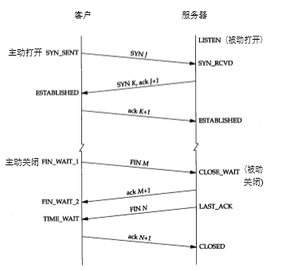

# 1. 本目录说明

- [1. 本目录说明](#1-本目录说明)
  - [1.1. 抓包](#11-抓包)
    - [1.1.1. connect.pcapng](#111-connectpcapng)
    - [1.1.2. tcpSend.pcapng](#112-tcpsendpcapng)
  - [1.2. python 文件](#12-python-文件)
    - [1.2.1. replace.py](#121-replacepy)
    - [1.2.2. tcpClient.py](#122-tcpclientpy)
    - [1.2.3. tcpClient2.py](#123-tcpclient2py)
    - [1.2.4. tcpServer.py](#124-tcpserverpy)
    - [1.2.5. test.py](#125-testpy)
  - [1.3. tcp 状态 Demo](#13-tcp-状态-demo)
    - [1.3.1. Server 缓存池](#131-server-缓存池)
    - [1.3.2. LISTEN 状态](#132-listen-状态)
    - [1.3.2. ESTABLISHED 状态](#132-established-状态)
    - [1.3.3. FIN_WAIT2 状态](#133-fin_wait2-状态)
    - [1.3.4. CLOSE_WAIT 状态](#134-close_wait-状态)
    - [1.3.5. TIME_WAIT 状态](#135-time_wait-状态)
    - [1.3.6. 同时关闭](#136-同时关闭)

## 1.1. 抓包

### 1.1.1. connect.pcapng

三次握手，四次挥手

### 1.1.2. tcpSend.pcapng

正常的大数据发送抓包，62发送数据给150，然后150全部返回给62

## 1.2. python 文件

### 1.2.1. replace.py

博客编写辅助文件(从pdf拷贝后，有些格式不规整)，替换一个格式不正确的内容。

### 1.2.2. tcpClient.py

多线程客户端

### 1.2.3. tcpClient2.py

单线程客户端

### 1.2.4. tcpServer.py

tcp服务端，监听2362端口

### 1.2.5. test.py

测试代码，可以忽略

## 1.3. tcp 状态 Demo

### 1.3.1. Server 缓存池

详见 `SimpleNetwork/listenlimit`

### 1.3.2. LISTEN 状态

详见 `SimpleNetwork/listenlimit`

### 1.3.2. ESTABLISHED 状态

详见 `SimpleNetwork/listenlimit`

### 1.3.3. FIN_WAIT2 状态

详见 `SimpleNetwork/close`

### 1.3.4. CLOSE_WAIT 状态

详见 `SimpleNetwork/close`

### 1.3.5. TIME_WAIT 状态

详见 `SimpleNetwork/close`

### 1.3.6. 同时关闭
