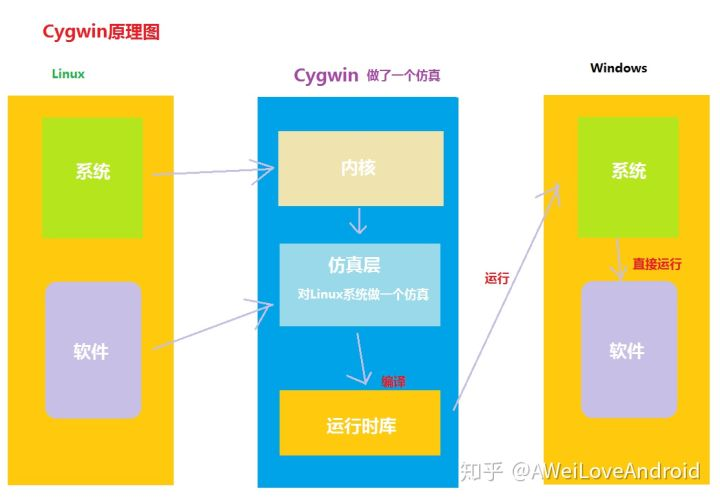
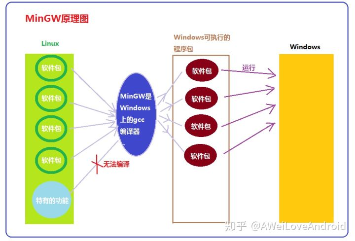

# 1. mingw_cygwin_msys_mingw-w64_msys2

- [1. mingw_cygwin_msys_mingw-w64_msys2](#1-mingwcygwinmsysmingw-w64msys2)
  - [1.1. 简介](#11-%e7%ae%80%e4%bb%8b)
  - [1.2. Cygwin](#12-cygwin)
  - [1.3. MinGW](#13-mingw)
  - [1.4. MSYS](#14-msys)
  - [1.5. MinGW-64](#15-mingw-64)
  - [1.6. msys2](#16-msys2)
  - [1.7. 区别](#17-%e5%8c%ba%e5%88%ab)
  - [1.8. 参考资料](#18-%e5%8f%82%e8%80%83%e8%b5%84%e6%96%99)

## 1.1. 简介

mingw，主要是用linux的gnu工具，如gcc，gdb开发windows程序。。。所以主要是gcc，gdb移植到win，并且加点库。

cygwin就是windows下开发linux，生成的是linux包。所以类似一个子系统。

msys主要是mingw基础上加了个类似unix命令行。

mingw-w64是多加了写api函数。

msys2是因为msys开发太慢又搞了的一个东西。

## 1.2. Cygwin

    Cygwin，原 Cygnus 出品（已被红帽收购），目前是 RedHat 名下的项目。项目的目的是提供运行于Windows 平台的类 Unix 环境（以 GNU 工具为代表），为了达到这个目的，Cygwin 提供了一套抽象dll，用于将部分 Posix 调用转换成 Windows 的 API 调用，实现相关功能。这里面最典型的，最基本的模拟层就是那个 cygwin1.dll。除此之外，随着 Linux 系统的发展壮大，目前的 Cygwin 已经不仅仅提供POSIX 兼容，因此也顺带多了更多模拟层的依赖关系。

    Cygwin 的目录结构基本照搬了 linux 的样子，但同时，也兼容了 Windows 的许多功能：大部分应用使用Unix 风格的路径，Windows的盘符通过类似挂载点的方式提供给 Cygwin 使用；Cygwin 中既可以运行Cygwin 的应用（依赖模拟层），又可以运行 Windows 应用，而传递给应用的路径会经过它的模拟层变换，以此保证程序运行不会出错。
    
    由于它的模拟层实现了相当良好的 Posix 兼容，人们试着将许多重要的 Linux/BSD 应用移植到了Cygwin下，使得Cygwin越来越大，功能也越来越丰富，以至于目前很多人直接把将Linux应用移植到Windows平台的任务都交给了Cygwin（当然，这种移植并非原生）。事实上，Cygwin诞生之初，本就是想通过GCC编译出Windows应用来，因为bootstrap GCC而顺带搞了一坨别的东西过来，最后发展到现在的。
    
    小结：Cygwin是运行于Windows平台的POSIX“子系统”，提供Windows下的类Unix环境，并提供将部分 Linux 应用“移植”到Windows平台的开发环境的一套软件。按照我经常开玩笑的话来讲，Cygwin 基本上就是传说中的 GNU/NT 系统（对照 GNU/Linux，GNU/BSD，GNU/HURD）。

## 1.3. MinGW

    MinGW，Minimalist GNU for Windows，用于开发原生（32位） Windows 应用的开发环境。它主要提供了针对 win32 应用的 GCC、GNU binutils 等工具，以及对等于 Windows SDK（的子集）的头文件和用于 MinGW 版本 linker 的库文件（so、a等，而不是 VC 的 lib）。

    MinGW 能够替代 cl 用于编译不包含 MFC 的、以 WinSDK 为主的 Windows 应用，并且编译出来的应用不依赖于第三方的模拟层支持，其运行时为大部分 Windows 标配的 msvcrt（故称原生 Windows 应用）。除此之外，MinGW 也支持 GCC 支持的其他语言。

    因为这些原因，MinGW 被许多 Linux 上发展起来的开发工具选择为 Windows 版本的默认编译器，例如CodeBlocks，例如 DevC++。

    小结，MinGW 是用于进行 Windows 应用开发的 GNU 工具链（开发环境），它的编译产物一般是原生Windows 应用，虽然它本身不一定非要运行在 Windows 系统下（是的 MinGW 工具链也存在于 Linux、BSD 甚至 Cygwin 下）。

## 1.4. MSYS

    MSYS，由于 MinGW 本身仅代表工具链，而在 Windows 下，由于那个shi一样的cmd，以及配套的命令行工具不够齐全（也不舒服），因此，MinGW 开发者从曾经比较旧的 Cygwin 创建了一个分支，也用于提供类 Unix 环境。但与 Cygwin 的大而全不同，MSYS 是冲着小巧玲珑的目标去的，所以整套 MSYS 以及 MinGW，主要以基本的 Linux 工具为主，大小在 200M 左右，并且没有多少扩展能力。
    
    MSYS 是用于辅助 Windows 版 MinGW 进行命令行开发的配套软件包，提供了部分 Unix 工具以使得MinGW 的工具使用起来方便一些。如果不喜欢庞大的 Cygwin，而且使用不多，可以试试。不过喜欢完整体验、不在乎磁盘占用等等，还是推荐 Cygwin 而不是 MSYS。

## 1.5. MinGW-64

    MinGW-w64，前面提到的 MinGW，是针对 32 位 Windows 应用开发的。而且由于版本问题，不能很好的支持较新的 Windows API。MinGW-W64 则是新一代的 MinGW，支持更多的 API，支持 64 位应用开发，甚至支持 32 位 host 编译 64 位应用以及反过来的“交叉”编译。除此之外，它本身也有 32 位和 64位不同版本，其它与 MinGW 相同。

## 1.6. msys2

    MSYS2，由于 MinGW 万年不更新，MSYS 更是，Cygwin的许多新功能 MSYS 没有同步过来，于是 Alex等人建立了新一代的 MSYS 项目。仍然是 fork 了 Cygwin（较新版），但有个更优秀的包管理器pacman，有活跃的开发者跟用户组，有大量预编译的软件包（虽然肯定没有Cygwin多）……对于不喜欢庞大的 Cygwin 的用户而言，推荐试试 msys2。

## 1.7. 区别

    区别（小结）：Cygwin是模拟 POSIX 系统，源码移植 Linux 应用到 Windows 下；MinGW 是用于开发Windows 应用的开发环境。
    联系：均提供了部分 Linux 下的应用，多跑在 Windows 上；MinGW 作为 Cygwin 下的软件包，可以在Cygwin 上运行。

    MinGW 是让Windows 用户可以用上GNU 工具，比如GCC。
    Cygwin 提供完整的类Unix 环境，Windows 用户不仅可以使用GNU 工具，理论上Linux 上的程序只要用Cygwin 重新编译，就可以在Windows 上运行。

    如果程序只用到C/C++ 标准库，可以用MinGW 或Cygwin 编译。
    如果程序还用到了POSIX API，则只能用Cygwin 编译。

    程序经MinGW 编译后可以直接在Windows 上面运行。
    程序经Cygwin 编译后运行，需要依赖安装时附带的cygwin1.dll。

    因为cygwin是虚拟了一个linux环境（cygwin.dll),运行时都需要这个中间模块，所以运行起来会慢一些。如果仅仅是学习和一般使用，这种慢很难察觉。但是如果是为了科学计算，差别会明显。（cygwin下30s,mingw下运行只需6s）另外，cygwin下也有mingw的实现版本。

    MinGW是跑在windows上的gcc toolchain，跟msvc编译器是同范畴的东西, Cygwin和MSYS是跑在windows上的可运行POSIX应用程序的工具环境，shell环境，跟linux下的wine同范畴。

## 1.8. 参考资料

1. [mingw ，cygwin，msys，mingw-w64，msys2区别一句话总结](https://blog.csdn.net/me4weizhen/article/details/52667708)
2. [Cygwin 和MinGW 的区别与联系是怎样的](https://www.zhihu.com/question/22137175)
