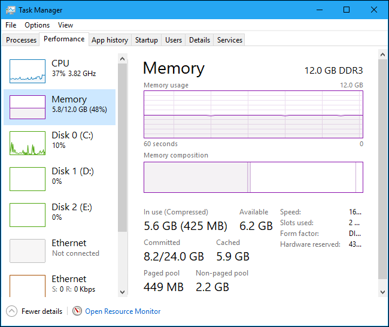
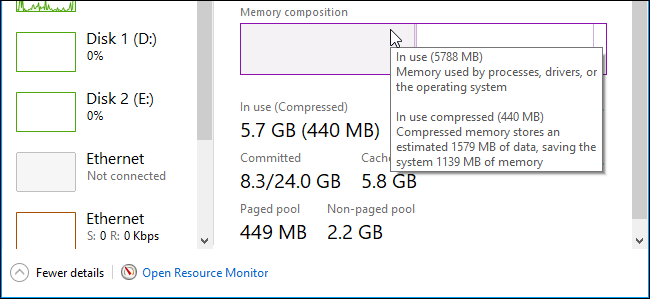

- [memory compression](#memory-compression)
  - [简介](#简介)
  - [Is Compressed Memory Bad?](#is-compressed-memory-bad)
  - [How to View Compressed Memory Details on Your PC](#how-to-view-compressed-memory-details-on-your-pc)
  - [参考资料](#参考资料)
    - [1.What Is Memory Compression in Windows 10?](#1what-is-memory-compression-in-windows-10)

# memory compression
## 简介
    Memory compression is a new feature in Windows 10, and is not available on Windows 7 and 8. However, both Linux and Apple’s macOS also use memory compression.

    RELATED: What Is the Windows Page File, and Should You Disable It?

    Traditionally, if you had 8 GB of RAM and applications had 9 GB of stuff to store in that RAM, at least 1 GB would have to be “paged out” and stored in the page file on your computer’s disk. Accessing data in the page file is very slow compared to RAM.

    With memory compression, some of that 9 GB of data can be compressed (just like a Zip file or other compressed data can be shrunk down) and kept in RAM. For example, you might have 6 GB of uncompressed data and 3 GB of compressed data that actually takes up 1.5 GB in RAM. You’d be storing all 9 GB of the original data in your 8 GB of RAM, as it would only take up 7.5 GB once some of it was compressed.

    Is there a downside? Well, yes and no. Compressing and uncompressing the data takes some CPU resources, which is why not all data is stored compressed—it’s only compressed when Windows thinks it’s necessary and helpful. Compressing and uncompressing the data at the cost of some CPU time is much, much faster than paging the data out to disk and reading it from the page file, though, so it’s usually worth the tradeoff.

+ dos下运行命令 `Get-Process -Name "Memory Compression"` 查看

## Is Compressed Memory Bad?
Compressing data in memory is much better than the alternative, which is paging that data out to disk. It’s faster than using the page file. There’s no downside to compressed memory. Windows will automatically compress data in memory when it needs space, and you don’t need even to think about this feature.

But memory compression does use some CPU resources. Your system may not perform as fast as it would if it didn’t need to compress data in memory in the first place. If you see a lot of compressed memory and suspect it’s the reason your PC is a bit slow, the only solution for this is installing more physical memory (RAM) in your system. If your PC doesn’t have enough physical memory for the applications you use, memory compression is better than the page file—but more physical memory is the best solution.

## How to View Compressed Memory Details on Your PC
 the Task Manager shows that our system is currently using 5.6 GB of its physical memory. 425 MB of that 5.6 GB is compressed memory.

If you mouse over the the left-most part of the bar under Memory composition, you’ll see more details about your compressed memory. 

## 参考资料
### 1.[What Is Memory Compression in Windows 10?](https://www.howtogeek.com/319933/what-is-memory-compression-in-windows-10/)
