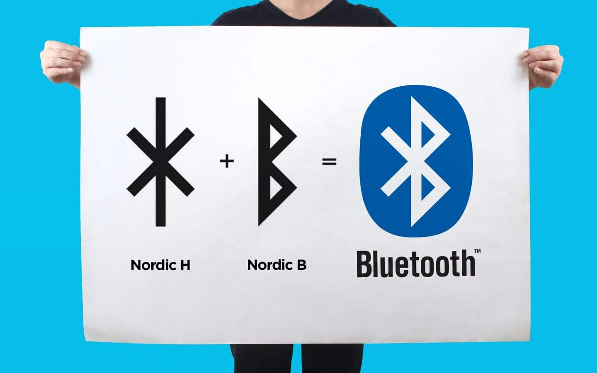
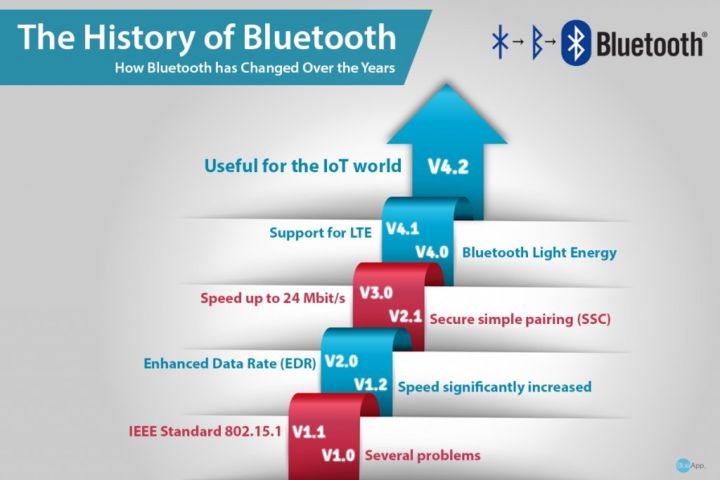
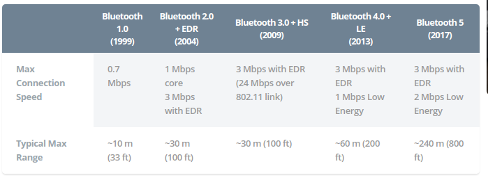

[toc]
# 一、蓝牙的前世今生(1.0 到 5.0)：
# 1. 蓝牙的简介:
从1998年诞生到现在, 不知不觉这个世界将有[40亿蓝牙设备](https://www.shenzhenware.com/articles/12386)了. 蓝牙经历了1.0到5.0的技术变迁, 从音频传输、图文传输、视频传输, 再到以低功耗为主打的物联网传输,渗透到方方面面. 
# 2. "蓝牙(bluetooth)"的由来:
蓝牙(bluetooth)一词取自于十世纪丹麦国王哈拉尔(Harald Bluetooth)的名字.

而将"蓝牙"与后来无线通讯技术标准关联到一起的,是来自英特尔的工程师Jim Kardach. 他在一次无线通讯行业会议上, 提议将「Bluetooth」作为无线通讯技术标准的名称.
**历史小故事**:
由于哈拉尔国王以统一了因宗教战争和领土争议而分裂的挪威与丹麦而闻名于世, 国王的成就与 Jim Kardach 的理念不谋而合, 他希望蓝牙也可以成为统一的通用传输标准——将所有分散的设备与内容互联互通. 蓝牙的 LOGO 来自后弗萨克文的符文组合, 将哈拉尔国王名字的首字母 H 和 B 拼在一起, 成为了今天大家熟知的蓝色徽标.

## 2. 蓝牙的起源 & 发展:
### 2.1 蓝牙的起源:
蓝牙的历史实际要追溯到二战时期. 蓝牙的核心是短距离无线点通讯, 它的基础来自于[跳频扩频(FHSS)技术](https://baike.baidu.com/item/%E8%B7%B3%E9%A2%91%E6%8A%80%E6%9C%AF)
蓝牙技术开始于爱立信在1994年创制的方案, 该方案旨在研究移动电话和其他配件间进行低功耗,低成本无线通信连接的方法.发明者希望为设备间的无线通讯创造一组统一规则(标准协议),以解决用户间互不兼容的移动电子设备的通讯问题, 用于代替[RS-232串口通讯协议](https://zh.wikipedia.org/zh-hans/RS-232).

1998年5月20日, 爱立信联合IBM、英特尔、诺基亚、东芝等5家厂商成立[特别兴趣小组(Special Interest Group, SIG)](https://www.bluetooth.com/about-us/our-history/), 即:蓝牙技术联盟的前身, 目标是开发一个低成本、高效益、可以在短距离范围内随意无线连接的蓝牙技术标准. 同年蓝牙退出0.7规格,支持Baseband 与 LMP(Link Manager Protocol)通讯协定两部分.

1999年,先后推出0.8 版、0.9 版、1.0 Draft 版. 完成了 SDP(Service Discovery Protocol)协定和 TCS(Telephony Control Specification)协定.

1999 年 7 月 26 日正式公布 1.0A 版, 确定使用 2.4GHz 频段. 和当时流行的红外线技术相比, 蓝牙有着更高的传输速度, 而且不需要像红外线那样进行接口对接口的连接, 所有蓝牙设备基本上只要在有效通讯范围内使用, 就可以进行随时连接

1999 年下半年, 微软、摩托罗拉、三星、朗讯与蓝牙特别小组的五家公司共同发起成立了蓝牙技术推广组织

### 第一代蓝牙: 关于短距离通讯早期的探索:
#### 1999年: 蓝牙1.0
早期的蓝牙1.0A和1.0B版, 确定使用2.4GHz频谱. 同时, 在两个设备链接(Handshaking)的过程中, 蓝牙硬件的地址(BD_ADDR)会被发送出去, 在协议的层面上不能做到匿名, 造成泄露数据的危险.因此, 当 1.0 版本推出以后, 蓝牙并未立即受到广泛的应用. 除了当时对应蓝牙功能的电子设备种类少, 蓝牙装置也十分昂贵.
#### 2001年: 蓝牙1.1
蓝牙1.1版正式列入IEEE 802.15.1标准, 该标准定义了物理层(PHY)和媒体访问控制(MAC)规范, 用于设备间的无线连接, 传输率为 0.7Mbps. 但因为是早期设计, 容易受到同频率之间产品干扰, 影响通讯质量.
#### 2003年: 蓝牙1.2
蓝牙1.2针对1.0版暴露出的安全行问题, 完善了匿名方式,; 新增了屏蔽设备的硬件地址(BD_ADDR)功能, 保护用户免受身份嗅探攻击和跟踪, 同时向下兼容1.1;  新增了四项新功能:
- AFH(Adaptive Frequency Hopping)适应性跳频技术, 减少了蓝牙产品与其它无线通讯装置之间所产生的干扰问题;
- eSCO(Extended Synchronous Connection-Oriented links)延伸同步连结导向信道技术, 用于提供 QoS 的音频传输, 进一步满足高阶语音与音频产品的需求；
- Faster Connection 快速连接功能, 可以缩短重新搜索与再连接的时间, 使连接过程更为稳定快速;
- 支持 Stereo 音效的传输要求, 但只能以单工方式工作

### 第二代蓝牙：发力传输速率的 EDR 时代:
#### 2004年: 蓝牙2.0
新增EDR(Enhanced Data Rate)技术通过提高多任务处理和多种蓝牙设备同时运行的能力, 提高设备传输率可达3Mbps;蓝牙2.0支持双工模式;EDR 技术通过减少工作负债循环来降低功耗, 由于带宽的增加, 蓝牙 2.0 增加了连接设备的数量.

#### 2007年: 蓝牙2.1
蓝牙 2.1 新增了 Sniff Subrating 省电功能, 将设备间相互确认的讯号发送时间间隔从旧版的 0.1 秒延长到 0.5 秒左右, 从而让蓝牙芯片的工作负载大幅降低;另外, 新增 SSP 简易安全配对功能, 改善了蓝牙设备的配对体验, 同时提升了使用和安全强度;支持 NFC 近场通信, 只要将两个内置有 NFC 芯片的蓝牙设备相互靠近, 配对密码将通过 NFC 进行传输, 无需手动输入.

### 第三代蓝牙：High Speed, 传输速率高达 24Mbps
#### 2009 年：蓝牙 3.0
蓝牙 3.0 新增了可选技术 High Speed, High Speed 可以使蓝牙调用 802.11 WiFi 用于实现高速数据传输, 传输率高达 24Mbps, 是蓝牙 2.0 的 8 倍, 轻松实现录像机至高清电视、PC 至 PMP、UMPC 至打印机之间的资料传输

蓝牙 3.0 的核心是 AMP(Generic Alternate MAC/PHY), 这是一种全新的交替射频技术, 允许蓝牙协议栈针对任一任务动态地选择正确射频

功耗方面, 蓝牙 3.0 引入了 EPC 增强电源控制技术, 再辅以 802.11, 实际空闲功耗明显降低

此外, 新的规范还加入 UCD 单向广播无连接数据技术, 提高了蓝牙设备的相应能力

### 第四代蓝牙：主推"Low Energy"低功耗
#### 2010 年：蓝牙 4.0
蓝牙 4.0 是迄今为止第一个蓝牙综合协议规范, 将三种规格集成在一起. 其中最重要的变化就是 BLE(Bluetooth Low Energy)低功耗功能, 提出了低功耗蓝牙、传统蓝牙和高速蓝牙三种模式:
- 高速蓝牙: 主攻数据交换与传输; 
- 传统蓝牙: 以信息沟通、设备连接为重点; 
- 低功耗蓝牙: 以不需占用太多带宽的设备连接为主, 功耗较老版本降低了 90%

蓝牙 4.0 的芯片模式分为 Single mode 与 Dual mode. Single mode 只能与蓝牙 4.0 互相传输无法向下与 3.0/2.1/2.0 版本兼容; Dual mode 可以向下兼容 3.0/2.1/2.0 版本. 前者应用于使用纽扣电池的传感器设备; 后者应用于传统蓝牙设备, 同时兼顾低功耗的需求

此外, 蓝牙 4.0 还把蓝牙的传输距离提升到100米以上(低功耗模式条件下). 拥有更快的响应速度, 最短可在 3 毫秒内完成连接设置并开始传输数据. 更安全的技术, 使用 AES-128 CCM 加密算法进行数据包加密和认证

苹果 iPhone 4S 是第一款支持蓝牙 4.0 标准的智能手机

#### 2013 年: 蓝牙 4.1
蓝牙 4.1 在传输速度和传输范围上变化很小, 此次更新目的是为了让 Bluetooth Smart 技术最终成为物联网(Internet of Things)发展的核心动力;

支持与 LTE 无缝协作. 当蓝牙与 LTE 无线电信号同时传输数据时, 那么蓝牙 4.1 可以自动协调两者的传输信息, 以确保协同传输, 降低相互干扰;

允许开发人员和制造商"自定义"蓝牙 4.1 设备的重新连接间隔, 为开发人员提供了更高的灵活性和掌控度; 

支持"云同步". 蓝牙 4.1 加入了专用的 IPv6 通道, 蓝牙 4.1 设备只需要连接到可以联网的设备(如手机), 就可以通过 IPv6 与云端的数据进行同步, 满足物联网的应用需求; --> 小米蓝牙网关

支持"扩展设备"与"中心设备"角色互换. 支持蓝牙 4.1 标准的耳机、手表、键鼠, 可以不用通过 PC、平板、手机等数据枢纽, 实现自主收发数据. 

#### 2014 年: 蓝牙 4.2
蓝牙 4.2 的传输速度更加快速, 比上代提高了 2.5 倍, 因为蓝牙智能(Bluetooth Smart)数据包的容量提高, 其可容纳的数据量相当于此前的10倍左右;

改善了传输速率和隐私保护程度, 蓝牙信号想要连接或者追踪用户设备, 必须经过用户许可.

支持 6LoWPAN, 6LoWPAN 是一种基于 IPv6 的低速无线个域网标准. 蓝牙 4.2 设备可以直接通过 IPv6 和 6LoWPAN 接入互联网. 这一技术允许多个蓝牙设备通过一个终端接入互联网或者局域网;

### 第五代蓝牙: 开启"物联网"时代大门
#### 2016 年: 蓝牙 5.0
蓝牙 5.0 在低功耗模式下具备更快更远的传输能力, 传输速率是蓝牙 4.2 的两倍(速度上限为 2Mbps), 有效传输距离是蓝牙 4.2 的四倍(理论上可达 300 米), 数据包容量是蓝牙 4.2 的八倍

支持室内定位导航功能, 结合 WiFi 可以实现精度小于 1 米的室内定位

#### Mesh 网状网络：实现物联网的关键"钥匙"
Mesh 网状网络是一项独立研发的网络技术, 它能够将蓝牙设备作为信号中继站, 将数据覆盖到非常大的物理区域, 兼容蓝牙 4 和 5 系列的协议;
传统的蓝牙连接是通过一台设备到另一台设备的"配对"实现的, 建立"一对一"或"一对多"的微型网络关系;
而 Mesh 网络能够使设备实现「多对多」的关系. Mesh 网络中每个设备节点都能发送和接收信息, 只要有一个设备连上网关, 信息就能够在节点之间被中继, 从而让消息传输至比无线电波正常传输距离更远的位置;

# 二、工作方式:
## 1.基础率/增强数据率(BR/EDR):
以点对点网络拓扑结构建立一对一设备通信;

## 2. 低耗能(LE):
使用点对点(一对一)、广播(一对多)和网格(多对多)等多种网络拓扑结构

## 3. 典型蓝牙与低耗电蓝牙（4.0）:
|技术规范|	典型蓝牙|	低耗电蓝牙|
|-|-|-|
|无线电频率|	2.4 GHz|	2.4 GHz|
|距离	|10米/100米|	30米|
|空中数据速率	|1-3 Mb/s|	1 Mb/s|
|应用吞吐量	|0.7-2.1 Mb/s	|0.2 Mb/s|
|节点／单元	|7-16,777,184	|未定义(理论最大值为2^32)|
|安全	|64/128-bit及用户自定义的应用层	|128-bit AES及用户自定义的应用层|
|强健性|	自动适应快速跳频, FEC, 快速ACK	|自动适应快速跳频
|延迟(非连接状态)	|100 ms|	<6 ms|
|发送数据的总时间	|0.625 ms	|3 ms|
|语音能力|	有|	没有|
|网络拓扑|	分散网|	星状拓扑(Star) 汇流排拓扑(Bus) 网状拓扑(Mesh)
|耗电量	|1(作为参考)|	0.01至0.5(视使用情况)|
|最大操作电流|	<30 mA|	<15 mA(最高运行时为15 mA)|
|主要用途	|手机, 游戏机, 耳机, 立体声音频串流, 汽车和PC等|手机, 游戏机, PC, 表, 体育和健身, 医疗保健, 汽车, 家用电子, 自动化和工业等|

# 三、开发蓝牙连接:
## 1. 标准蓝牙:
主机协议栈支持的经典蓝牙协议规范和协议如下：
- 规范：GAP、A2DP(SNK)、AVRCP(CT)
- 协议：L2CAP、SDP、AVDTP、AVCTP

协议和规范
- L2CAP:
    - 蓝牙逻辑链路控制和适配协议;
- L2CAP:
    - 信道共支持6种模式：基本L2CAP模式、流量控制模式、重传模式、加强重传模式、流模式、基于LE Credit的流量控制模式
- SDP 服务发现协议: 
    - 允许应用程序发现其他对等蓝牙设备提供的服务, 并确定可用服务的特征. 
- GAP: 通用访问规范
    - 可提供有关设备可发现性、可连接性和安全性的模式和过程描述. 
- A2DP和AVRCP:
    - 高级音频分发规范、音频/视频远程控制规范

## 2. 低功耗蓝牙:
GAP协议层定义了 BLE 设备的发现流程, 设备管理理和设备连接的建立;
设备的发现通过通用访问配置文件(GAP)协议进行.  发现之后, 设备到设备之间的通信通过通用属性 (GATT)协议进行;
[微软的文档](https://docs.microsoft.com/zh-cn/windows/uwp/devices-sensors/bluetooth-low-energy-overview)中给出了服务关系:

心率服务以 GATT 服务器 API 格式表示

## 3. 蓝牙开发必须知道的概念
### 3.1 central和peripheral
蓝牙应用开发中, 存在两种角色, 分别是central和peripheral(pə’rɪfərəl) ,中文就是中心和外设. 比如手机去连接智能设备, 那手机就是central, 智能设备就是peripheral. 大多时候都是central去连接peripheral的场景;

### 3.2 广播和连接
peripheral会发出广播(advertisement:ædvɚ’taɪzmənt),central扫描到广播后, 可以对设备进行连接, 发出connect请求, peripheral接收到请求后, 同意连接后, central和peripheral就建立了连接. 

### 3.3 连接后的操作

write, read, notify, indecate,  response or not … 
indecate和notify的区别就在于, indecate是一定会收到数据, notify有可能会丢失数据(不会有central收到数据的回应), write也分为response和noresponse, 如果是response, 那么write成功回收到peripheral的确认消息, 但是会降低写入的速率. 

### 3.4 数据协议
每个具体的智能设备, 都约定了一组数据格式, 这个就是数据协议, 例如小米蓝牙温度计获取道德温湿度数据是0xF90719DF0B, 其中第1到第4位表示温度, 即0x07F9,转换成十进制是2041, 表示20.41℃, 第5,6位表示湿度, 即0x19, 转换成十进制是25, 表示25%. 需要注意的是, 设备端都是小端模式, 所以取4位时候, 高字节在前低字节在后

## 4. 低功耗蓝牙(BLE)协议栈：
### 4.1 协议栈框架：
要实现一个BLE应用, 首先需要一个支持BLE射频的芯片, 然后还需要提供一个与此芯片配套的BLE协议栈, 最后在协议栈上开发自己的应用. 简单来说, BLE协议栈主要用来对应用数据进行层层封包, 以生成一个满足BLE协议的空中数据包, 也就是说, 把应用数据包裹在一系列的帧头(header)和帧尾(tail)中. 具体来说, BLE协议栈主要由如下几部分组成:
- PHY层(Physical layer物理层):
    - 指定BLE所用的无线频段,调制解调方式和方法等
- LL层(Link Layer链路层):
    - 是整个BLE协议栈的核心.LL层只负责把数据发出去或者收回来, 对数据进行怎样的解析则交给上面的GAP或者GATT.
- HCI(Host controller interface):
    - 用来规范两者之间的通信协议和通信命令.
- GAP层(Generic access profile):
    - GAP是对LL层payload(有效数据包)如何进行解析的两种方式中的一种,而且是最简单的那一种. GAP目前主要用来进行广播,扫描和发起连接等;
- L2CAP层(Logic link control and adaptation protocol):
    - L2CAP对LL进行了一次简单封装,LL只关心传输的数据本身,L2CAP就要区分是加密通道还是普通通道,同时还要对连接间隔进行管理.
- SMP(Secure manager protocol):
    - SMP用来管理BLE连接的加密和安全的,如何保证连接的安全性,同时不影响用户的体验,这些都是SMP要考虑的工作.
- ATT(Attribute protocol):
    - ATT层用来定义用户命令及命令操作的数据. BLE协议栈中,开发者接触最多的就是ATT. BLE引入了attribute概念, 用来描述一条一条的数据. Attribute除了定义数据, 同时定义该数据可以使用的ATT命令,因此这一层被称为ATT层.
- GATT(Generic attribute profile ):
    - GATT用来规范attribute中的数据内容,并运用group(分组)的概念对attribute进行分类管理.没有GATT,BLE协议栈也能跑,但互联互通就会出问题,也正是因为有了GATT和各种各样的应用profile,BLE摆脱了ZigBee(Zigbee技术是一种应用于短距离和低速率下的无线通信技术)等无线协议的兼容性困境,成了出货量最大的2.4G无线通信产品

## 5. 蓝牙应用的一般开发流程
- 建立中心角色
- 扫描外设(discover)
- 连接外设(connect)
- 扫描外设中的服务和特征(discover) 
    - 获取外设的services
    - 获取外设的Characteristics,获取Characteristics的值, 获取Characteristics的Descriptor和Descriptor的值
- 与外设做数据交互(explore and interact)
- 订阅Characteristic的通知
- 断开连接(disconnect)

# 四、python连接蓝牙的常见库:
## 1. pybluez:
- Document: [https://pybluez.github.io/](https://pybluez.github.io/)
- github: [https://github.com/pybluez/pybluez](https://github.com/pybluez/pybluez)
- 注意:
    - 仅GNU/Linux实验性支持 BLE

## 2. bluepy:
- pypi: [https://pypi.org/project/bluepy/](https://pypi.org/project/bluepy/)
- github:[https://github.com/IanHarvey/bluepy](https://github.com/IanHarvey/bluepy)
- 树莓派上的支持: [https://www.elinux.org/RPi_Bluetooth_LE](https://www.elinux.org/RPi_Bluetooth_LE)
- 注意:
    - 目前，它仅在Linux上运行
## 3. pygatt:
- pypi: [https://pypi.org/project/pygatt/](https://pypi.org/project/pygatt/)
- github:[https://github.com/peplin/pygatt](https://github.com/peplin/pygatt)
- 注意:
    - pygatt通过包装两个不同的后端来提供Pythonic API：
        - BlueZ(需要Linux), 使用gatttool命令行实用程序;
        - Bluegiga的BGAPI与BLED112等USB适配器兼容;

## 4. from socket import AF_BLUETOOTH

## 5. bleak:
- pypi: [https://pypi.org/project/bleak/](https://pypi.org/project/bleak/)
- Document: [https://bleak.readthedocs.io/en/latest/](https://bleak.readthedocs.io/en/latest/)

- github: [https://github.com/hbldh/bleak](https://github.com/hbldh/bleak)
- 说明:
    - Bleak是GATT客户端软件, 能够连接到充当GATT服务器的BLE设备. 它旨在提供异步的, 跨平台的Python API, 以与例如传感器进行连接和通信;
    - 需要asyncio, 支持python3

# 五、演示:
## 1. 小米蓝牙温度计:

## 2.esp32:
- 目的: 拿到esp32温度传感器的温度值,消息/可读

## 3. HC-05蓝牙主从一体模块
- 目的: 演示AT指令

# 对米家蓝牙温度计2:
[米家BLE产品接入](https://iot.mi.com/new/doc/embedded-development/ble/introduction.html)
[米家BLE Object定义](https://iot.mi.com/new/doc/embedded-development/ble/object-definition.html)

## 资料参考：
[https://zhuanlan.zhihu.com/p/37717509](https://zhuanlan.zhihu.com/p/37717509)
[The history of the Bluetooth Special Interest Group.bluetooth.com](https://www.bluetooth.com/about-us/our-history/)