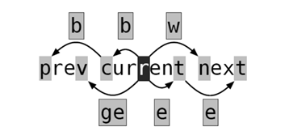

# 1. vim

- [1. vim](#1-vim)
  - [1.1. 键盘图](#11-键盘图)
  - [1.2. 命令快捷键](#12-命令快捷键)
    - [1.2.1. 删除、赋值和粘贴](#121-删除赋值和粘贴)
    - [1.2.2. 修改、查找与替换](#122-修改查找与替换)
    - [1.2.3. 移动、跳转及缩进](#123-移动跳转及缩进)
  - [1.3. 模式](#13-模式)
    - [1.3.1. 正常模式 (Normal-mode)](#131-正常模式-normal-mode)
    - [1.3.2. 插入模式 (Insert-mode)](#132-插入模式-insert-mode)
    - [1.3.3. 命令模式 (Command-mode)](#133-命令模式-command-mode)
    - [1.3.4. 可视模式 (Visual-mode)](#134-可视模式-visual-mode)
    - [1.3.5. 配置文件](#135-配置文件)
  - [1.4. 参考资料](#14-参考资料)

## 1.1. 键盘图

## 1.2. 命令快捷键

### 1.2.1. 删除、赋值和粘贴

### 1.2.2. 修改、查找与替换

### 1.2.3. 移动、跳转及缩进

| 快捷键            | 说明                | 备注                              |
| ----------------- | ------------------- | --------------------------------- |
| `HJKL`            | 左下上右            | 。H最左边，L最右边，J下，老K上    |
| `^/0`             | 行首                | ^不含空格tab,0指向真正行首        |
| `$`               | 行尾                | 同正则表达式                      |
| ----------------  | ------------------- | -----------------------------     |
| `w/W`             | 正向word开头        | 正向移动到下个单词开头            |
| `b/B`             | 反向word开头        | 同上，反向                        |
| `e/E`             | 正向word结尾        |                                   |
| `ge`              | 反向word结尾        |                                   |
| ----------------  | ------------------- | -----------------------------     |
| ctrl+f/F          | 跳转到下一页        |                                   |
| ctrl+b/B          | 跳转到上一页        |                                   |
| ctrl+d/u          | 向上或向下跳转半页  |                                   |
| gg                | 跳转到文件第一行    |                                   |
| G                 | 跳转到文件最后一行  |                                   |
| gg/G              | 跳转到指定行数      | 例如 12gg或者12G 代表跳转到 12 行 |
| {g}+Ctrl-g/G      | 查看文件信息。      |                                   |
| ----------------- | ------------------- | -----------------------------     |
| >> / :>           | 向右缩进            ||
| m,n> / :m>(n-m+1) | m到n行缩进          ||
| m>n               | m行开始共n行缩进    ||

[count]+operator+[count]+motion

count：次数的意思，用于重复；
operator ：操作方式就是增删改之类的。例如复制（y）,删除（d）等；
motion ：Vim help 中会有相应的解释。简单来说就是operator的操作对象。比如一个单词、句子或者移动的方向等。

## 1.3. 模式

共7种模式，常用的主要是下边4种。

### 1.3.1. 正常模式 (Normal-mode)

&emsp;&emsp;启动vim后默认处于正常模式。不论位于什么模式，按下`<Esc>`键(有时需要按两下）都会进入正常模式。正常模式主要作为其他模式的中转

### 1.3.2. 插入模式 (Insert-mode)

&emsp;&emsp;在正常模式中按下i, I, a, A等键，会进入插入模式。现在只用记住按i键会进行插入模式。在插入模式中，击键时会写入相应的字符。

### 1.3.3. 命令模式 (Command-mode)

&emsp;&emsp;在正常模式中，按下:（英文冒号）键，会进入命令模式。在命令模式中可以执行一些输入并执行一些vim或插件提供的指令，就像在shell里一样。这些指令包括设置环境、文件操作、调用某个功能等等。
&emsp;&emsp;常用的命令有：q（退出）、q!（强制退出）、w（保存）、wq（保存并退出）。

### 1.3.4. 可视模式 (Visual-mode)

&emsp;&emsp;在正常模式中按下v, V, `<Ctrl>+v`，可以进入可视模式。可视模式中的操作有点像拿鼠标进行操作，选择文本的时候有一种鼠标选择的即视感，有时候会很方便。

### 1.3.5. 配置文件

vimrc

## 1.4. 参考资料

1. [视频](https://www.imooc.com/video/17940)
