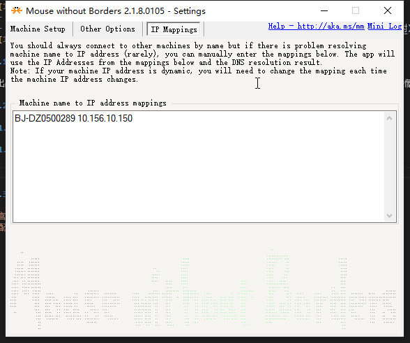

# 1. MouseWithoutBorders

- [1. MouseWithoutBorders](#1-mousewithoutborders)
  - [1.1. 简介](#11-简介)
  - [1.2. 问题集](#12-问题集)
    - [1.2.1. 仅限windows之间控制，但是比sharemouse稳定](#121-仅限windows之间控制但是比sharemouse稳定)
    - [1.2.2. 如果电脑名称没法识别，协议手动配置一下映射](#122-如果电脑名称没法识别协议手动配置一下映射)
  - [1.3. 参考资料](#13-参考资料)

## 1.1. 简介

微软出品的Mouse without Borders。通过它，你可以利用一套键鼠设备在若干台(最多4台)电脑之前无缝切换。就好像是在两个连接在同一个电脑的两个显示器之间切换一样方便。

## 1.2. 问题集

### 1.2.1. 仅限windows之间控制，但是比sharemouse稳定

### 1.2.2. 如果电脑名称没法识别，协议手动配置一下映射

## 1.3. 参考资料

1. [官网](microsoft.com/en-us/download/details.aspx?id=35460)
2. [配置步骤](https://loveky.github.io/2017/03/18/mouse-without-borders/)
