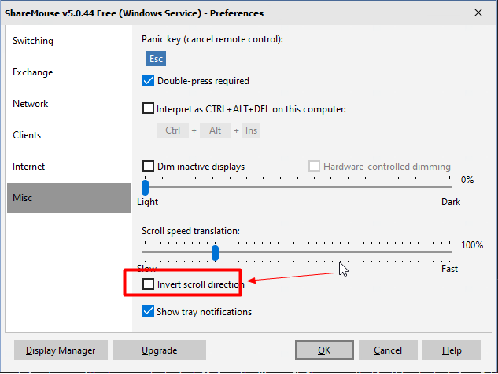

# 1. sharemouse

- [1. sharemouse](#1-sharemouse)
  - [1.1. 简介](#11-简介)
  - [1.2. 问题集](#12-问题集)
    - [1.2.1. 非主控电脑的鼠标滚轮反向](#121-非主控电脑的鼠标滚轮反向)
    - [稳定性有待考证，window之间经常失效(亲自实践)](#稳定性有待考证window之间经常失效亲自实践)
  - [1.3. 参考资料](#13-参考资料)

## 1.1. 简介

多台台电脑，多个显示器，公用一套鼠标和键盘。(支持windows和linux公用，通过网络进行控制共享)

## 1.2. 问题集

### 1.2.1. 非主控电脑的鼠标滚轮反向

方法：settins->Misc->Invert scroll direction 前边的勾去掉。如下图

### 稳定性有待考证，window之间经常失效(亲自实践)

## 1.3. 参考资料

1. [官网](https://www.sharemouse.com/doc/installation/)
2. [配置步骤](https://blog.csdn.net/zhangyu4863/article/details/81750161)
